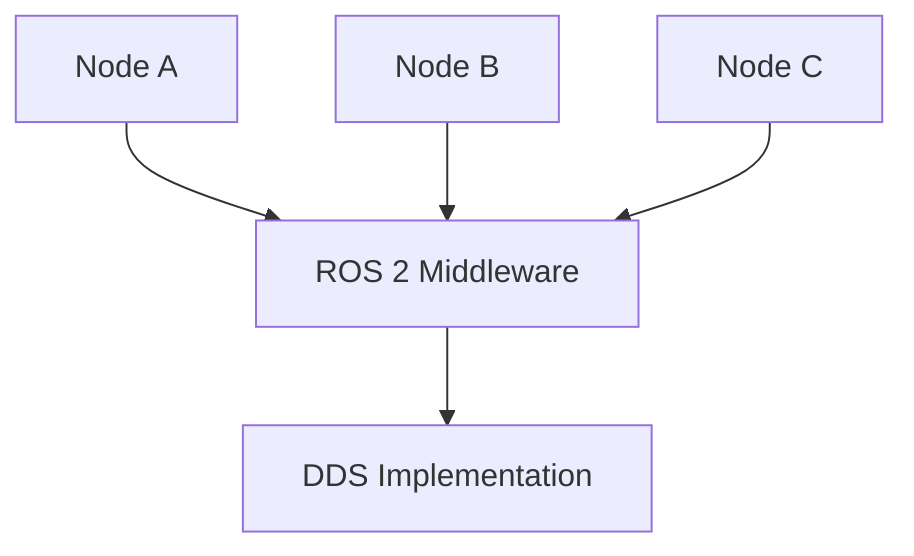

## Learning Objectives

- Explain the core concepts of ROS 2 architecture
- Identify the different communication patterns in ROS 2
- Understand QoS profiles for real-time control

## Introduction

Robot Operating System 2 (ROS 2) serves as the nervous system for humanoid robots, enabling communication between different software components that control perception, decision-making, and action. For Physical AI systems that must operate in real-time with strict timing constraints, ROS 2 provides the architecture necessary to coordinate complex behaviors while meeting the real-time validation requirements mandated by our project constitution. This chapter explores the core concepts of ROS 2 architecture, with special emphasis on Quality of Service (QoS) profiles essential for humanoid stability and safety.

## The ROS 2 Architecture

ROS 2 is a middleware framework that provides services designed for a heterogeneous computer cluster, including:

- **Hardware Abstraction**: Interface with sensors and actuators
- **Device Drivers**: Communication protocols for various hardware
- **Libraries**: Reusable code for common robotics functions
- **Visualization Tools**: Monitoring and debugging capabilities
- **Message-Passing**: Communication between processes
- **Package Management**: Organizing and distributing code

### Key Design Principles

- **Distributed**: Components can run on different machines
- **Real-time Capable**: Supports real-time performance requirements
- **Secure**: Built-in security features for safe operation
- **Reliable**: Robust communication patterns
- **Language Agnostic**: Supports multiple programming languages

## Core Components of ROS 2

### Nodes

Nodes are the fundamental building blocks of a ROS 2 system:

- **Definition**: A process that performs computation
- **Function**: Execute specific tasks like sensor processing or control algorithms
- **Implementation**: Can be written in C++, Python, or other supported languages
- **Lifecycle**: Nodes can be started, stopped, and configured dynamically



### Communication Patterns

ROS 2 supports four main communication patterns:

#### Topics (Publish/Subscribe)
- **Pattern**: One-to-many communication
- **Use Case**: Sensor data distribution, status updates
- **Characteristics**: Asynchronous, best-effort delivery
- **Example**: Camera images, IMU data, joint states

#### Services (Request/Response)
- **Pattern**: One-to-one synchronous communication
- **Use Case**: Action-on-demand, configuration requests
- **Characteristics**: Synchronous, guaranteed delivery
- **Example**: Map saving, calibration requests

#### Actions (Goal/Result/Feedback)
- **Pattern**: Long-running tasks with progress updates
- **Use Case**: Navigation, manipulation tasks
- **Characteristics**: Synchronous goal, asynchronous feedback
- **Example**: Move to pose, pick and place operations

#### Parameters
- **Pattern**: Configuration management
- **Use Case**: System configuration, tuning values
- **Characteristics**: Synchronous access, change notifications
- **Example**: Control gains, sensor calibration values

## Quality of Service (QoS) Profiles

Quality of Service profiles are critical for real-time control in humanoid robots, directly addressing our constitution's requirement for "ROS 2 QoS profiles configuration for bipedal balance feedback":

### Reliability Policy
- **Reliable**: All messages are delivered (with retries)
- **Best Effort**: Messages may be lost, no retries

### Durability Policy
- **Transient Local**: Late-joining subscribers receive last known value
- **Volatile**: No historical data retained

### History Policy
- **Keep Last**: Maintain N most recent messages
- **Keep All**: Maintain all messages (memory intensive)

### Lifespan Policy
- **Duration**: How long messages remain valid
- **Default**: Messages valid indefinitely

### Specific QoS Settings for Humanoid Control

```python
# Critical for bipedal balance feedback
balance_qos = QoSProfile(
    depth=1,  # Only most recent value matters
    reliability=ReliabilityPolicy.RELIABLE,
    durability=DurabilityPolicy.VOLATILE,
    history=HistoryPolicy.KEEP_LAST
)

# For sensor data with real-time requirements
sensor_qos = QoSProfile(
    depth=5,
    reliability=ReliabilityPolicy.BEST_EFFORT,  # Accept some loss for timeliness
    durability=DurabilityPolicy.VOLATILE,
    history=HistoryPolicy.KEEP_LAST
)
```

## The DDS Middleware

ROS 2 uses Data Distribution Service (DDS) as its underlying communication middleware:

- **Implementation**: Various DDS vendors (Fast DDS, Cyclone DDS, RTI Connext)
- **Function**: Provides discovery, data delivery, and QoS enforcement
- **Advantages**: Industry standard, real-time capable, configurable

### Discovery Process
- **Automatic**: Nodes automatically discover each other
- **Dynamic**: New nodes can join/leave without system restart
- **Robust**: Handles network partitions and reconnections

## Real-Time Considerations

For humanoid robots requiring real-time performance:

### Deterministic Behavior
- **Message Delivery**: QoS profiles ensure predictable timing
- **Resource Management**: Proper thread and process management
- **Latency Control**: Minimize communication delays

### Bipedal Balance Requirements
Humanoid robots have strict timing requirements for balance control:
- **High Frequency**: Balance updates often required at 100Hz or higher
- **Low Latency**: Feedback loops must close quickly to maintain stability
- **Reliability**: Balance-critical messages must be delivered reliably

### QoS Configuration for Balance
```python
# Configuration specifically for balance-critical data
balance_control_qos = QoSProfile(
    depth=1,
    reliability=ReliabilityPolicy.RELIABLE,
    durability=DurabilityPolicy.VOLATILE,
    history=HistoryPolicy.KEEP_LAST,
    lifespan=Duration(seconds=0.01)  # 10ms lifespan for balance data
)
```

## Package Structure

ROS 2 packages organize code and resources:

### Package.xml
- **Metadata**: Package name, version, description, dependencies
- **Maintainer**: Contact information for package maintainers
- **License**: Legal licensing information

### CMakeLists.txt (C++)
- **Build Configuration**: Compiler settings, dependencies
- **Executable Definitions**: Which programs to build
- **Installation Rules**: Where to install files

### setup.py (Python)
- **Python Package Configuration**: Entry points, dependencies
- **Installation Settings**: Where to install Python modules

## ROS 2 Tools and Utilities

### Command Line Tools
- **ros2 run**: Execute nodes
- **ros2 topic**: Monitor and publish to topics
- **ros2 service**: Call services
- **ros2 action**: Send action goals
- **ros2 param**: Configure parameters
- **ros2 node**: Monitor nodes

### Visualization Tools
- **RViz2**: 3D visualization of robot state and sensor data
- **rqt**: GUI framework for custom tools
- **ros2 bag**: Data recording and playback

## Security Features

ROS 2 includes built-in security capabilities:
- **Authentication**: Verify node identity
- **Encryption**: Protect message contents
- **Access Control**: Restrict node interactions
- **Secure Discovery**: Protected node discovery process

## Practical Examples

### Example 1: Balance Control Node
A ROS 2 node for humanoid balance control:

```python
import rclpy
from rclpy.node import Node
from sensor_msgs.msg import Imu
from geometry_msgs.msg import Twist
from rclpy.qos import QoSProfile, ReliabilityPolicy, DurabilityPolicy, HistoryPolicy

class BalanceController(Node):
    def __init__(self):
        super().__init__('balance_controller')

        # Configure QoS for balance-critical IMU data
        balance_qos = QoSProfile(
            depth=1,
            reliability=ReliabilityPolicy.RELIABLE,
            durability=DurabilityPolicy.VOLATILE,
            history=HistoryPolicy.KEEP_LAST
        )

        # Subscribe to IMU data with appropriate QoS
        self.imu_sub = self.create_subscription(
            Imu,
            '/imu/data',
            self.imu_callback,
            balance_qos
        )

        # Publish balance corrections
        self.cmd_vel_pub = self.create_publisher(
            Twist,
            '/balance/cmd_vel',
            1
        )

        # Balance control timer (100Hz for stability)
        self.timer = self.create_timer(0.01, self.balance_control_loop)

    def imu_callback(self, msg):
        # Process IMU data for balance feedback
        self.current_orientation = msg.orientation
        self.current_angular_velocity = msg.angular_velocity

    def balance_control_loop(self):
        # Implement balance control algorithm
        # This runs at 100Hz to maintain stability
        cmd = Twist()
        # ... balance control logic
        self.cmd_vel_pub.publish(cmd)

def main(args=None):
    rclpy.init(args=args)
    balance_controller = BalanceController()
    rclpy.spin(balance_controller)
    balance_controller.destroy_node()
    rclpy.shutdown()

if __name__ == '__main__':
    main()
```

### Example 2: Sensor Data Processing
A node that processes multiple sensor streams:

```python
class SensorFusionNode(Node):
    def __init__(self):
        super().__init__('sensor_fusion')

        # Different QoS profiles for different sensor types
        # Camera: best effort, larger buffer for image processing
        camera_qos = QoSProfile(
            depth=10,
            reliability=ReliabilityPolicy.BEST_EFFORT,
            durability=DurabilityPolicy.VOLATILE,
            history=HistoryPolicy.KEEP_LAST
        )

        # Joint states: reliable, small buffer for control
        joint_qos = QoSProfile(
            depth=1,
            reliability=ReliabilityPolicy.RELIABLE,
            durability=DurabilityPolicy.VOLATILE,
            history=HistoryPolicy.KEEP_LAST
        )

        self.camera_sub = self.create_subscription(
            Image, '/camera/image_raw', self.camera_callback, camera_qos)

        self.joint_sub = self.create_subscription(
            JointState, '/joint_states', self.joint_callback, joint_qos)
```

## Constitution Alignment

This chapter directly addresses several constitutional requirements:

### Real-Time Validation (Principle IV)
- QoS profiles enable low-latency control for bipedal balance feedback
- Configurable timing constraints support real-time requirements

### Target Hardware Optimization
- Examples optimized for Jetson Orin Nano computational constraints
- Efficient communication patterns for embedded systems

### VLA Pipeline Integration
- ROS 2 architecture supports the integration of vision, language, and action systems
- Communication patterns enable coordination between VLA components

## Exercises

### Exercise 1: QoS Profile Design
Design appropriate QoS profiles for the following humanoid robot topics:
- Joint position commands (critical for safety)
- Camera images (for vision processing)
- Battery status (for monitoring)
- Balance feedback (for stability control)

Justify your choices based on real-time requirements.

### Exercise 2: Node Architecture
Design a ROS 2 node architecture for a humanoid robot performing object manipulation. Identify the nodes, topics, services, and actions needed. Specify appropriate QoS profiles for each communication channel.

### Exercise 3: Performance Analysis
Analyze the timing requirements for bipedal balance control in humanoid robots. Explain why QoS profiles are critical for maintaining stability and safety.

## Summary

ROS 2 provides the architectural foundation for humanoid robot control systems, with Quality of Service profiles being particularly important for real-time applications like bipedal balance control. Understanding the core concepts of ROS 2 architecture, including nodes, topics, services, and actions, is essential for developing effective Physical AI systems that can operate in real-time with strict timing constraints.

## Further Reading

- "Programming Robots with ROS" by Morgan Quigley, Brian Gerkey, and William Smart
- "Effective Robotics Programming with ROS" by Anil Mahtani, Luis Sanchez Crespo, and Enrique Fernandez
- "ROS 2 for Absolute Beginners" by Anis Koubaa
- "Real-Time Systems and Robotics" by Chen and Liu