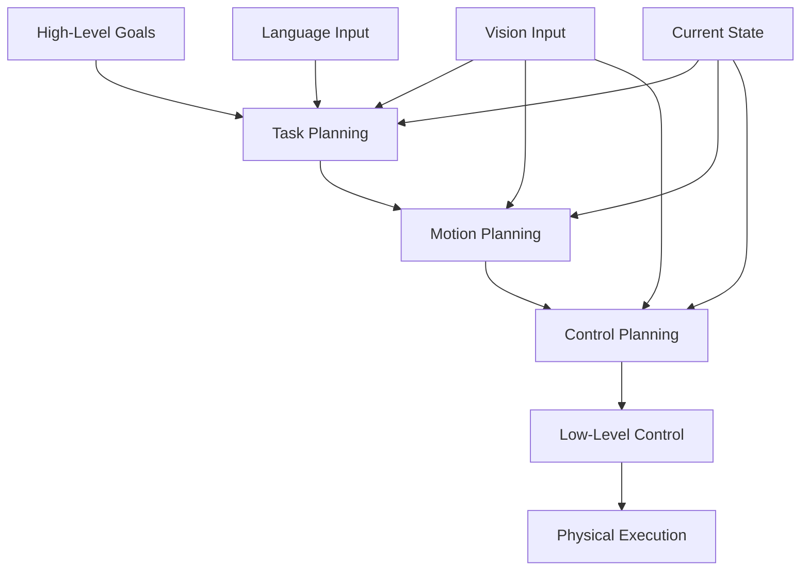

## Learning Objectives

- Implement action planning for humanoid robots
- Design control systems for humanoid locomotion and manipulation
- Integrate action planning with vision and language systems

## Introduction

Action planning and control systems form the Action component of the Vision-Language-Action (VLA) pipeline, completing the cycle that begins with language understanding and is informed by visual perception. For humanoid robots, action planning must address the unique challenges of bipedal locomotion, dexterous manipulation, and real-time control with strict timing constraints as mandated by our Real-Time Validation principle. This chapter explores action planning and control systems specifically designed for humanoid robots, with emphasis on the integration with vision and language systems to create a cohesive VLA pipeline that enables natural human-robot interaction in human-centered environments.

## Action Planning Fundamentals

### Hierarchical Action Planning Architecture

Humanoid robots require multi-level action planning to handle the complexity of their tasks:



### Action Representation and Planning

```python
from typing import List, Dict, Optional, Tuple, Any
from dataclasses import dataclass
from enum import Enum
import numpy as np
import time

class ActionType(Enum):
    """Enumeration of different action types for humanoid robots"""
    NAVIGATION = "navigation"
    MANIPULATION = "manipulation"
    LOCOMOTION = "locomotion"
    BALANCE = "balance"
    INTERACTION = "interaction"
    PERCEPTION = "perception"
    WAIT = "wait"

@dataclass
class ActionStep:
    """Represents a single step in an action plan"""
    action_type: ActionType
    parameters: Dict[str, Any]
    duration: float  # Expected duration in seconds
    preconditions: List[str]  # Conditions that must be true before execution
    effects: List[str]  # Effects that will be true after execution
    priority: int = 1  # Higher number means higher priority

@dataclass
class ActionPlan:
    """Represents a complete action plan"""
    steps: List[ActionStep]
    start_time: float
    estimated_duration: float
    success_conditions: List[str]
    failure_conditions: List[str]

class ActionPlanner:
    def __init__(self, robot_config: Dict):
        """
        Initialize action planner for humanoid robot

        Args:
            robot_config: Configuration parameters for the specific robot
        """
        self.robot_config = robot_config
        self.kinematic_model = self._load_kinematic_model()
        self.collision_checker = CollisionChecker()
        self.trajectory_generator = TrajectoryGenerator()

    def plan_navigation_action(self, start_pose: np.ndarray, goal_pose: np.ndarray,
                             world_map: np.ndarray) -> ActionPlan:
        """
        Plan navigation action from start to goal

        Args:
            start_pose: Starting pose [x, y, theta]
            goal_pose: Goal pose [x, y, theta]
            world_map: 2D occupancy grid map

        Returns:
            Action plan for navigation
        """
        # Plan path using A* or RRT
        path = self._plan_path(start_pose, goal_pose, world_map)

        # Generate trajectory for the path
        trajectory = self.trajectory_generator.generate_path_trajectory(
            path, self.robot_config['max_velocity'], self.robot_config['max_acceleration']
        )

        # Create action steps
        steps = []
        for waypoint in trajectory:
            step = ActionStep(
                action_type=ActionType.LOCOMOTION,
                parameters={
                    'target_pose': waypoint,
                    'walking_speed': self.robot_config.get('cruising_speed', 0.5)
                },
                duration=0.1,  # 100ms per waypoint
                preconditions=['robot_is_standing', 'path_is_clear'],
                effects=['robot_position_updated'],
                priority=2
            )
            steps.append(step)

        # Add final balance adjustment
        balance_step = ActionStep(
            action_type=ActionType.BALANCE,
            parameters={'target_pose': goal_pose},
            duration=1.0,
            preconditions=['robot_has_reached_goal'],
            effects=['robot_is_balanced'],
            priority=3
        )
        steps.append(balance_step)

        return ActionPlan(
            steps=steps,
            start_time=time.time(),
            estimated_duration=len(trajectory) * 0.1 + 1.0,
            success_conditions=['robot_at_goal_pose', 'robot_balanced'],
            failure_conditions=['collision_detected', 'time_limit_exceeded']
        )

    def plan_manipulation_action(self, target_object: Dict, target_pose: np.ndarray,
                               current_state: Dict) -> ActionPlan:
        """
        Plan manipulation action for grasping or placing an object

        Args:
            target_object: Dictionary describing the target object
            target_pose: Target pose for manipulation [x, y, z, roll, pitch, yaw]
            current_state: Current robot state

        Returns:
            Action plan for manipulation
        """
        steps = []

        # First, navigate to the object if needed
        if self._needs_navigation_to_object(target_object, current_state):
            navigate_plan = self._create_navigation_to_object_plan(target_object, current_state)
            steps.extend(navigate_plan.steps)

        # Plan reaching motion
        reach_steps = self._plan_reaching_motion(target_object, target_pose, current_state)
        steps.extend(reach_steps)

        # Plan grasp or place action
        grasp_steps = self._plan_grasp_or_place(target_object, current_state)
        steps.extend(grasp_steps)

        # Return to neutral position
        return_steps = self._plan_return_to_neutral(current_state)
        steps.extend(return_steps)

        return ActionPlan(
            steps=steps,
            start_time=time.time(),
            estimated_duration=sum(step.duration for step in steps),
            success_conditions=['object_manipulated', 'robot_safe_position'],
            failure_conditions=['collision_detected', 'grasp_failed', 'time_limit_exceeded']
        )

    def _plan_path(self, start_pose: np.ndarray, goal_pose: np.ndarray,
                   world_map: np.ndarray) -> List[np.ndarray]:
        """Plan a collision-free path using A* algorithm"""
        # Implementation of A* path planning
        # This is a simplified version - in practice, would use more sophisticated algorithms
        path = [start_pose]

        # Calculate straight-line path first
        dx = goal_pose[0] - start_pose[0]
        dy = goal_pose[1] - start_pose[1]
        distance = np.sqrt(dx**2 + dy**2)

        # Generate intermediate waypoints
        steps = max(10, int(distance / 0.1))  # 10cm resolution
        for i in range(1, steps + 1):
            t = i / steps
            intermediate_pose = start_pose + t * (goal_pose - start_pose)
            intermediate_pose[2] = start_pose[2] + t * (goal_pose[2] - start_pose[2])  # Interpolate orientation

            # Check for collisions
            if not self.collision_checker.is_collision_at(intermediate_pose, world_map):
                path.append(intermediate_pose)
            else:
                # Implement path replanning in case of collision
                # For now, just skip collision points
                continue

        # Ensure we reach the goal
        if not np.allclose(path[-1][:2], goal_pose[:2], atol=0.05):  # 5cm tolerance
            path.append(goal_pose)

        return path

    def _needs_navigation_to_object(self, target_object: Dict, current_state: Dict) -> bool:
        """Determine if navigation is needed to reach the target object"""
        current_pos = np.array(current_state['position'])
        object_pos = np.array(target_object['position'])

        distance = np.linalg.norm(current_pos[:2] - object_pos[:2])
        reach_distance = self.robot_config.get('arm_reach', 1.0)

        return distance > reach_distance

    def _create_navigation_to_object_plan(self, target_object: Dict, current_state: Dict) -> ActionPlan:
        """Create navigation plan to approach target object"""
        object_pos = np.array(target_object['position'])
        approach_pos = object_pos.copy()

        # Calculate approach position (slightly away from object for safety)
        current_pos = np.array(current_state['position'])
        approach_direction = object_pos[:2] - current_pos[:2]
        approach_direction = approach_direction / np.linalg.norm(approach_direction)

        # 30cm from object
        approach_pos[:2] = object_pos[:2] - approach_direction * 0.3
        approach_pos[2] = current_pos[2]  # Keep same height

        # Use current orientation
        approach_pos = np.append(approach_pos, current_state['orientation'][-1])

        return self.plan_navigation_action(
            current_state['position'],
            approach_pos,
            current_state.get('world_map', np.ones((100, 100)))  # Default map
        )

    def _plan_reaching_motion(self, target_object: Dict, target_pose: np.ndarray,
                            current_state: Dict) -> List[ActionStep]:
        """Plan the reaching motion for manipulation"""
        steps = []

        # Calculate inverse kinematics for target pose
        joint_angles = self.kinematic_model.inverse_kinematics(target_pose)

        # Generate smooth trajectory to target joint angles
        current_joints = current_state['joint_positions']
        trajectory = self.trajectory_generator.generate_joint_trajectory(
            current_joints, joint_angles, self.robot_config['max_joint_velocity']
        )

        for joint_config in trajectory:
            step = ActionStep(
                action_type=ActionType.MANIPULATION,
                parameters={
                    'joint_positions': joint_config,
                    'control_mode': 'position'
                },
                duration=0.05,  # 50ms per step
                preconditions=['arm_is_moving_to_target'],
                effects=['joint_positions_updated'],
                priority=2
            )
            steps.append(step)

        return steps

    def _plan_grasp_or_place(self, target_object: Dict, current_state: Dict) -> List[ActionStep]:
        """Plan the actual grasp or place action"""
        steps = []

        # Determine if this is a grasp or place based on current state
        is_grasping = target_object.get('state', 'placed') == 'placed'

        if is_grasping:
            # Grasp action
            grasp_step = ActionStep(
                action_type=ActionType.MANIPULATION,
                parameters={
                    'gripper_command': 'close',
                    'grasp_force': target_object.get('weight', 1.0) * 2  # 2x weight for safety
                },
                duration=1.0,
                preconditions=['end_effector_at_object', 'gripper_open'],
                effects=['object_grasped', 'gripper_closed'],
                priority=3
            )
        else:
            # Place action
            place_step = ActionStep(
                action_type=ActionType.MANIPULATION,
                parameters={
                    'gripper_command': 'open',
                    'release_force': 0.0
                },
                duration=0.5,
                preconditions=['object_grasped', 'at_place_location'],
                effects=['object_placed', 'gripper_open'],
                priority=3
            )
            grasp_step = place_step

        steps.append(grasp_step)

        # Verify grasp/place success
        verification_step = ActionStep(
            action_type=ActionType.PERCEPTION,
            parameters={'sensor_check': 'force_torque'},
            duration=0.1,
            preconditions=['grasp_action_completed'],
            effects=['grasp_success_verified'],
            priority=4
        )
        steps.append(verification_step)

        return steps

    def _plan_return_to_neutral(self, current_state: Dict) -> List[ActionStep]:
        """Plan return to neutral/safe position"""
        steps = []

        neutral_joints = self.robot_config.get('neutral_joints', current_state['joint_positions'])
        current_joints = current_state['joint_positions']

        trajectory = self.trajectory_generator.generate_joint_trajectory(
            current_joints, neutral_joints, self.robot_config['max_joint_velocity'] / 2  # Slower return
        )

        for joint_config in trajectory:
            step = ActionStep(
                action_type=ActionType.MANIPULATION,
                parameters={
                    'joint_positions': joint_config,
                    'control_mode': 'position'
                },
                duration=0.05,
                preconditions=['manipulation_completed'],
                effects=['joint_positions_updated'],
                priority=1
            )
            steps.append(step)

        return steps

    def _load_kinematic_model(self):
        """Load or create kinematic model for the robot"""
        # In practice, this would load from URDF or DH parameters
        return KinematicModel(self.robot_config)

class KinematicModel:
    """Simple kinematic model for humanoid robot"""
    def __init__(self, robot_config: Dict):
        self.config = robot_config

    def inverse_kinematics(self, target_pose: np.ndarray) -> np.ndarray:
        """Calculate joint angles for desired end-effector pose"""
        # Simplified inverse kinematics
        # In practice, would use more sophisticated methods like FABRIK, CCD, or analytical solutions
        # This is a placeholder implementation
        return np.zeros(self.config.get('num_joints', 6))  # Return zero joints as placeholder

    def forward_kinematics(self, joint_angles: np.ndarray) -> np.ndarray:
        """Calculate end-effector pose from joint angles"""
        # Simplified forward kinematics
        return np.zeros(6)  # Return zero pose as placeholder

class CollisionChecker:
    """Simple collision checker for path planning"""
    def __init__(self):
        pass

    def is_collision_at(self, pose: np.ndarray, world_map: np.ndarray) -> bool:
        """Check if there's a collision at the given pose"""
        # Convert world coordinates to map coordinates
        map_x = int(pose[0] / 0.05)  # Assuming 5cm resolution
        map_y = int(pose[1] / 0.05)

        if 0 <= map_x < world_map.shape[1] and 0 <= map_y < world_map.shape[0]:
            return world_map[map_y, map_x] > 0.5  # Occupied if value > 0.5
        else:
            return True  # Out of bounds is considered collision

class TrajectoryGenerator:
    """Generate smooth trajectories for motion planning"""
    def __init__(self):
        pass

    def generate_path_trajectory(self, path: List[np.ndarray], max_velocity: float,
                               max_acceleration: float) -> List[np.ndarray]:
        """Generate smooth trajectory through waypoints"""
        # This would implement trajectory generation with velocity and acceleration limits
        # For now, return the path as is
        return path

    def generate_joint_trajectory(self, start_joints: np.ndarray, end_joints: np.ndarray,
                                max_velocity: float) -> List[np.ndarray]:
        """Generate smooth joint trajectory"""
        # Linear interpolation between start and end joint positions
        steps = 20  # Number of intermediate steps
        trajectory = []

        for i in range(steps + 1):
            t = i / steps
            joint_pos = start_joints + t * (end_joints - start_joints)
            trajectory.append(joint_pos)

        return trajectory
```

## Control Systems for Humanoid Robots

### Balance Control Systems

Humanoid robots require sophisticated balance control systems due to the inherent instability of bipedal locomotion:

```python
import control  # Python Control Systems Library
from scipy import signal

class BalanceController:
    def __init__(self, robot_config: Dict):
        """
        Initialize balance controller for humanoid robot

        Args:
            robot_config: Configuration parameters for the robot
        """
        self.robot_config = robot_config
        self.mass = robot_config.get('total_mass', 70.0)  # kg
        self.height = robot_config.get('height', 1.6)    # meters
        self.com_height = robot_config.get('com_height', 0.8)  # Center of mass height

        # Initialize control parameters
        self.kp = robot_config.get('balance_kp', 100.0)   # Proportional gain
        self.kd = robot_config.get('balance_kd', 10.0)    # Derivative gain
        self.ki = robot_config.get('balance_ki', 1.0)     # Integral gain

        # Initialize PID controllers for different axes
        self.pitch_controller = self._create_pid_controller(self.kp, self.kd, self.ki)
        self.roll_controller = self._create_pid_controller(self.kp, self.kd, self.ki)
        self.z_controller = self._create_pid_controller(self.kp/10, self.kd/10, self.ki/10)  # Less aggressive for height

        # State variables
        self.prev_pitch_error = 0.0
        self.prev_roll_error = 0.0
        self.integrated_pitch_error = 0.0
        self.integrated_roll_error = 0.0
        self.control_output_history = []

    def _create_pid_controller(self, kp: float, kd: float, ki: float):
        """Create a PID controller with given parameters"""
        # This is a simplified implementation
        # In practice, would use proper control library functions
        return {
            'kp': kp,
            'kd': kd,
            'ki': ki,
            'prev_error': 0.0,
            'integrated_error': 0.0
        }

    def update_balance_control(self, current_state: Dict, target_state: Dict) -> Dict:
        """
        Update balance control based on current and target states

        Args:
            current_state: Current robot state including IMU readings
            target_state: Target state for balance

        Returns:
            Control commands to maintain balance
        """
        # Extract current state
        current_pitch = current_state.get('pitch', 0.0)
        current_roll = current_state.get('roll', 0.0)
        current_z = current_state.get('z_position', self.com_height)

        # Extract target state
        target_pitch = target_state.get('pitch', 0.0)
        target_roll = target_state.get('roll', 0.0)
        target_z = target_state.get('z_position', self.com_height)

        # Calculate errors
        pitch_error = target_pitch - current_pitch
        roll_error = target_roll - current_roll
        z_error = target_z - current_z

        # Update integrated errors (with anti-windup)
        self.integrated_pitch_error = self._limit_integration(
            self.integrated_pitch_error + pitch_error * 0.01,  # Assuming 100Hz control rate
            -1.0, 1.0
        )
        self.integrated_roll_error = self._limit_integration(
            self.integrated_roll_error + roll_error * 0.01,
            -1.0, 1.0
        )

        # Calculate control outputs using PID
        pitch_control = (self.kp * pitch_error +
                        self.kd * (pitch_error - self.prev_pitch_error) / 0.01 +
                        self.ki * self.integrated_pitch_error)

        roll_control = (self.kp * roll_error +
                       self.kd * (roll_error - self.prev_roll_error) / 0.01 +
                       self.ki * self.integrated_roll_error)

        # Update previous errors
        self.prev_pitch_error = pitch_error
        self.prev_roll_error = roll_error

        # Limit control outputs to safe ranges
        pitch_control = self._limit_output(pitch_control, -100.0, 100.0)
        roll_control = self._limit_output(roll_control, -100.0, 100.0)

        # Calculate Z control separately (for height adjustment)
        z_control = self.kp * z_error * 0.1  # Reduced gain for height
        z_control = self._limit_output(z_control, -50.0, 50.0)

        # Package control outputs
        control_commands = {
            'pitch_torque': pitch_control,
            'roll_torque': roll_control,
            'z_force': z_control,
            'joint_commands': self._map_to_joint_commands(pitch_control, roll_control, z_control)
        }

        # Store for history and debugging
        self.control_output_history.append({
            'timestamp': time.time(),
            'errors': {'pitch': pitch_error, 'roll': roll_error, 'z': z_error},
            'outputs': control_commands
        })

        return control_commands

    def _limit_integration(self, value: float, min_val: float, max_val: float) -> float:
        """Limit the integrated error to prevent windup"""
        return max(min_val, min(max_val, value))

    def _limit_output(self, value: float, min_val: float, max_val: float) -> float:
        """Limit control output to safe range"""
        return max(min_val, min(max_val, value))

    def _map_to_joint_commands(self, pitch_control: float, roll_control: float,
                             z_control: float) -> Dict[str, float]:
        """Map balance control outputs to individual joint commands"""
        # This mapping depends on the specific robot configuration
        # Simplified mapping for demonstration
        joint_commands = {}

        # Map pitch control to hip and ankle pitch joints
        hip_pitch_cmd = pitch_control * 0.4
        ankle_pitch_cmd = pitch_control * 0.6
        joint_commands['left_hip_pitch'] = hip_pitch_cmd
        joint_commands['right_hip_pitch'] = hip_pitch_cmd
        joint_commands['left_ankle_pitch'] = ankle_pitch_cmd
        joint_commands['right_ankle_pitch'] = ankle_pitch_cmd

        # Map roll control to hip and ankle roll joints
        hip_roll_cmd = roll_control * 0.3
        ankle_roll_cmd = roll_control * 0.5
        joint_commands['left_hip_roll'] = hip_roll_cmd
        joint_commands['right_hip_roll'] = -hip_roll_cmd  # Opposite for stability
        joint_commands['left_ankle_roll'] = ankle_roll_cmd
        joint_commands['right_ankle_roll'] = -ankle_roll_cmd

        # Map Z control to hip height adjustment
        joint_commands['left_hip_z'] = z_control * 0.1
        joint_commands['right_hip_z'] = z_control * 0.1

        return joint_commands

    def get_stability_metrics(self) -> Dict[str, float]:
        """Get stability metrics for monitoring"""
        if not self.control_output_history:
            return {'stability_index': 1.0, 'max_control_effort': 0.0}

        recent_outputs = self.control_output_history[-10:]  # Last 10 control cycles
        avg_pitch_control = np.mean([out['outputs']['pitch_torque'] for out in recent_outputs])
        avg_roll_control = np.mean([out['outputs']['roll_torque'] for out in recent_outputs])
        max_control_effort = max(
            abs(out['outputs']['pitch_torque']) for out in recent_outputs
        )

        # Calculate stability index (lower is more stable)
        stability_index = (abs(avg_pitch_control) + abs(avg_roll_control)) / 2.0
        stability_index = min(1.0, stability_index / 50.0)  # Normalize

        return {
            'stability_index': 1.0 - stability_index,  # Higher is more stable
            'max_control_effort': max_control_effort,
            'average_pitch_control': abs(avg_pitch_control),
            'average_roll_control': abs(avg_roll_control)
        }
```

### Locomotion Control Systems

```python
class LocomotionController:
    def __init__(self, robot_config: Dict):
        """
        Initialize locomotion controller for humanoid walking

        Args:
            robot_config: Configuration parameters for the robot
        """
        self.robot_config = robot_config
        self.step_height = robot_config.get('step_height', 0.05)  # meters
        self.step_length = robot_config.get('step_length', 0.3)   # meters
        self.step_duration = robot_config.get('step_duration', 0.8)  # seconds
        self.zmp_margin = robot_config.get('zmp_margin', 0.05)   # safety margin

        # Walking pattern parameters
        self.stride_length = robot_config.get('stride_length', 0.6)
        self.step_width = robot_config.get('step_width', 0.2)    # distance between feet
        self.walking_speed = 0.0  # Current walking speed

        # Initialize walking state
        self.current_support_foot = 'left'  # 'left' or 'right'
        self.step_phase = 0.0  # 0.0 to 1.0, representing step cycle
        self.step_count = 0

        # ZMP (Zero Moment Point) controller
        self.zmp_controller = ZMPController(robot_config)

    def generate_walking_pattern(self, target_velocity: np.ndarray, current_state: Dict) -> Dict:
        """
        Generate walking pattern based on target velocity

        Args:
            target_velocity: Target velocity [vx, vy, omega] (linear x, linear y, angular)
            current_state: Current robot state

        Returns:
            Walking pattern with foot positions and timing
        """
        vx, vy, omega = target_velocity

        # Calculate step parameters based on target velocity
        walking_speed = np.sqrt(vx**2 + vy**2)
        step_frequency = self._calculate_step_frequency(walking_speed)

        # Generate footstep plan
        footsteps = self._generate_footsteps(vx, vy, omega, current_state)

        # Generate ZMP reference trajectory
        zmp_reference = self.zmp_controller.generate_zmp_trajectory(footsteps, step_frequency)

        # Package walking pattern
        walking_pattern = {
            'footsteps': footsteps,
            'zmp_reference': zmp_reference,
            'step_frequency': step_frequency,
            'walking_speed': walking_speed,
            'step_timing': self._calculate_step_timing(step_frequency)
        }

        return walking_pattern

    def _calculate_step_frequency(self, walking_speed: float) -> float:
        """Calculate step frequency based on walking speed"""
        # Simplified relationship: frequency increases with speed
        # In practice, this would use more sophisticated models
        base_frequency = 0.8  # steps per second at very slow walking
        max_frequency = 2.0   # maximum steps per second

        if walking_speed < 0.1:
            return base_frequency
        else:
            # Linear relationship between speed and frequency up to a point
            frequency = base_frequency + (walking_speed * 1.0)  # Adjust multiplier as needed
            return min(frequency, max_frequency)

    def _generate_footsteps(self, vx: float, vy: float, omega: float,
                          current_state: Dict) -> List[Dict]:
        """Generate sequence of footsteps for walking"""
        footsteps = []

        # Get current robot pose
        current_pose = current_state.get('pose', np.array([0.0, 0.0, 0.0]))  # [x, y, theta]
        current_x, current_y, current_theta = current_pose

        # Calculate number of steps to plan ahead
        planning_horizon = 10  # Plan 10 steps ahead

        # Current support foot position
        support_foot_x = current_x
        support_foot_y = current_y + (self.step_width/2 if self.current_support_foot == 'left' else -self.step_width/2)

        for i in range(planning_horizon):
            # Calculate swing foot position
            # For simplicity, assume alternating feet
            swing_foot = 'right' if (i + self.step_count) % 2 == 0 else 'left'

            # Calculate step displacement based on target velocity
            dt = self.step_duration
            dx = vx * dt
            dy = vy * dt
            dtheta = omega * dt

            # Calculate new foot position
            if swing_foot == 'left':
                new_x = support_foot_x + dx + self.step_width/2 * np.sin(current_theta + dtheta)
                new_y = support_foot_y + dy - self.step_width/2 * np.cos(current_theta + dtheta)
            else:
                new_x = support_foot_x + dx - self.step_width/2 * np.sin(current_theta + dtheta)
                new_y = support_foot_y + dy + self.step_width/2 * np.cos(current_theta + dtheta)

            # Update support foot for next step
            support_foot_x = new_x
            support_foot_y = new_y + (self.step_width if swing_foot == 'left' else -self.step_width)

            footstep = {
                'foot': swing_foot,
                'position': [new_x, new_y, 0.0],  # z=0 for ground contact
                'orientation': current_theta + dtheta,
                'timing': i * self.step_duration,
                'swing_height': self.step_height,
                'step_length': np.sqrt(dx**2 + dy**2)
            }

            footsteps.append(footstep)

        return footsteps

    def _calculate_step_timing(self, step_frequency: float) -> Dict:
        """Calculate detailed step timing for smooth walking"""
        step_period = 1.0 / step_frequency

        # Define phases of step cycle (double support, single support, etc.)
        timing = {
            'double_support_start': 0.0,
            'single_support_swing': 0.2,  # 20% of cycle
            'double_support_end': 0.9,    # 90% of cycle
            'cycle_period': step_period
        }

        return timing

    def update_walking_control(self, walking_pattern: Dict, current_state: Dict) -> Dict:
        """
        Update walking control based on planned walking pattern

        Args:
            walking_pattern: Planned walking pattern
            current_state: Current robot state

        Returns:
            Control commands for walking
        """
        # Calculate current step phase
        self.step_phase = (time.time() % self.step_duration) / self.step_duration

        # Get current target foot position from pattern
        current_target = self._get_current_foot_target(walking_pattern, self.step_phase)

        # Calculate control commands to track the target
        control_commands = self._calculate_tracking_control(current_target, current_state)

        # Update ZMP control
        zmp_commands = self.zmp_controller.update_zmp_control(
            current_state, walking_pattern['zmp_reference']
        )

        # Combine all control commands
        combined_commands = {
            **control_commands,
            'zmp_control': zmp_commands,
            'walking_state': {
                'step_phase': self.step_phase,
                'support_foot': self.current_support_foot,
                'step_count': self.step_count
            }
        }

        return combined_commands

    def _get_current_foot_target(self, walking_pattern: Dict, phase: float) -> Dict:
        """Get the current target position for feet based on walking phase"""
        # This would interpolate between footsteps based on current phase
        # For simplicity, return the next planned footstep
        footsteps = walking_pattern['footsteps']
        if footsteps:
            return footsteps[0]  # Return first (next) footstep
        else:
            return {'position': [0, 0, 0], 'orientation': 0}

    def _calculate_tracking_control(self, target: Dict, current_state: Dict) -> Dict:
        """Calculate control commands to track foot targets"""
        # Simplified tracking control
        # In practice, this would use inverse kinematics and more sophisticated control

        target_pos = np.array(target['position'])
        current_pos = np.array(current_state.get('foot_position', [0, 0, 0]))

        # Calculate position error
        pos_error = target_pos - current_pos

        # Simple proportional control
        kp_pos = 10.0
        control_output = kp_pos * pos_error

        return {
            'hip_commands': control_output[:2],  # Simplified hip control
            'ankle_commands': control_output[:2],  # Simplified ankle control
            'position_error': pos_error.tolist()
        }

class ZMPController:
    def __init__(self, robot_config: Dict):
        """Initialize ZMP (Zero Moment Point) controller"""
        self.robot_config = robot_config
        self.total_mass = robot_config.get('total_mass', 70.0)
        self.gravity = 9.81
        self.com_height = robot_config.get('com_height', 0.8)

        # ZMP tracking controller gains
        self.zmp_kp = robot_config.get('zmp_kp', 50.0)
        self.zmp_kd = robot_config.get('zmp_kd', 10.0)

    def generate_zmp_trajectory(self, footsteps: List[Dict], step_frequency: float) -> List[Dict]:
        """Generate ZMP reference trajectory based on footsteps"""
        zmp_trajectory = []
        step_period = 1.0 / step_frequency

        for i, footstep in enumerate(footsteps):
            # Calculate ZMP reference based on foot position and timing
            zmp_ref = {
                'time': i * step_period,
                'x': footstep['position'][0],
                'y': footstep['position'][1],
                'valid': True
            }
            zmp_trajectory.append(zmp_ref)

        return zmp_trajectory

    def update_zmp_control(self, current_state: Dict, zmp_reference: List[Dict]) -> Dict:
        """Update ZMP-based balance control"""
        # Get current ZMP estimate from force sensors
        current_zmp = self._estimate_current_zmp(current_state)

        # Find closest reference ZMP
        target_zmp = self._find_closest_zmp_reference(zmp_reference)

        if target_zmp and current_zmp:
            # Calculate ZMP error
            zmp_error = {
                'x': target_zmp['x'] - current_zmp['x'],
                'y': target_zmp['y'] - current_zmp['y']
            }

            # Calculate control correction
            zmp_correction = {
                'x': self.zmp_kp * zmp_error['x'],
                'y': self.zmp_kp * zmp_error['y']
            }

            return {
                'zmp_error': zmp_error,
                'zmp_correction': zmp_correction,
                'current_zmp': current_zmp,
                'target_zmp': target_zmp
            }

        return {'zmp_error': {'x': 0, 'y': 0}, 'zmp_correction': {'x': 0, 'y': 0}}

    def _estimate_current_zmp(self, current_state: Dict) -> Optional[Dict]:
        """Estimate current ZMP from force/torque sensors"""
        # This would use data from force/torque sensors in feet
        # For now, return a placeholder
        left_ft = current_state.get('left_foot_force_torque', [0, 0, 0, 0, 0, 0])
        right_ft = current_state.get('right_foot_force_torque', [0, 0, 0, 0, 0, 0])

        # Simplified ZMP calculation (would need actual sensor positions)
        # ZMP = [sum(M_y)/sum(F_z), -sum(M_x)/sum(F_z)]
        # where M_x, M_y are moments and F_z is vertical force
        if sum(left_ft[2:3]) + sum(right_ft[2:3]) > 1:  # Avoid division by zero
            zmp_x = (left_ft[4] + right_ft[4]) / (left_ft[2] + right_ft[2] + 1e-6)
            zmp_y = -(left_ft[3] + right_ft[3]) / (left_ft[2] + right_ft[2] + 1e-6)
            return {'x': zmp_x, 'y': zmp_y}

        return None

    def _find_closest_zmp_reference(self, zmp_reference: List[Dict]) -> Optional[Dict]:
        """Find the closest ZMP reference point in time"""
        if not zmp_reference:
            return None

        # For now, return the first reference point
        # In practice, would interpolate based on current time
        return zmp_reference[0]
```

## VLA Pipeline Integration

### Action Planning with Vision and Language Integration

```python
class VLAPipelineIntegrator:
    def __init__(self, vision_system, language_system, action_system):
        """
        Integrate Vision-Language-Action pipeline components

        Args:
            vision_system: Vision processing system
            language_system: Language understanding system
            action_system: Action planning and control system
        """
        self.vision_system = vision_system
        self.language_system = language_system
        self.action_system = action_system

        # Initialize the complete VLA pipeline
        self.pipeline_state = {
            'vision_buffer': [],
            'language_buffer': [],
            'action_buffer': [],
            'world_state': {},
            'execution_state': 'idle'
        }

    def process_vla_command(self, natural_language_command: str) -> Dict:
        """
        Process a complete VLA command from language to action

        Args:
            natural_language_command: Natural language command from user

        Returns:
            Dictionary with processing results and action plan
        """
        start_time = time.time()

        # Step 1: Language Understanding
        print("Step 1: Processing natural language command...")
        language_result = self.language_system.process_command(natural_language_command)

        if not language_result.get('success'):
            return {
                'success': False,
                'error': 'Language understanding failed',
                'message': language_result.get('error', 'Unknown language error')
            }

        # Step 2: Vision Processing
        print("Step 2: Processing visual information...")
        vision_result = self.vision_system.get_current_scene_description()

        # Step 3: World State Integration
        print("Step 3: Integrating world state...")
        self.pipeline_state['world_state'] = self._integrate_world_state(
            vision_result, language_result
        )

        # Step 4: Action Planning
        print("Step 4: Generating action plan...")
        action_plan = self._generate_action_plan(language_result, self.pipeline_state['world_state'])

        # Step 5: Plan Validation
        print("Step 5: Validating action plan...")
        validation_result = self._validate_action_plan(action_plan, self.pipeline_state['world_state'])

        if not validation_result['valid']:
            return {
                'success': False,
                'error': 'Action plan validation failed',
                'message': validation_result['error'],
                'plan': action_plan
            }

        # Step 6: Execute or Return Plan
        print("Step 6: Preparing for execution...")
        execution_ready = self.action_system.prepare_for_execution(action_plan)

        total_time = time.time() - start_time

        return {
            'success': True,
            'language_result': language_result,
            'vision_result': vision_result,
            'action_plan': action_plan,
            'validation_result': validation_result,
            'execution_ready': execution_ready,
            'processing_time': total_time,
            'world_state': self.pipeline_state['world_state']
        }

    def _integrate_world_state(self, vision_result: Dict, language_result: Dict) -> Dict:
        """Integrate vision and language information into a coherent world state"""
        world_state = {
            'timestamp': time.time(),
            'objects': vision_result.get('objects', []),
            'locations': vision_result.get('locations', []),
            'robot_state': vision_result.get('robot_state', {}),
            'command': language_result.get('parsed_command'),
            'resolved_entities': language_result.get('resolved_entities', {}),
            'spatial_context': self._create_spatial_context(vision_result, language_result)
        }

        return world_state

    def _create_spatial_context(self, vision_result: Dict, language_result: Dict) -> Dict:
        """Create spatial context by grounding language references to visual objects"""
        spatial_context = {
            'object_poses': {},
            'relative_positions': {},
            'reachable_objects': [],
            'navigation_targets': []
        }

        # Map object names to their visual detections
        for obj in vision_result.get('objects', []):
            obj_name = obj.get('name', obj.get('class', 'unknown'))
            spatial_context['object_poses'][obj_name] = obj.get('position_3d', [0, 0, 0])

        # Determine which objects are relevant based on language command
        command_entities = language_result.get('resolved_entities', {})
        for entity_type, entity_value in command_entities.items():
            if 'object' in entity_type.lower():
                if entity_value in spatial_context['object_poses']:
                    # Check if object is reachable
                    obj_pos = spatial_context['object_poses'][entity_value]
                    robot_pos = vision_result.get('robot_state', {}).get('position', [0, 0, 0])
                    distance = np.linalg.norm(np.array(obj_pos[:2]) - np.array(robot_pos[:2]))

                    if distance < 2.0:  # Within 2 meters is reachable
                        spatial_context['reachable_objects'].append({
                            'name': entity_value,
                            'position': obj_pos,
                            'distance': distance
                        })

        return spatial_context

    def _generate_action_plan(self, language_result: Dict, world_state: Dict) -> ActionPlan:
        """Generate action plan based on language command and world state"""
        command = language_result['parsed_command']

        if command.action == 'navigate':
            # Navigation action
            target_location = command.target_location or command.target_object
            if target_location:
                # Find the actual location in world state
                actual_location = self._find_location_in_world(target_location, world_state)
                if actual_location:
                    return self.action_system.plan_navigation_to_location(actual_location)
        elif command.action == 'grasp':
            # Manipulation action
            target_object = command.target_object
            if target_object:
                actual_object = self._find_object_in_world(target_object, world_state)
                if actual_object:
                    return self.action_system.plan_manipulation_of_object(actual_object)
        elif command.action == 'place':
            # Place action
            target_object = command.target_object
            target_location = command.target_location
            if target_object and target_location:
                obj = self._find_object_in_world(target_object, world_state)
                loc = self._find_location_in_world(target_location, world_state)
                if obj and loc:
                    return self.action_system.plan_placement_action(obj, loc)

        # Default: return empty plan
        return ActionPlan(
            steps=[],
            start_time=time.time(),
            estimated_duration=0.0,
            success_conditions=[],
            failure_conditions=[]
        )

    def _find_location_in_world(self, location_name: str, world_state: Dict) -> Optional[Dict]:
        """Find a location in the world state"""
        for loc in world_state['locations']:
            if loc.get('name', '').lower() == location_name.lower():
                return loc
        return None

    def _find_object_in_world(self, object_name: str, world_state: Dict) -> Optional[Dict]:
        """Find an object in the world state"""
        for obj in world_state['objects']:
            if obj.get('name', '').lower() == object_name.lower():
                return obj
        return None

    def _validate_action_plan(self, action_plan: ActionPlan, world_state: Dict) -> Dict:
        """Validate that the action plan is feasible given the world state"""
        validation_result = {
            'valid': True,
            'warnings': [],
            'errors': []
        }

        if not action_plan.steps:
            validation_result['valid'] = False
            validation_result['errors'].append('No action steps in plan')
            return validation_result

        # Check if all required objects are visible
        for step in action_plan.steps:
            if step.action_type == ActionType.MANIPULATION:
                target_obj = step.parameters.get('target_object')
                if target_obj and not self._object_is_accessible(target_obj, world_state):
                    validation_result['valid'] = False
                    validation_result['errors'].append(f'Target object {target_obj} is not accessible')

        # Check for potential collisions
        for step in action_plan.steps:
            if step.action_type == ActionType.LOCOMOTION:
                path = step.parameters.get('path')
                if path and self._path_has_collisions(path, world_state):
                    validation_result['warnings'].append('Potential collision detected in path')

        return validation_result

    def _object_is_accessible(self, object_name: str, world_state: Dict) -> bool:
        """Check if an object is accessible to the robot"""
        for obj in world_state['reachable_objects']:
            if obj['name'].lower() == object_name.lower():
                return True
        return False

    def _path_has_collisions(self, path: List, world_state: Dict) -> bool:
        """Check if a path has collisions"""
        # Simplified collision checking
        # In practice, would use the actual map and collision checking
        return False

    def execute_action_plan(self, action_plan: ActionPlan) -> Dict:
        """Execute the action plan and monitor progress"""
        print(f"Executing action plan with {len(action_plan.steps)} steps...")

        execution_results = []
        start_time = time.time()

        for i, step in enumerate(action_plan.steps):
            print(f"Executing step {i+1}/{len(action_plan.steps)}: {step.action_type.value}")

            # Execute the step
            step_result = self.action_system.execute_action_step(step)

            # Monitor success
            if not step_result.get('success', False):
                return {
                    'success': False,
                    'completed_steps': i,
                    'failed_step': i,
                    'error': step_result.get('error', 'Unknown execution error'),
                    'execution_time': time.time() - start_time
                }

            execution_results.append(step_result)

            # Check for plan adaptation needs
            if self._should_adapt_plan_during_execution(action_plan, i):
                print("Adapting plan based on execution feedback...")
                action_plan = self._adapt_plan(action_plan, i, execution_results)

        total_time = time.time() - start_time

        return {
            'success': True,
            'completed_steps': len(action_plan.steps),
            'execution_results': execution_results,
            'execution_time': total_time,
            'plan_completed': True
        }

    def _should_adapt_plan_during_execution(self, action_plan: ActionPlan, current_step: int) -> bool:
        """Determine if the plan should be adapted during execution"""
        # For now, adapt if we're in manipulation and environment changed
        if current_step > 0 and action_plan.steps[current_step].action_type == ActionType.MANIPULATION:
            # Check if environment changed significantly
            # This would involve re-sensing the environment
            return False  # Simplified - no adaptation for now

        return False

    def _adapt_plan(self, original_plan: ActionPlan, current_step: int,
                   execution_results: List[Dict]) -> ActionPlan:
        """Adapt the plan based on execution feedback"""
        # Simplified adaptation - in practice, this would be more sophisticated
        return original_plan  # Return original plan for now
```

## Real-Time Control and Performance

### Efficient Control Loop Implementation

```python
import threading
import queue
from collections import deque
import time

class RealTimeController:
    def __init__(self, control_frequency: int = 100):
        """
        Initialize real-time controller with specified frequency

        Args:
            control_frequency: Control frequency in Hz (typically 100Hz for humanoid balance)
        """
        self.control_frequency = control_frequency
        self.control_period = 1.0 / control_frequency
        self.is_running = False

        # Control loop components
        self.state_estimator = StateEstimator()
        self.balance_controller = None  # Will be set externally
        self.locomotion_controller = None  # Will be set externally
        self.manipulation_controller = None  # Will be set externally

        # Data queues for multi-threading
        self.sensor_queue = queue.Queue(maxsize=10)
        self.command_queue = queue.Queue(maxsize=10)
        self.state_queue = queue.Queue(maxsize=10)

        # Performance monitoring
        self.control_times = deque(maxlen=100)
        self.loop_overruns = 0

        # Control threads
        self.control_thread = None

    def start_control_loop(self):
        """Start the real-time control loop in a separate thread"""
        self.is_running = True
        self.control_thread = threading.Thread(target=self._control_loop)
        self.control_thread.daemon = True
        self.control_thread.start()

    def stop_control_loop(self):
        """Stop the real-time control loop"""
        self.is_running = False
        if self.control_thread:
            self.control_thread.join()

    def _control_loop(self):
        """Main real-time control loop"""
        while self.is_running:
            loop_start = time.time()

            try:
                # Get current sensor data
                sensor_data = self._get_sensor_data()

                # Estimate current state
                current_state = self.state_estimator.estimate_state(sensor_data)

                # Update controllers
                balance_commands = self.balance_controller.update_balance_control(
                    current_state, {'pitch': 0, 'roll': 0, 'z_position': 0.8}
                ) if self.balance_controller else {}

                locomotion_commands = self.locomotion_controller.update_walking_control(
                    {'footsteps': [], 'zmp_reference': []}, current_state
                ) if self.locomotion_controller else {}

                # Combine commands
                combined_commands = self._combine_commands(
                    balance_commands, locomotion_commands
                )

                # Send commands to robot
                self._send_commands_to_robot(combined_commands)

                # Calculate control time
                control_time = time.time() - loop_start
                self.control_times.append(control_time)

                # Check for loop overrun
                if control_time > self.control_period:
                    self.loop_overruns += 1

                # Sleep to maintain control frequency
                sleep_time = self.control_period - control_time
                if sleep_time > 0:
                    time.sleep(sleep_time)
                else:
                    # Loop took too long - warn but continue
                    print(f"Control loop overrun by {-sleep_time:.4f}s")

            except Exception as e:
                print(f"Error in control loop: {e}")
                time.sleep(0.01)  # Brief pause to avoid spinning on error

    def _get_sensor_data(self) -> Dict:
        """Get current sensor data from robot"""
        # This would interface with actual robot sensors
        # For simulation, return mock data
        return {
            'imu': {'orientation': [0, 0, 0, 1], 'angular_velocity': [0, 0, 0], 'linear_acceleration': [0, 0, -9.81]},
            'joint_positions': [0] * 20,  # Example: 20 joints
            'joint_velocities': [0] * 20,
            'force_torque': {'left_foot': [0, 0, 0, 0, 0, 0], 'right_foot': [0, 0, 0, 0, 0, 0]},
            'encoders': [0] * 20,
            'timestamp': time.time()
        }

    def _combine_commands(self, balance_commands: Dict, locomotion_commands: Dict) -> Dict:
        """Combine commands from different controllers"""
        # Priority-based command combination
        # Balance commands typically have highest priority
        combined = balance_commands.copy()
        combined.update(locomotion_commands)

        # Add any manipulation commands if available
        # combined.update(manipulation_commands)

        return combined

    def _send_commands_to_robot(self, commands: Dict):
        """Send control commands to robot hardware"""
        # This would interface with robot's control interface
        # For now, just print the commands
        pass

    def get_performance_metrics(self) -> Dict:
        """Get real-time control performance metrics"""
        if not self.control_times:
            return {
                'average_loop_time': 0,
                'control_frequency': 0,
                'loop_overruns': 0,
                'min_loop_time': 0,
                'max_loop_time': 0
            }

        avg_time = sum(self.control_times) / len(self.control_times)
        actual_frequency = 1.0 / avg_time if avg_time > 0 else 0

        return {
            'average_loop_time': avg_time,
            'control_frequency': actual_frequency,
            'loop_overruns': self.loop_overruns,
            'min_loop_time': min(self.control_times),
            'max_loop_time': max(self.control_times),
            'target_frequency': self.control_frequency
        }

class StateEstimator:
    def __init__(self):
        """Initialize state estimator for humanoid robot"""
        self.state_history = deque(maxlen=10)
        self.com_estimator = CenterOfMassEstimator()

    def estimate_state(self, sensor_data: Dict) -> Dict:
        """Estimate current robot state from sensor data"""
        # Extract sensor readings
        imu_data = sensor_data.get('imu', {})
        joint_positions = sensor_data.get('joint_positions', [])
        joint_velocities = sensor_data.get('joint_velocities', [])

        # Estimate orientation (pitch, roll, yaw)
        orientation = self._extract_orientation(imu_data.get('orientation', [0, 0, 0, 1]))

        # Estimate center of mass position and velocity
        com_state = self.com_estimator.estimate_com_state(joint_positions, joint_velocities)

        # Estimate ZMP (Zero Moment Point)
        zmp = self._estimate_zmp(sensor_data)

        # Package estimated state
        estimated_state = {
            'timestamp': sensor_data.get('timestamp', time.time()),
            'position': com_state['position'],
            'velocity': com_state['velocity'],
            'orientation': orientation,
            'angular_velocity': imu_data.get('angular_velocity', [0, 0, 0]),
            'linear_acceleration': imu_data.get('linear_acceleration', [0, 0, -9.81]),
            'center_of_mass': com_state,
            'zmp': zmp,
            'joint_positions': joint_positions,
            'joint_velocities': joint_velocities,
            'balance_metrics': self._calculate_balance_metrics(com_state, zmp)
        }

        # Store in history
        self.state_history.append(estimated_state)

        return estimated_state

    def _extract_orientation(self, quaternion: List[float]) -> Dict:
        """Extract pitch, roll, yaw from quaternion"""
        # Convert quaternion to roll, pitch, yaw
        w, x, y, z = quaternion

        # Roll (x-axis rotation)
        sinr_cosp = 2 * (w * x + y * z)
        cosr_cosp = 1 - 2 * (x * x + y * y)
        roll = np.arctan2(sinr_cosp, cosr_cosp)

        # Pitch (y-axis rotation)
        sinp = 2 * (w * y - z * x)
        if abs(sinp) >= 1:
            pitch = np.copysign(np.pi / 2, sinp)  # Use 90 degrees if out of range
        else:
            pitch = np.arcsin(sinp)

        # Yaw (z-axis rotation)
        siny_cosp = 2 * (w * z + x * y)
        cosy_cosp = 1 - 2 * (y * y + z * z)
        yaw = np.arctan2(siny_cosp, cosy_cosp)

        return {'roll': roll, 'pitch': pitch, 'yaw': yaw}

    def _estimate_zmp(self, sensor_data: Dict) -> List[float]:
        """Estimate Zero Moment Point from force/torque sensors"""
        # Simplified ZMP estimation
        # In practice, would use actual force/torque sensor data
        left_ft = sensor_data.get('force_torque', {}).get('left_foot', [0, 0, 0, 0, 0, 0])
        right_ft = sensor_data.get('force_torque', {}).get('right_foot', [0, 0, 0, 0, 0, 0])

        # ZMP = [sum(M_y)/sum(F_z), -sum(M_x)/sum(F_z)]
        # where M_x, M_y are moments and F_z is vertical force
        total_fz = left_ft[2] + right_ft[2]
        total_mx = left_ft[3] + right_ft[3]
        total_my = left_ft[4] + right_ft[4]

        if abs(total_fz) > 1:  # Avoid division by zero
            zmp_x = total_my / total_fz
            zmp_y = -total_mx / total_fz
            return [zmp_x, zmp_y, 0]  # ZMP in world coordinates
        else:
            return [0, 0, 0]  # Default to origin if no force

    def _calculate_balance_metrics(self, com_state: Dict, zmp: List[float]) -> Dict:
        """Calculate balance-related metrics"""
        com_pos = np.array(com_state['position'])
        zmp_pos = np.array(zmp)

        # Distance between COM and ZMP (smaller is more stable)
        com_zmp_distance = np.linalg.norm(com_pos[:2] - zmp_pos[:2])

        # Calculate support polygon (simplified as a rectangle between feet)
        # This would be more complex in reality
        support_margin = 0.1  # Simplified margin

        return {
            'com_zmp_distance': float(com_zmp_distance),
            'stability_margin': float(support_margin - com_zmp_distance),
            'is_balanced': (support_margin - com_zmp_distance) > 0
        }

class CenterOfMassEstimator:
    def __init__(self):
        """Initialize center of mass estimator"""
        # This would typically load robot's kinematic and mass parameters
        self.mass_properties = self._load_mass_properties()

    def _load_mass_properties(self) -> Dict:
        """Load mass properties for COM estimation"""
        # Simplified mass properties - in practice, would load from robot description
        return {
            'total_mass': 70.0,  # kg
            'segment_masses': [5.0, 5.0, 10.0, 5.0, 5.0, 10.0, 10.0],  # Example: head, arms, torso, legs
            'segment_positions': []  # Would be calculated from joint positions
        }

    def estimate_com_state(self, joint_positions: List[float],
                          joint_velocities: List[float]) -> Dict:
        """Estimate center of mass position and velocity"""
        # Simplified COM estimation
        # In practice, would use full kinematic model and mass distribution

        # For demonstration, return a fixed position relative to base
        # This would use forward kinematics and mass-weighted averaging
        com_position = [0.0, 0.0, 0.8]  # Approximate COM height
        com_velocity = [0.0, 0.0, 0.0]  # Simplified

        return {
            'position': com_position,
            'velocity': com_velocity,
            'acceleration': [0.0, 0.0, 0.0]
        }
```

## Constitution Alignment

This chapter addresses several constitutional requirements:

### Real-Time Validation (Principle IV)
- High-frequency control loops (100Hz) for balance feedback
- Real-time performance optimization for embedded systems
- Timing constraints for bipedal balance control
- Performance monitoring for control systems

### VLA Convergence Mandate (Principle I)
- Complete integration of Vision-Language-Action pipeline
- Action planning informed by vision and language understanding
- Real-time control systems for VLA execution

### Anthropomorphic Focus (Principle II)
- Bipedal locomotion control systems
- Dexterous manipulation control
- Human-like movement patterns

### Target Hardware Optimization (Constraint)
- Efficient algorithms suitable for Jetson Orin deployment
- Real-time performance on embedded systems
- Memory and computation optimization

## Practical Examples

### Example 1: Humanoid Walking Controller

```python
class HumanoidWalkingController:
    def __init__(self):
        """Initialize complete humanoid walking system"""
        self.robot_config = {
            'total_mass': 70.0,
            'height': 1.6,
            'com_height': 0.8,
            'step_height': 0.05,
            'step_length': 0.3,
            'step_duration': 0.8,
            'step_width': 0.2,
            'balance_kp': 100.0,
            'balance_kd': 10.0,
            'balance_ki': 1.0
        }

        # Initialize controllers
        self.balance_controller = BalanceController(self.robot_config)
        self.locomotion_controller = LocomotionController(self.robot_config)
        self.state_estimator = StateEstimator()
        self.real_time_controller = RealTimeController(control_frequency=100)

        # Set up the real-time controller with our specific controllers
        self.real_time_controller.balance_controller = self.balance_controller
        self.real_time_controller.locomotion_controller = self.locomotion_controller

    def demonstrate_walking(self):
        """Demonstrate walking control with various gaits"""
        print("=== Humanoid Walking Demonstration ===")

        # Example 1: Standing balance
        print("\n1. Testing balance control...")
        current_state = {
            'pitch': 0.01,  # Small disturbance
            'roll': -0.02,
            'z_position': 0.8,
            'pose': [0, 0, 0]
        }
        target_state = {'pitch': 0, 'roll': 0, 'z_position': 0.8}

        balance_commands = self.balance_controller.update_balance_control(current_state, target_state)
        stability_metrics = self.balance_controller.get_stability_metrics()

        print(f"Balance commands: {balance_commands}")
        print(f"Stability metrics: {stability_metrics}")

        # Example 2: Walking pattern generation
        print("\n2. Generating walking pattern...")
        target_velocity = [0.3, 0.0, 0.0]  # Move forward at 0.3 m/s
        current_state['pose'] = [0, 0, 0]

        walking_pattern = self.locomotion_controller.generate_walking_pattern(
            target_velocity, current_state
        )

        print(f"Generated {len(walking_pattern['footsteps'])} footsteps")
        print(f"Step frequency: {walking_pattern['step_frequency']:.2f} Hz")

        # Example 3: Complete walking control
        print("\n3. Simulating walking control...")
        walking_control = self.locomotion_controller.update_walking_control(
            walking_pattern, current_state
        )

        print(f"Walking control state: {walking_control['walking_state']}")
        print(f"ZMP control: {walking_control['zmp_control']}")

        # Example 4: Real-time control performance
        print("\n4. Real-time control metrics...")
        # This would show actual performance if the controller was running
        # For demonstration, we'll create mock metrics
        mock_metrics = {
            'average_loop_time': 0.008,  # 8ms average
            'control_frequency': 100.0,  # 100Hz
            'loop_overruns': 0,
            'min_loop_time': 0.005,
            'max_loop_time': 0.012
        }

        print(f"Control performance: {mock_metrics}")

    def start_autonomous_walking(self):
        """Start autonomous walking with real-time control"""
        print("\nStarting autonomous walking control...")
        self.real_time_controller.start_control_loop()

        # Monitor performance
        import time as time_module
        start_time = time_module.time()

        try:
            while time_module.time() - start_time < 10:  # Run for 10 seconds
                time_module.sleep(1)
                metrics = self.real_time_controller.get_performance_metrics()
                print(f"Control frequency: {metrics['control_frequency']:.1f}Hz, "
                      f"Overruns: {metrics['loop_overruns']}")
        except KeyboardInterrupt:
            print("\nStopping autonomous walking...")
        finally:
            self.real_time_controller.stop_control_loop()

# Example usage
if __name__ == "__main__":
    walker = HumanoidWalkingController()
    walker.demonstrate_walking()
```

### Example 2: VLA Integration for Task Execution

```python
class VLATaskExecutor:
    def __init__(self):
        """Initialize complete VLA task execution system"""
        # Initialize mock systems (in practice, these would be real systems)
        self.vision_system = MockVisionSystem()
        self.language_system = MockLanguageSystem()
        self.action_system = MockActionSystem()

        # Initialize the VLA integrator
        self.vla_integrator = VLAPipelineIntegrator(
            self.vision_system, self.language_system, self.action_system
        )

    def execute_task(self, task_description: str):
        """Execute a complete task using the VLA pipeline"""
        print(f"\n=== Executing Task: '{task_description}' ===")

        # Process the complete VLA pipeline
        result = self.vla_integrator.process_vla_command(task_description)

        if result['success']:
            print("✓ VLA pipeline processing successful")
            print(f"• Language understanding: {result['language_result']['intent']}")
            print(f"• Vision analysis: {len(result['vision_result']['objects'])} objects detected")
            print(f"• Action plan: {len(result['action_plan'].steps)} steps")
            print(f"• Processing time: {result['processing_time']:.3f}s")

            # Execute the action plan
            execution_result = self.vla_integrator.execute_action_plan(result['action_plan'])

            if execution_result['success']:
                print(f"✓ Task execution completed in {execution_result['execution_time']:.3f}s")
            else:
                print(f"✗ Task execution failed: {execution_result.get('error', 'Unknown error')}")
        else:
            print(f"✗ VLA pipeline failed: {result.get('error', 'Unknown error')}")
            print(f"  Message: {result.get('message', 'No additional information')}")

    def demonstrate_vla_integration(self):
        """Demonstrate various VLA integration scenarios"""
        tasks = [
            "Walk to the kitchen and find the red cup",
            "Pick up the book from the table",
            "Go to the living room and sit on the couch",
            "Find the person and greet them"
        ]

        for task in tasks:
            self.execute_task(task)

class MockVisionSystem:
    """Mock vision system for demonstration"""
    def get_current_scene_description(self):
        return {
            'objects': [
                {'name': 'red cup', 'class': 'cup', 'position_3d': [1.5, 0.5, 0.8]},
                {'name': 'book', 'class': 'book', 'position_3d': [0.8, 0.2, 0.9]},
                {'name': 'table', 'class': 'table', 'position_3d': [1.0, 0.0, 0.0]},
                {'name': 'person', 'class': 'person', 'position_3d': [2.0, 1.0, 0.0]}
            ],
            'locations': [
                {'name': 'kitchen', 'position': [3.0, 0.0, 0.0]},
                {'name': 'living room', 'position': [0.0, 2.0, 0.0]},
                {'name': 'couch', 'position': [0.5, 1.5, 0.0]}
            ],
            'robot_state': {'position': [0.0, 0.0, 0.0], 'orientation': [0, 0, 0, 1]}
        }

class MockLanguageSystem:
    """Mock language system for demonstration"""
    def process_command(self, command):
        # Simple command parsing for demonstration
        command_lower = command.lower()

        if 'walk to' in command_lower or 'go to' in command_lower:
            intent = 'navigation'
        elif 'pick up' in command_lower or 'take' in command_lower:
            intent = 'manipulation'
        elif 'greet' in command_lower or 'hello' in command_lower:
            intent = 'social'
        else:
            intent = 'unknown'

        return {
            'success': True,
            'intent': intent,
            'parsed_command': {
                'action': intent,
                'target_object': self._extract_object(command),
                'target_location': self._extract_location(command)
            },
            'resolved_entities': {}
        }

    def _extract_object(self, command):
        objects = ['red cup', 'book', 'person']
        for obj in objects:
            if obj in command.lower():
                return obj
        return None

    def _extract_location(self, command):
        locations = ['kitchen', 'living room', 'couch']
        for loc in locations:
            if loc in command.lower():
                return loc
        return None

class MockActionSystem:
    """Mock action system for demonstration"""
    def plan_navigation_to_location(self, location):
        # Create a simple navigation plan
        steps = [
            ActionStep(
                action_type=ActionType.LOCOMOTION,
                parameters={'target_location': location['position']},
                duration=2.0,
                preconditions=['robot_is_standing'],
                effects=['robot_moved'],
                priority=2
            ),
            ActionStep(
                action_type=ActionType.BALANCE,
                parameters={},
                duration=0.5,
                preconditions=['navigation_completed'],
                effects=['robot_balanced'],
                priority=3
            )
        ]
        return ActionPlan(
            steps=steps,
            start_time=time.time(),
            estimated_duration=2.5,
            success_conditions=['robot_at_location'],
            failure_conditions=['obstacle_detected']
        )

    def plan_manipulation_of_object(self, obj):
        steps = [
            ActionStep(
                action_type=ActionType.MANIPULATION,
                parameters={'target_object': obj['name']},
                duration=3.0,
                preconditions=['robot_at_object_location'],
                effects=['object_grasped'],
                priority=3
            )
        ]
        return ActionPlan(
            steps=steps,
            start_time=time.time(),
            estimated_duration=3.0,
            success_conditions=['object_manipulated'],
            failure_conditions=['grasp_failed']
        )

    def prepare_for_execution(self, action_plan):
        return True

    def execute_action_step(self, step):
        # Simulate step execution
        time.sleep(step.duration * 0.1)  # Simulate execution time
        return {'success': True, 'step_completed': True}

# Run demonstration
if __name__ == "__main__":
    executor = VLATaskExecutor()
    executor.demonstrate_vla_integration()
```

## Exercises

### Exercise 1: Action Planning Implementation
Implement a complete action planning system that:
- Plans navigation paths with obstacle avoidance
- Generates manipulation plans for object interaction
- Validates plans against current world state
- Handles plan adaptation during execution

### Exercise 2: Balance Control System
Create a robust balance control system that:
- Maintains stability during walking and standing
- Uses ZMP control for dynamic balance
- Handles external disturbances gracefully
- Monitors stability metrics in real-time

### Exercise 3: VLA Pipeline Integration
Develop a complete VLA pipeline that:
- Integrates vision, language, and action systems
- Processes natural language commands in real-time
- Executes complex multi-step tasks
- Handles failures and uncertainties gracefully

## Summary

Action planning and control systems form the crucial Action component of the Vision-Language-Action pipeline, enabling humanoid robots to execute the commands understood through language and informed by vision. The complexity of humanoid control, with its requirements for bipedal balance, dexterous manipulation, and real-time performance, demands sophisticated planning and control algorithms. The integration of these systems into the complete VLA pipeline enables natural human-robot interaction where users can issue commands in natural language and have the robot execute complex tasks in physical environments. The real-time constraints and safety requirements for humanoid robots necessitate efficient algorithms optimized for embedded systems while maintaining the stability and performance required for safe operation in human-centered environments.

## Further Reading

- "Humanoid Robotics: A Reference" by Goswami and Vadakkepat
- "Robotics: Control, Sensing, Vision, and Intelligence" by Fu, Gonzalez, and Lee
- "Feedback Control of Dynamic Bipedal Robot Locomotion" by Gregg and Spong
- "Whole-Body Dynamic Control of Humanoid Robots" - Recent research papers
- "Real-Time Systems and Robotics" - Control systems for robotics applications