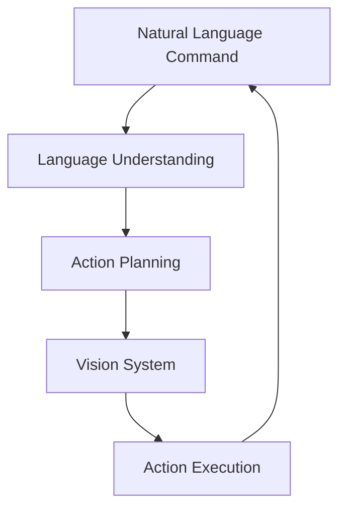

## Learning Objectives

- Implement language understanding for robotics
- Apply NLP techniques to humanoid robot interaction
- Integrate language with vision and action systems

## Introduction

Language understanding forms the Language component of the Vision-Language-Action (VLA) pipeline, which is central to our project's VLA Convergence Mandate principle. For humanoid robots operating in human-centered environments, language understanding systems must be capable of processing natural language commands, engaging in human-like interaction, and translating high-level linguistic goals into concrete robotic actions. This chapter explores natural language processing techniques specifically tailored for robotics applications, with special emphasis on humanoid robot interaction systems that must operate effectively in human environments using natural language as the primary control interface, as mandated by our constitution.

## Language Understanding in Robotics Context

### The VLA Pipeline Architecture

The Vision-Language-Action pipeline in humanoid robots operates as follows:



This creates a closed loop where language commands are interpreted, plans are generated, vision systems provide feedback, and actions are executed, with continuous monitoring and adjustment.

### Key Challenges in Robotic Language Understanding

#### Ambiguity Resolution
Natural language commands often contain ambiguities that must be resolved through context and perception:

- **Spatial references**: "Pick up the cup" - which cup?
- **Temporal references**: "Do it again" - what is "it"?
- **Pragmatic understanding**: "It's cold" - should the robot adjust temperature?

#### Situated Language Understanding
Robotic language understanding must be grounded in the physical environment:

- **Deixis**: Understanding "this", "that", "here", "there" in spatial context
- **Perceptual grounding**: Connecting words to visual objects and locations
- **Action grounding**: Connecting language to executable robot actions

#### Multi-Modal Integration
Language understanding in robotics must integrate with other modalities:

- **Visual context**: Understanding commands based on what the robot sees
- **Action context**: Understanding commands based on current robot state
- **Temporal context**: Understanding commands based on recent interactions

## Natural Language Processing for Robotics

### Command Parsing and Semantic Analysis

```python
import re
import spacy
from typing import List, Dict, Optional, Tuple
from dataclasses import dataclass
from enum import Enum

@dataclass
class RobotCommand:
    """Represents a parsed robot command with semantic meaning"""
    action: str
    target_object: Optional[str] = None
    target_location: Optional[str] = None
    attributes: Dict[str, str] = None
    confidence: float = 1.0

class Action(Enum):
    """Enumeration of supported robot actions"""
    MOVE = "move"
    GRASP = "grasp"
    PLACE = "place"
    GREET = "greet"
    FOLLOW = "follow"
    FIND = "find"
    REPORT = "report"
    WAIT = "wait"
    STOP = "stop"

class CommandParser:
    def __init__(self):
        """Initialize the command parser with spaCy model"""
        try:
            self.nlp = spacy.load("en_core_web_sm")
        except OSError:
            print("spaCy model not found. Install with: python -m spacy download en_core_web_sm")
            # Fallback to simple rule-based parsing
            self.nlp = None

        # Define action patterns for rule-based parsing
        self.action_patterns = {
            Action.GRASP: [
                r"pick up (.+)",
                r"grab (.+)",
                r"take (.+)",
                r"get (.+)",
                r"lift (.+)"
            ],
            Action.PLACE: [
                r"put (.+) (?:on|in|at) (.+)",
                r"place (.+) (?:on|in|at) (.+)",
                r"drop (.+) (?:on|in|at) (.+)",
                r"set (.+) (?:on|in|at) (.+)"
            ],
            Action.MOVE: [
                r"go to (.+)",
                r"move to (.+)",
                r"walk to (.+)",
                r"navigate to (.+)",
                r"approach (.+)"
            ],
            Action.FOLLOW: [
                r"follow (.+)",
                r"come after (.+)",
                r"accompany (.+)"
            ],
            Action.FIND: [
                r"find (.+)",
                r"locate (.+)",
                r"search for (.+)",
                r"look for (.+)"
            ],
            Action.GREET: [
                r"hello",
                r"hi",
                r"greet (.+)",
                r"say hello to (.+)"
            ],
            Action.REPORT: [
                r"what do you see",
                r"describe the room",
                r"report (.+)",
                r"tell me (.+)"
            ],
            Action.WAIT: [
                r"wait",
                r"stop",
                r"pause",
                r"hold on"
            ]
        }

    def parse_command(self, text: str) -> Optional[RobotCommand]:
        """
        Parse a natural language command into structured representation

        Args:
            text: Natural language command

        Returns:
            Parsed RobotCommand or None if parsing fails
        """
        text = text.strip().lower()

        if self.nlp:
            # Use spaCy for advanced parsing
            return self._parse_with_spacy(text)
        else:
            # Fallback to rule-based parsing
            return self._parse_with_rules(text)

    def _parse_with_spacy(self, text: str) -> Optional[RobotCommand]:
        """Parse command using spaCy NLP model"""
        doc = self.nlp(text)

        # Extract main action (verb)
        action = self._extract_action(doc)
        if not action:
            return None

        # Extract target object
        target_object = self._extract_target_object(doc)

        # Extract target location
        target_location = self._extract_target_location(doc)

        # Extract additional attributes
        attributes = self._extract_attributes(doc)

        return RobotCommand(
            action=action.value,
            target_object=target_object,
            target_location=target_location,
            attributes=attributes
        )

    def _extract_action(self, doc) -> Optional[Action]:
        """Extract the main action from parsed document"""
        # Look for root verb or main action
        for token in doc:
            if token.pos_ == "VERB":
                # Check if this verb corresponds to a known action
                verb_lemma = token.lemma_.lower()

                for action_enum in Action:
                    if verb_lemma in action_enum.value:
                        return action_enum

                # Check for variations
                if verb_lemma in ["take", "grasp", "seize", "catch"]:
                    return Action.GRASP
                elif verb_lemma in ["put", "place", "set", "drop"]:
                    return Action.PLACE
                elif verb_lemma in ["go", "move", "walk", "navigate", "approach"]:
                    return Action.MOVE
                elif verb_lemma in ["follow", "accompany", "chase"]:
                    return Action.FOLLOW
                elif verb_lemma in ["find", "locate", "search", "look"]:
                    return Action.FIND
                elif verb_lemma in ["greet", "hello", "hi", "wave"]:
                    return Action.GREET
                elif verb_lemma in ["report", "describe", "tell", "say"]:
                    return Action.REPORT
                elif verb_lemma in ["wait", "pause", "stop", "hold"]:
                    return Action.WAIT

        return None

    def _extract_target_object(self, doc) -> Optional[str]:
        """Extract target object from parsed document"""
        # Look for direct objects and noun phrases
        for token in doc:
            if token.dep_ == "dobj":  # Direct object
                # Get the full noun phrase
                return self._get_full_noun_phrase(token)

            # Look for objects after prepositions
            if token.pos_ == "NOUN" and token.head.dep_ in ["pobj", "pcomp"]:
                return self._get_full_noun_phrase(token)

        # If no direct object found, look for noun phrases
        for chunk in doc.noun_chunks:
            if chunk.root.pos_ == "NOUN":
                # Avoid pronouns and articles
                if chunk.text.lower() not in ["it", "this", "that", "the", "a", "an"]:
                    return chunk.text

        return None

    def _extract_target_location(self, doc) -> Optional[str]:
        """Extract target location from parsed document"""
        # Look for prepositional phrases indicating location
        for token in doc:
            if token.pos_ == "ADP" and token.text in ["to", "at", "on", "in", "by", "near"]:
                # Look for the object of the preposition
                for child in token.children:
                    if child.pos_ == "NOUN" or child.pos_ == "PROPN":
                        return self._get_full_noun_phrase(child)

        # Look for noun chunks that might be locations
        for chunk in doc.noun_chunks:
            # Check if this could be a location based on context
            if any(word in chunk.text.lower() for word in
                  ["table", "kitchen", "room", "door", "chair", "couch", "bed", "desk"]):
                return chunk.text

        return None

    def _extract_attributes(self, doc) -> Dict[str, str]:
        """Extract additional attributes like colors, sizes, etc."""
        attributes = {}

        for token in doc:
            if token.pos_ == "ADJ":  # Adjectives
                # Look for adjectives that modify nouns
                if token.head.pos_ in ["NOUN", "PROPN"]:
                    noun_phrase = self._get_full_noun_phrase(token.head)
                    attributes[f"adjective_{token.text}"] = noun_phrase

            elif token.pos_ == "NUM":  # Numbers
                # Look for numbers that might indicate quantities
                attributes[f"number_{token.text}"] = token.head.text

        return attributes

    def _get_full_noun_phrase(self, token) -> str:
        """Get the full noun phrase starting from a token"""
        # This is a simplified approach - spaCy has more sophisticated methods
        phrase = []

        # Add left-side modifiers (adjectives, determiners)
        for left_token in token.lefts:
            if left_token.pos_ in ["ADJ", "DET"]:
                phrase.append(left_token.text)

        # Add the main token
        phrase.append(token.text)

        # Add right-side modifiers if any
        for right_token in token.rights:
            if right_token.pos_ in ["NOUN", "PROPN"] and right_token.dep_ == "compound":
                phrase.append(right_token.text)

        return " ".join(phrase)

    def _parse_with_rules(self, text: str) -> Optional[RobotCommand]:
        """Parse command using rule-based patterns (fallback)"""
        for action, patterns in self.action_patterns.items():
            for pattern in patterns:
                match = re.search(pattern, text)
                if match:
                    groups = match.groups()

                    if action in [Action.PLACE] and len(groups) >= 2:
                        # Pattern: "put X on Y" - groups are [object, location]
                        return RobotCommand(
                            action=action.value,
                            target_object=groups[0],
                            target_location=groups[1]
                        )
                    elif len(groups) >= 1:
                        # Pattern with one main argument
                        return RobotCommand(
                            action=action.value,
                            target_object=groups[0] if len(groups) > 0 else None,
                            target_location=groups[1] if len(groups) > 1 else None
                        )
                    else:
                        # Pattern without arguments
                        return RobotCommand(action=action.value)

        # If no pattern matches, return None
        return None

class ContextualCommandResolver:
    def __init__(self, vision_system, robot_state):
        """
        Initialize resolver with access to vision and robot state

        Args:
            vision_system: Interface to robot's vision system
            robot_state: Interface to robot's current state
        """
        self.vision_system = vision_system
        self.robot_state = robot_state
        self.command_parser = CommandParser()
        self.conversation_context = []

    def resolve_command(self, text: str, world_state: Dict = None) -> Optional[RobotCommand]:
        """
        Resolve an ambiguous command using context and perception

        Args:
            text: Natural language command
            world_state: Current world state including objects and locations

        Returns:
            Resolved RobotCommand with specific references
        """
        # Parse the command first
        parsed_command = self.command_parser.parse_command(text)
        if not parsed_command:
            return None

        # Resolve ambiguous references using context
        resolved_command = self._resolve_ambiguous_references(parsed_command, world_state)

        # Add to conversation context
        self.conversation_context.append({
            'command': text,
            'parsed': parsed_command,
            'resolved': resolved_command,
            'timestamp': time.time()
        })

        # Keep only recent context (last 10 interactions)
        if len(self.conversation_context) > 10:
            self.conversation_context = self.conversation_context[-10:]

        return resolved_command

    def _resolve_ambiguous_references(self, command: RobotCommand, world_state: Dict) -> RobotCommand:
        """Resolve ambiguous references like 'it', 'there', etc. using context"""
        resolved = RobotCommand(
            action=command.action,
            target_object=command.target_object,
            target_location=command.target_location,
            attributes=command.attributes or {}
        )

        # Resolve pronouns and demonstratives
        if resolved.target_object and resolved.target_object.lower() in ["it", "that", "this"]:
            # Use vision system to identify the most likely referent
            resolved.target_object = self._resolve_pronoun_reference(
                resolved.target_object, world_state
            )

        if resolved.target_location and resolved.target_location.lower() in ["there", "here", "that place"]:
            # Use robot state and world state to resolve location
            resolved.target_location = self._resolve_location_reference(
                resolved.target_location, world_state
            )

        return resolved

    def _resolve_pronoun_reference(self, pronoun: str, world_state: Dict) -> Optional[str]:
        """Resolve pronoun references using visual context"""
        if not world_state or 'visible_objects' not in world_state:
            return None

        visible_objects = world_state['visible_objects']

        if pronoun.lower() == "it":
            # Use the most recently mentioned or most salient object
            if len(visible_objects) == 1:
                return visible_objects[0]['name']
            else:
                # For now, return the first object - in practice, use more sophisticated resolution
                return visible_objects[0]['name'] if visible_objects else None
        elif pronoun.lower() in ["this", "that"]:
            # Use spatial context or the closest object
            closest_object = self._find_closest_object(visible_objects)
            return closest_object['name'] if closest_object else None

        return None

    def _resolve_location_reference(self, location_ref: str, world_state: Dict) -> Optional[str]:
        """Resolve location references like 'here', 'there'"""
        if not world_state:
            return None

        current_location = world_state.get('robot_location', 'unknown')

        if location_ref.lower() == "here":
            return current_location
        elif location_ref.lower() == "there":
            # Use the most recently mentioned location from context
            for entry in reversed(self.conversation_context):
                if entry['resolved'].target_location:
                    return entry['resolved'].target_location

        return None

    def _find_closest_object(self, objects: List[Dict]) -> Optional[Dict]:
        """Find the closest object based on spatial information"""
        # This would use actual spatial relationships
        # For now, return the first object
        return objects[0] if objects else None
```

### Intent Recognition and Dialogue Management

```python
import json
import time
from typing import List, Dict, Any
from collections import defaultdict

class IntentRecognizer:
    def __init__(self):
        """Initialize intent recognition system"""
        self.intents = self._load_intent_definitions()
        self.context_manager = ContextManager()

    def _load_intent_definitions(self) -> Dict:
        """Load intent definitions with patterns and required entities"""
        return {
            "navigation": {
                "patterns": [
                    r"go to (.+)",
                    r"move to (.+)",
                    r"walk to (.+)",
                    r"navigate to (.+)",
                    r"approach (.+)"
                ],
                "required_entities": ["location"],
                "optional_entities": ["speed", "caution_level"]
            },
            "object_manipulation": {
                "patterns": [
                    r"pick up (.+)",
                    r"grab (.+)",
                    r"take (.+)",
                    r"get (.+) and put it (?:on|in) (.+)",
                    r"move (.+) from (.+) to (.+)"
                ],
                "required_entities": ["object"],
                "optional_entities": ["source_location", "target_location"]
            },
            "social_interaction": {
                "patterns": [
                    r"hello",
                    r"hi",
                    r"greet (.+)",
                    r"introduce yourself",
                    r"what's your name"
                ],
                "required_entities": [],
                "optional_entities": ["person"]
            },
            "information_request": {
                "patterns": [
                    r"what can you do",
                    r"help",
                    r"what's possible",
                    r"capabilities"
                ],
                "required_entities": [],
                "optional_entities": []
            },
            "status_inquiry": {
                "patterns": [
                    r"what do you see",
                    r"describe (.+)",
                    r"report (.+)",
                    r"tell me about (.+)"
                ],
                "required_entities": [],
                "optional_entities": ["target"]
            }
        }

    def recognize_intent(self, text: str) -> Dict[str, Any]:
        """
        Recognize intent and extract entities from text

        Args:
            text: Input text to analyze

        Returns:
            Dictionary with intent, confidence, and extracted entities
        """
        text_lower = text.lower().strip()

        for intent_name, intent_def in self.intents.items():
            for pattern in intent_def["patterns"]:
                match = re.search(pattern, text_lower)
                if match:
                    entities = {
                        f"entity_{i}": entity
                        for i, entity in enumerate(match.groups())
                    }

                    # Validate required entities are present
                    required_count = len(intent_def["required_entities"])
                    if len(entities) >= required_count:
                        return {
                            "intent": intent_name,
                            "confidence": 0.9,  # High confidence for pattern matches
                            "entities": entities,
                            "original_text": text
                        }

        # If no pattern matches, use default intent
        return {
            "intent": "unknown",
            "confidence": 0.0,
            "entities": {},
            "original_text": text
        }

    def process_command_with_context(self, text: str, context: Dict = None) -> Dict[str, Any]:
        """
        Process command considering conversation context

        Args:
            text: Input command text
            context: Current conversation context

        Returns:
            Processed command with context resolution
        """
        # Recognize intent and entities
        result = self.recognize_intent(text)

        # Resolve context-dependent references
        if context:
            result["entities"] = self._resolve_context_references(
                result["entities"], context
            )

        # Update context
        if context is not None:
            context["last_command"] = result
            context["command_history"].append(result)

        return result

    def _resolve_context_references(self, entities: Dict, context: Dict) -> Dict:
        """Resolve entities that depend on conversation context"""
        resolved_entities = entities.copy()

        # Resolve pronouns and demonstratives based on context
        for key, value in resolved_entities.items():
            if value.lower() in ["it", "this", "that"]:
                # Resolve based on previous context
                previous_entities = self._get_recent_entities(context)
                if previous_entities:
                    # For "it", use the most recent object
                    if value.lower() == "it":
                        for prev_entity_key, prev_value in previous_entities.items():
                            if "object" in prev_entity_key or "location" in prev_entity_key:
                                resolved_entities[key] = prev_value
                                break

        return resolved_entities

    def _get_recent_entities(self, context: Dict) -> Dict:
        """Get entities from recent conversation"""
        if "command_history" not in context:
            return {}

        recent_commands = context["command_history"][-3:]  # Last 3 commands
        recent_entities = {}

        for cmd in recent_commands:
            if "entities" in cmd:
                recent_entities.update(cmd["entities"])

        return recent_entities

class ContextManager:
    def __init__(self):
        """Initialize conversation context manager"""
        self.conversation_history = []
        self.object_references = {}
        self.location_references = {}
        self.user_preferences = defaultdict(lambda: None)

    def update_context(self, command_result: Dict):
        """Update context with new command result"""
        self.conversation_history.append(command_result)

        # Update object and location references if present
        entities = command_result.get("entities", {})
        for key, value in entities.items():
            if "object" in key.lower():
                self.object_references[value] = len(self.conversation_history) - 1
            elif "location" in key.lower():
                self.location_references[value] = len(self.conversation_history) - 1

        # Keep only recent history
        if len(self.conversation_history) > 20:
            self.conversation_history = self.conversation_history[-20:]

    def get_context(self) -> Dict:
        """Get current context for command processing"""
        return {
            "conversation_history": self.conversation_history[-10:],  # Last 10 exchanges
            "object_references": dict(self.object_references),
            "location_references": dict(self.location_references),
            "user_preferences": dict(self.user_preferences),
            "current_time": time.time()
        }

class DialogueManager:
    def __init__(self):
        """Initialize dialogue management system"""
        self.intent_recognizer = IntentRecognizer()
        self.response_generator = ResponseGenerator()
        self.context_manager = ContextManager()

    def process_input(self, user_input: str, world_state: Dict = None) -> Dict:
        """
        Process user input and generate appropriate response

        Args:
            user_input: Natural language input from user
            world_state: Current state of the world (objects, locations, etc.)

        Returns:
            Dictionary with action to take and response to give
        """
        # Get current context
        context = self.context_manager.get_context()

        # Recognize intent with context
        intent_result = self.intent_recognizer.process_command_with_context(
            user_input, context
        )

        # Generate appropriate response based on intent
        response = self.response_generator.generate_response(
            intent_result, world_state, context
        )

        # Update context
        self.context_manager.update_context({
            "input": user_input,
            "intent_result": intent_result,
            "response": response
        })

        return {
            "intent": intent_result["intent"],
            "entities": intent_result["entities"],
            "action": response.get("action"),
            "response_text": response.get("response_text"),
            "confidence": intent_result["confidence"]
        }

class ResponseGenerator:
    def __init__(self):
        """Initialize response generation system"""
        self.response_templates = self._load_response_templates()

    def _load_response_templates(self) -> Dict:
        """Load response templates for different intents"""
        return {
            "navigation": [
                "I will navigate to {location}.",
                "Moving toward {location} now.",
                "Heading to {location}."
            ],
            "object_manipulation": [
                "I will {action} the {object}.",
                "Attempting to {action} the {object}.",
                "Processing manipulation of {object}."
            ],
            "social_interaction": [
                "Hello! How can I assist you?",
                "Greetings! What would you like me to do?",
                "Hi there! How may I help you?"
            ],
            "information_request": [
                "I can help with navigation, object manipulation, and social interaction.",
                "My capabilities include moving around, picking up objects, and talking with you.",
                "I can navigate spaces, manipulate objects, and engage in conversation."
            ],
            "status_inquiry": [
                "I see {objects_count} objects in view.",
                "The room contains {objects_list}.",
                "I can see: {objects_list}."
            ],
            "unknown": [
                "I'm not sure I understand. Could you rephrase that?",
                "I didn't catch that. Can you say it differently?",
                "I'm not sure what you mean. Could you be more specific?"
            ]
        }

    def generate_response(self, intent_result: Dict, world_state: Dict, context: Dict) -> Dict:
        """Generate appropriate response based on intent and world state"""
        intent = intent_result["intent"]
        entities = intent_result["entities"]

        # Select template based on intent
        templates = self.response_templates.get(intent, self.response_templates["unknown"])
        template = templates[0] if templates else "I understand."

        # Fill in template with entities
        response_text = template
        for entity_key, entity_value in entities.items():
            placeholder = "{" + entity_key.replace("entity_", "") + "}"
            response_text = response_text.replace(placeholder, str(entity_value))

        # Special handling for status inquiries
        if intent == "status_inquiry" and world_state:
            if "visible_objects" in world_state:
                objects = [obj.get("name", "unknown object") for obj in world_state["visible_objects"]]
                response_text = response_text.replace("{objects_count}", str(len(objects)))
                response_text = response_text.replace("{objects_list}", ", ".join(objects))

        # Determine action based on intent
        action = self._map_intent_to_action(intent, entities, world_state)

        return {
            "response_text": response_text,
            "action": action,
            "requires_clarification": self._needs_clarification(intent, entities, world_state)
        }

    def _map_intent_to_action(self, intent: str, entities: Dict, world_state: Dict) -> Dict:
        """Map intent to specific robot action"""
        if intent == "navigation":
            return {
                "type": "navigate",
                "target_location": entities.get("entity_0", "unknown")
            }
        elif intent == "object_manipulation":
            action = entities.get("entity_0", "unknown")
            target_object = entities.get("entity_1", "unknown")
            return {
                "type": "manipulate",
                "action": action,
                "target_object": target_object
            }
        elif intent == "social_interaction":
            return {
                "type": "social",
                "action": "greet"
            }
        elif intent == "information_request":
            return {
                "type": "report",
                "action": "capabilities"
            }
        elif intent == "status_inquiry":
            return {
                "type": "report",
                "action": "environment_status"
            }
        else:
            return {
                "type": "unknown",
                "action": "awaiting_clarification"
            }

    def _needs_clarification(self, intent: str, entities: Dict, world_state: Dict) -> bool:
        """Determine if the command needs clarification"""
        if intent == "unknown":
            return True

        # Check if required entities are missing
        if intent == "object_manipulation" and not entities:
            return True

        # Check if references are ambiguous
        if world_state and "visible_objects" in world_state:
            visible_objects = world_state["visible_objects"]
            for entity_key, entity_value in entities.items():
                if entity_value.lower() in ["it", "that", "this"] and len(visible_objects) > 1:
                    return True

        return False
```

## Integration with Vision and Action Systems

### Vision-Language Integration

```python
import numpy as np
from typing import List, Dict, Tuple, Optional
from dataclasses import dataclass

@dataclass
class VisualObject:
    """Represents a detected object with visual and linguistic properties"""
    id: str
    name: str
    bbox: Tuple[int, int, int, int]  # (x, y, width, height)
    confidence: float
    position_3d: Optional[Tuple[float, float, float]] = None
    properties: Dict[str, Any] = None

class VisionLanguageIntegrator:
    def __init__(self, vision_system, language_system):
        """
        Integrate vision and language systems

        Args:
            vision_system: Interface to computer vision system
            language_system: Interface to language understanding system
        """
        self.vision_system = vision_system
        self.language_system = language_system
        self.object_grounding = ObjectGroundingSystem()

    def process_vision_language_task(self, command_text: str) -> Dict:
        """
        Process a task that requires both vision and language understanding

        Args:
            command_text: Natural language command

        Returns:
            Dictionary with processed results
        """
        # Parse the language command
        parsed_command = self.language_system.resolve_command(
            command_text,
            world_state=self.get_current_world_state()
        )

        if not parsed_command:
            return {"success": False, "error": "Could not parse command"}

        # Use vision to identify relevant objects
        vision_results = self.vision_system.get_current_scene_description()

        # Ground linguistic references to visual objects
        grounded_command = self.object_grounding.ground_command_to_objects(
            parsed_command, vision_results
        )

        # Plan the action based on grounded command
        action_plan = self._create_action_plan(grounded_command, vision_results)

        return {
            "success": True,
            "parsed_command": parsed_command,
            "vision_results": vision_results,
            "grounded_command": grounded_command,
            "action_plan": action_plan
        }

    def get_current_world_state(self) -> Dict:
        """Get current world state including visible objects and locations"""
        # Get results from vision system
        vision_results = self.vision_system.get_current_scene_description()

        world_state = {
            "timestamp": time.time(),
            "visible_objects": [],
            "robot_location": self.vision_system.get_robot_position(),
            "traversable_areas": self.vision_system.get_traversable_map()
        }

        # Convert vision results to standardized format
        for obj in vision_results.get("objects", []):
            visual_obj = VisualObject(
                id=obj.get("id", f"obj_{len(world_state['visible_objects'])}"),
                name=obj.get("class", "unknown"),
                bbox=obj.get("bbox", (0, 0, 0, 0)),
                confidence=obj.get("confidence", 0.0),
                position_3d=obj.get("position_3d"),
                properties=obj.get("properties", {})
            )
            world_state["visible_objects"].append(visual_obj)

        return world_state

    def _create_action_plan(self, grounded_command: RobotCommand, vision_results: Dict) -> List[Dict]:
        """Create an action plan based on grounded command and vision results"""
        action_plan = []

        if grounded_command.action == Action.GRASP.value:
            # Find the target object
            target_obj = self._find_object_by_name(
                grounded_command.target_object,
                vision_results.get("objects", [])
            )

            if target_obj:
                action_plan.extend([
                    {
                        "action": "navigate",
                        "target": target_obj["position_3d"],
                        "description": f"Navigate to {target_obj['name']}"
                    },
                    {
                        "action": "grasp",
                        "target": target_obj,
                        "description": f"Grasp {target_obj['name']}"
                    }
                ])
            else:
                action_plan.append({
                    "action": "report",
                    "target": f"Could not find {grounded_command.target_object}",
                    "description": "Report failure to find object"
                })

        elif grounded_command.action == Action.MOVE.value:
            # Navigate to target location
            action_plan.append({
                "action": "navigate",
                "target": grounded_command.target_location,
                "description": f"Navigate to {grounded_command.target_location}"
            })

        elif grounded_command.action == Action.PLACE.value:
            # This would involve both object and location
            target_obj = self._find_object_by_name(
                grounded_command.target_object,
                vision_results.get("objects", [])
            )
            target_location = self._find_location_by_name(
                grounded_command.target_location,
                vision_results.get("locations", [])
            )

            if target_obj and target_location:
                action_plan.extend([
                    {
                        "action": "grasp",
                        "target": target_obj,
                        "description": f"Grasp {target_obj['name']}"
                    },
                    {
                        "action": "navigate",
                        "target": target_location["position"],
                        "description": f"Navigate to {target_location['name']}"
                    },
                    {
                        "action": "place",
                        "target": target_location,
                        "description": f"Place object at {target_location['name']}"
                    }
                ])

        return action_plan

    def _find_object_by_name(self, name: str, objects: List[Dict]) -> Optional[Dict]:
        """Find an object by name from a list of detected objects"""
        for obj in objects:
            if obj.get("name", "").lower() == name.lower():
                return obj
            # Also check class names and aliases
            if obj.get("class", "").lower() == name.lower():
                return obj
            if obj.get("id", "").lower() == name.lower():
                return obj

        # If exact match not found, try partial matching
        for obj in objects:
            if name.lower() in obj.get("name", "").lower():
                return obj
            if name.lower() in obj.get("class", "").lower():
                return obj

        return None

    def _find_location_by_name(self, name: str, locations: List[Dict]) -> Optional[Dict]:
        """Find a location by name from a list of known locations"""
        for loc in locations:
            if loc.get("name", "").lower() == name.lower():
                return loc

        return None

class ObjectGroundingSystem:
    def __init__(self):
        """Initialize system for grounding linguistic references to visual objects"""
        self.similarity_threshold = 0.7

    def ground_command_to_objects(self, command: RobotCommand, vision_results: Dict) -> RobotCommand:
        """
        Ground linguistic object references to actual visual objects

        Args:
            command: Parsed command with potentially ambiguous object references
            vision_results: Current visual scene description

        Returns:
            Command with grounded object references
        """
        grounded_command = RobotCommand(
            action=command.action,
            target_object=command.target_object,
            target_location=command.target_location,
            attributes=command.attributes,
            confidence=command.confidence
        )

        # Ground target object if specified
        if command.target_object:
            grounded_obj = self._ground_object_reference(
                command.target_object,
                vision_results.get("objects", [])
            )
            if grounded_obj:
                grounded_command.target_object = grounded_obj

        # Ground target location if specified
        if command.target_location:
            grounded_loc = self._ground_location_reference(
                command.target_location,
                vision_results.get("locations", [])
            )
            if grounded_loc:
                grounded_command.target_location = grounded_loc

        return grounded_command

    def _ground_object_reference(self, reference: str, objects: List[Dict]) -> Optional[str]:
        """Ground a linguistic object reference to a visual object"""
        # Try exact name matching first
        for obj in objects:
            if obj.get("name", "").lower() == reference.lower():
                return obj.get("name")

        # Try class matching
        for obj in objects:
            if obj.get("class", "").lower() == reference.lower():
                return obj.get("name")

        # Try attribute-based matching
        for obj in objects:
            obj_attributes = obj.get("attributes", {})
            if self._match_attributes(reference, obj_attributes):
                return obj.get("name")

        # If no exact match, try similarity-based matching
        best_match = self._find_best_similarity_match(reference, objects)
        if best_match and best_match[1] > self.similarity_threshold:
            return best_match[0]

        return None

    def _match_attributes(self, reference: str, obj_attributes: Dict) -> bool:
        """Check if object attributes match the reference"""
        # This would implement more sophisticated attribute matching
        # For now, a simple approach
        reference_lower = reference.lower()

        for attr_key, attr_value in obj_attributes.items():
            if reference_lower in str(attr_value).lower():
                return True
            if reference_lower in attr_key.lower():
                return True

        return False

    def _find_best_similarity_match(self, reference: str, objects: List[Dict]) -> Optional[Tuple[str, float]]:
        """Find the object with the best similarity to the reference"""
        best_match = (None, 0.0)

        for obj in objects:
            name = obj.get("name", "")
            obj_class = obj.get("class", "")

            # Calculate similarity scores
            name_similarity = self._calculate_string_similarity(reference, name)
            class_similarity = self._calculate_string_similarity(reference, obj_class)

            max_similarity = max(name_similarity, class_similarity)

            if max_similarity > best_match[1]:
                best_match = (obj.get("name", obj.get("id", "unknown")), max_similarity)

        return best_match if best_match[1] > 0 else None

    def _calculate_string_similarity(self, str1: str, str2: str) -> float:
        """Calculate similarity between two strings (simplified)"""
        if not str1 or not str2:
            return 0.0

        # Convert to lowercase for comparison
        str1, str2 = str1.lower(), str2.lower()

        # Simple token-based similarity
        tokens1 = set(str1.split())
        tokens2 = set(str2.split())

        if not tokens1 and not tokens2:
            return 1.0
        if not tokens1 or not tokens2:
            return 0.0

        # Calculate Jaccard similarity
        intersection = tokens1.intersection(tokens2)
        union = tokens1.union(tokens2)
        jaccard = len(intersection) / len(union)

        return jaccard

    def _ground_location_reference(self, reference: str, locations: List[Dict]) -> Optional[str]:
        """Ground a linguistic location reference to a visual location"""
        for loc in locations:
            if loc.get("name", "").lower() == reference.lower():
                return loc.get("name")

        # Try partial matching
        for loc in locations:
            if reference.lower() in loc.get("name", "").lower():
                return loc.get("name")

        return None
```

## Speech Processing and Natural Interaction

### Speech-to-Text Integration

```python
import speech_recognition as sr
import pyaudio
from typing import Optional, Callable
import threading

class SpeechInterface:
    def __init__(self, language: str = "en-US"):
        """
        Initialize speech interface for humanoid robot

        Args:
            language: Language code for speech recognition
        """
        self.recognizer = sr.Recognizer()
        self.microphone = sr.Microphone()
        self.language = language

        # Adjust for ambient noise
        with self.microphone as source:
            self.recognizer.adjust_for_ambient_noise(source)

        # Callbacks
        self.command_callback: Optional[Callable] = None
        self.listening_callback: Optional[Callable] = None

    def listen_once(self) -> Optional[str]:
        """
        Listen for a single command and return the recognized text

        Returns:
            Recognized text or None if recognition failed
        """
        try:
            with self.microphone as source:
                if self.listening_callback:
                    self.listening_callback(True)

                print("Listening...")
                audio = self.recognizer.listen(source, timeout=5, phrase_time_limit=10)

            # Use Google's speech recognition
            text = self.recognizer.recognize_google(audio, language=self.language)
            print(f"Recognized: {text}")
            return text

        except sr.WaitTimeoutError:
            print("Timeout: No speech detected")
            return None
        except sr.UnknownValueError:
            print("Could not understand audio")
            return None
        except sr.RequestError as e:
            print(f"Could not request results; {e}")
            return None
        finally:
            if self.listening_callback:
                self.listening_callback(False)

    def start_continuous_listening(self):
        """Start continuous listening in a separate thread"""
        self.listening_thread = threading.Thread(target=self._continuous_listening_loop)
        self.listening_thread.daemon = True
        self.listening_thread.start()

    def _continuous_listening_loop(self):
        """Main loop for continuous speech recognition"""
        with self.microphone as source:
            while True:
                try:
                    print("Waiting for command...")
                    if self.listening_callback:
                        self.listening_callback(True)

                    # Listen for audio
                    audio = self.recognizer.listen(source, timeout=10, phrase_time_limit=10)

                    # Recognize speech
                    text = self.recognizer.recognize_google(audio, language=self.language)
                    print(f"Recognized: {text}")

                    # Call command callback if available
                    if self.command_callback:
                        self.command_callback(text)

                except sr.WaitTimeoutError:
                    # Continue waiting for speech
                    continue
                except sr.UnknownValueError:
                    # Could not understand, continue listening
                    continue
                except sr.RequestError as e:
                    print(f"Recognition error: {e}")
                    continue
                finally:
                    if self.listening_callback:
                        self.listening_callback(False)

    def set_command_callback(self, callback: Callable[[str], None]):
        """Set callback for when a command is recognized"""
        self.command_callback = callback

    def set_listening_callback(self, callback: Callable[[bool], None]):
        """Set callback for when listening state changes"""
        self.listening_callback = callback

class TextToSpeech:
    def __init__(self):
        """Initialize text-to-speech system"""
        try:
            from gtts import gTTS
            import pygame
            self.gTTS = gTTS
            self.pygame = pygame
            self.pygame.mixer.init()
            self.use_gtts = True
        except ImportError:
            # Fallback to espeak if gtts not available
            self.use_gtts = False
            print("gTTS not available, using fallback TTS")

    def speak(self, text: str, language: str = "en"):
        """
        Convert text to speech and play it

        Args:
            text: Text to convert to speech
            language: Language code
        """
        if self.use_gtts:
            try:
                # Create speech
                tts = self.gTTS(text=text, lang=language, slow=False)

                # Save to temporary file and play
                import io
                fp = io.BytesIO()
                tts.write_to_fp(fp)
                fp.seek(0)

                # Play the audio
                self.pygame.mixer.music.load(fp)
                self.pygame.mixer.music.play()

                # Wait for playback to finish
                while self.pygame.mixer.music.get_busy():
                    continue

            except Exception as e:
                print(f"TTS error: {e}")
        else:
            # Fallback: print text to console
            print(f"[TTS]: {text}")

class HumanoidInteractionManager:
    def __init__(self, vision_system, language_system, action_system):
        """
        Manage the complete interaction pipeline for humanoid robot

        Args:
            vision_system: Vision processing system
            language_system: Language understanding system
            action_system: Action execution system
        """
        self.vision_system = vision_system
        self.language_system = language_system
        self.action_system = action_system

        # Initialize speech interface
        self.speech_interface = SpeechInterface()
        self.text_to_speech = TextToSpeech()

        # Initialize dialogue manager
        self.dialogue_manager = DialogueManager()

        # Initialize vision-language integrator
        self.vision_language_integrator = VisionLanguageIntegrator(
            vision_system, language_system
        )

    def setup_interaction_callbacks(self):
        """Set up callbacks for continuous interaction"""
        def command_callback(text: str):
            self.process_spoken_command(text)

        def listening_callback(listening: bool):
            # Update robot's listening state for visual feedback
            self.action_system.set_listening_state(listening)

        self.speech_interface.set_command_callback(command_callback)
        self.speech_interface.set_listening_callback(listening_callback)

    def process_spoken_command(self, command_text: str):
        """
        Process a command received through speech

        Args:
            command_text: Natural language command from speech recognition
        """
        try:
            # Get current world state
            world_state = self.vision_language_integrator.get_current_world_state()

            # Process through dialogue manager
            response = self.dialogue_manager.process_input(command_text, world_state)

            # Generate verbal response
            response_text = response.get("response_text", "I understand.")
            self.text_to_speech.speak(response_text)

            # Execute action if specified
            action = response.get("action")
            if action:
                self._execute_action(action, world_state)

        except Exception as e:
            error_response = "I encountered an error processing your command."
            self.text_to_speech.speak(error_response)
            print(f"Error processing command: {e}")

    def _execute_action(self, action: Dict, world_state: Dict):
        """Execute the specified action"""
        action_type = action.get("type")
        target = action.get("target")

        if action_type == "navigate":
            self.action_system.navigate_to(target)
        elif action_type == "manipulate":
            self.action_system.manipulate_object(target)
        elif action_type == "social":
            self.action_system.perform_social_action(target)
        elif action_type == "report":
            info = self._generate_report(action.get("action"), world_state)
            self.text_to_speech.speak(info)
        else:
            self.text_to_speech.speak("I'm not sure how to perform that action.")

    def _generate_report(self, report_type: str, world_state: Dict) -> str:
        """Generate a verbal report based on world state"""
        if report_type == "environment_status":
            objects = world_state.get("visible_objects", [])
            count = len(objects)
            if count == 0:
                return "I don't see any objects around me."
            elif count == 1:
                return f"I see one object: {objects[0].name}."
            else:
                obj_names = [obj.name for obj in objects[:3]]  # Limit to first 3
                if count <= 3:
                    return f"I see {count} objects: {', '.join(obj_names)}."
                else:
                    return f"I see {count} objects including: {', '.join(obj_names)}."
        elif report_type == "capabilities":
            return "I can navigate spaces, manipulate objects, recognize people, and engage in conversation."
        else:
            return "I can provide information about my environment and capabilities."

    def start_interaction_loop(self):
        """Start the complete interaction loop"""
        print("Starting humanoid interaction system...")

        # Set up callbacks
        self.setup_interaction_callbacks()

        # Start continuous listening
        self.speech_interface.start_continuous_listening()

        print("Interaction system ready. Listening for commands...")

    def process_text_command(self, command_text: str) -> Dict:
        """
        Process a command provided as text (for testing/debugging)

        Args:
            command_text: Natural language command as text

        Returns:
            Dictionary with processing results
        """
        # Get current world state
        world_state = self.vision_language_integrator.get_current_world_state()

        # Process through dialogue manager
        response = self.dialogue_manager.process_input(command_text, world_state)

        # Generate verbal response
        response_text = response.get("response_text", "I understand.")
        self.text_to_speech.speak(response_text)

        # Execute action if specified
        action = response.get("action")
        if action:
            self._execute_action(action, world_state)

        return response
```

## Constitution Alignment

This chapter addresses several constitutional requirements:

### VLA Convergence Mandate (Principle I)
- Language understanding as the primary control interface for humanoid robots
- Integration of language with vision and action systems
- Natural language processing for human-like interaction

### Real-Time Validation (Principle IV)
- Efficient processing for real-time interaction
- Response time considerations for human-robot dialogue
- Performance optimization for embedded systems

### Anthropomorphic Focus (Principle II)
- Natural language interaction patterns similar to human communication
- Social interaction capabilities for human-centered environments
- Context-aware understanding of human commands

### Target Hardware Optimization (Constraint)
- Efficient NLP algorithms suitable for Jetson Orin deployment
- Optimized processing pipelines for embedded systems
- Memory-efficient language models where applicable

## Practical Examples

### Example 1: Humanoid Assistant Dialogue System

```python
class HumanoidAssistant:
    def __init__(self):
        """Initialize a humanoid assistant with complete VLA capabilities"""
        # Initialize systems (these would be properly connected in real implementation)
        self.vision_system = MockVisionSystem()  # Placeholder
        self.language_system = ContextualCommandResolver(None, None)
        self.action_system = MockActionSystem()  # Placeholder

        # Initialize interaction manager
        self.interaction_manager = HumanoidInteractionManager(
            self.vision_system,
            self.language_system,
            self.action_system
        )

    def demonstrate_interaction(self):
        """Demonstrate various interaction scenarios"""

        # Scenario 1: Simple navigation
        print("=== Scenario 1: Navigation ===")
        response = self.interaction_manager.process_text_command("Please go to the kitchen")
        print(f"Response: {response}")

        # Scenario 2: Object manipulation
        print("\n=== Scenario 2: Object Manipulation ===")
        response = self.interaction_manager.process_text_command("Pick up the red cup and put it on the table")
        print(f"Response: {response}")

        # Scenario 3: Context-dependent reference
        print("\n=== Scenario 3: Context-Dependent Reference ===")
        response1 = self.interaction_manager.process_text_command("Find the book")
        print(f"Response 1: {response1}")
        response2 = self.interaction_manager.process_text_command("Now put it on the shelf")
        print(f"Response 2: {response2}")

        # Scenario 4: Social interaction
        print("\n=== Scenario 4: Social Interaction ===")
        response = self.interaction_manager.process_text_command("Hello, how are you?")
        print(f"Response: {response}")

class MockVisionSystem:
    """Mock vision system for demonstration purposes"""
    def get_current_scene_description(self):
        return {
            "objects": [
                {"id": "obj1", "name": "red cup", "class": "cup", "bbox": [100, 100, 50, 50]},
                {"id": "obj2", "name": "book", "class": "book", "bbox": [200, 150, 80, 100]},
                {"id": "obj3", "name": "table", "class": "table", "bbox": [0, 300, 400, 200]}
            ],
            "locations": [
                {"name": "kitchen", "position": [2.0, 1.0, 0.0]},
                {"name": "living room", "position": [0.0, 0.0, 0.0]},
                {"name": "shelf", "position": [1.5, 0.5, 0.0]}
            ]
        }

    def get_robot_position(self):
        return [0.0, 0.0, 0.0]

    def get_traversable_map(self):
        return np.ones((10, 10))

class MockActionSystem:
    """Mock action system for demonstration purposes"""
    def navigate_to(self, target):
        print(f"Navigating to: {target}")

    def manipulate_object(self, target):
        print(f"Manipulating: {target}")

    def perform_social_action(self, target):
        print(f"Performing social action: {target}")

    def set_listening_state(self, listening):
        print(f"Listening state: {listening}")
```

### Example 2: Multi-Turn Dialogue Management

```python
class MultiTurnDialogueManager:
    def __init__(self):
        self.context = {
            "current_task": None,
            "task_objects": [],
            "task_locations": [],
            "conversation_history": [],
            "user_preferences": {}
        }
        self.language_understanding = IntentRecognizer()
        self.response_generator = ResponseGenerator()

    def process_multi_turn_dialogue(self, user_input: str, current_world_state: Dict) -> Dict:
        """
        Process multi-turn dialogue with context maintenance
        """
        # Update conversation history
        self.context["conversation_history"].append({
            "speaker": "user",
            "text": user_input,
            "timestamp": time.time()
        })

        # Process the input
        intent_result = self.language_understanding.process_command_with_context(
            user_input, self.context
        )

        # Handle task-specific contexts
        task_response = self._handle_task_context(intent_result, current_world_state)

        # Generate natural response
        response = self.response_generator.generate_response(
            intent_result, current_world_state, self.context
        )

        # Update context
        self.context["conversation_history"].append({
            "speaker": "robot",
            "text": response["response_text"],
            "timestamp": time.time(),
            "intent": intent_result["intent"]
        })

        return {
            "response": response["response_text"],
            "intent": intent_result["intent"],
            "task_continuation": task_response,
            "context_updated": True
        }

    def _handle_task_context(self, intent_result: Dict, world_state: Dict) -> Optional[Dict]:
        """Handle context for ongoing tasks"""
        current_task = self.context.get("current_task")

        if current_task:
            # If we're in the middle of a task, check if the user input is related
            if intent_result["intent"] == "confirmation":
                return self._handle_confirmation(current_task, intent_result)
            elif intent_result["intent"] == "correction":
                return self._handle_correction(current_task, intent_result)
            elif intent_result["intent"] == "abandon_task":
                self.context["current_task"] = None
                return {"action": "task_abandoned", "message": "Task abandoned as requested."}

        # If this is a new task, set it as current
        if intent_result["intent"] in ["object_manipulation", "navigation"]:
            self.context["current_task"] = {
                "intent": intent_result["intent"],
                "entities": intent_result["entities"],
                "start_time": time.time()
            }

        return None

    def _handle_confirmation(self, current_task: Dict, intent_result: Dict) -> Dict:
        """Handle user confirmation of robot's interpretation"""
        if current_task:
            return {
                "action": "task_confirmed",
                "message": f"Proceeding with {current_task['intent']} task.",
                "task": current_task
            }
        return {"action": "no_task_to_confirm", "message": "No current task to confirm."}

    def _handle_correction(self, current_task: Dict, intent_result: Dict) -> Dict:
        """Handle user corrections to robot's interpretation"""
        # Extract correction information
        correction_entities = intent_result.get("entities", {})

        # Update current task with corrections
        if "target_object" in correction_entities:
            current_task["entities"]["target_object"] = correction_entities["target_object"]

        if "target_location" in correction_entities:
            current_task["entities"]["target_location"] = correction_entities["target_location"]

        return {
            "action": "task_corrected",
            "message": f"Task updated based on your correction.",
            "task": current_task
        }
```

## Exercises

### Exercise 1: Language Understanding Pipeline
Implement a complete language understanding pipeline that:
- Parses natural language commands into structured representations
- Resolves ambiguous references using visual context
- Integrates with vision and action systems
- Handles multi-turn dialogue with context maintenance

### Exercise 2: Context-Aware Resolution
Create a system that resolves linguistic references by:
- Identifying pronouns and demonstratives in commands
- Using visual input to ground ambiguous references
- Maintaining conversation context across turns
- Handling corrections and clarifications naturally

### Exercise 3: Real-Time Interaction
Develop a real-time interaction system that:
- Processes speech input continuously
- Responds to commands within 2-3 seconds
- Provides appropriate verbal feedback
- Integrates seamlessly with vision and action systems

## Summary

Language understanding in robotics, particularly for humanoid robots, requires specialized approaches that go beyond traditional NLP. The Vision-Language-Action pipeline demands that language be grounded in the physical environment, with real-time processing capabilities and natural interaction patterns. For humanoid robots operating in human-centered environments, language systems must handle ambiguity, maintain context across conversations, and integrate seamlessly with perception and action systems. The primary control interface through natural language, as mandated by our constitution, requires sophisticated understanding of human communication patterns and the ability to translate high-level linguistic goals into concrete robotic behaviors.

## Further Reading

- "Language and Robots" by Tellex and Roy
- "Grounded Language Learning and Processing" by Gorniak
- "Human-Robot Interaction: A Survey" by Goodrich and Schultz
- "Natural Language Processing for Human-Robot Interaction" - Recent research papers
- "Situated Language Understanding for Robotics" - ACL and ICRA proceedings