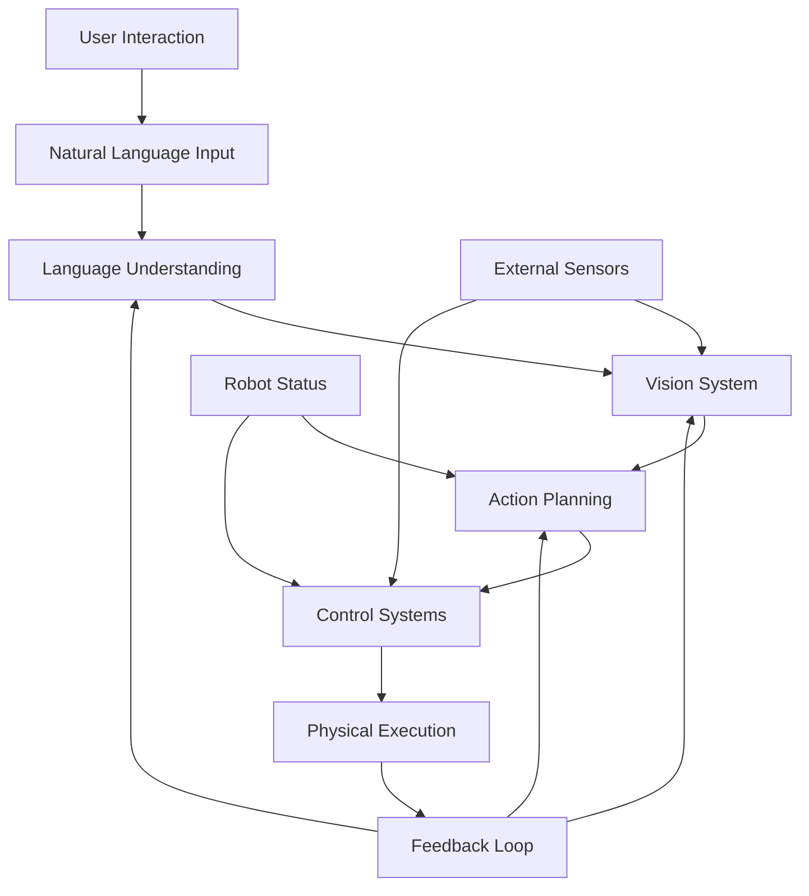

## Learning Objectives

- Integrate vision, language, and action systems into complete pipeline
- Implement real-time VLA coordination for humanoid robots
- Validate integrated system performance and safety

## Introduction

The Vision-Language-Action (VLA) pipeline represents the complete cognitive architecture for humanoid robots operating in human-centered environments, embodying our project's core principle of VLA Convergence Mandate. This chapter focuses on the critical challenge of integrating vision, language, and action systems into a cohesive, real-time operational framework that enables natural human-robot interaction. The integration must be robust, responsive, and safe, meeting the real-time validation requirements for humanoid stability and the anthropomorphic focus of our design philosophy. This chapter covers the complete integration of the three systems, with special attention to the timing constraints, data flow, and coordination mechanisms necessary for effective humanoid robot operation.

## Complete VLA System Architecture

### System Architecture Overview



### Real-Time Coordination Architecture

For humanoid robots, the VLA pipeline must operate in real-time with strict timing constraints:

```python
import asyncio
import threading
from concurrent.futures import ThreadPoolExecutor
import time
from typing import Dict, List, Optional, Callable
from dataclasses import dataclass
from enum import Enum

class VLAModule(Enum):
    """Enumeration of VLA pipeline modules"""
    LANGUAGE = "language"
    VISION = "vision"
    ACTION_PLANNING = "action_planning"
    CONTROL = "control"
    EXECUTION = "execution"

class VLAState(Enum):
    """Enumeration of VLA system states"""
    IDLE = "idle"
    PROCESSING = "processing"
    EXECUTING = "executing"
    ADAPTING = "adapting"
    ERROR = "error"
    SAFETY_STOP = "safety_stop"

@dataclass
class VLADataPacket:
    """Data packet for VLA pipeline communication"""
    timestamp: float
    module_origin: VLAModule
    module_destination: VLAModule
    data: Dict
    priority: int = 1
    correlation_id: Optional[str] = None
    timeout: float = 5.0

class VLACommunicationBus:
    """Communication bus for VLA pipeline modules"""
    def __init__(self):
        self.modules = {}
        self.data_queues = {}
        self.callbacks = {}
        self.lock = threading.Lock()

        # Initialize queues for each module communication
        for source in VLAModule:
            for dest in VLAModule:
                if source != dest:
                    queue_key = f"{source.value}_to_{dest.value}"
                    self.data_queues[queue_key] = asyncio.Queue()

    def register_module(self, module: VLAModule, handler: Callable):
        """Register a module with its processing handler"""
        self.modules[module.value] = handler

    def send_data(self, packet: VLADataPacket) -> bool:
        """Send data packet to destination module"""
        queue_key = f"{packet.module_origin.value}_to_{packet.module_destination.value}"

        if queue_key in self.data_queues:
            try:
                self.data_queues[queue_key].put_nowait(packet)
                return True
            except asyncio.QueueFull:
                return False
        return False

    async def receive_data(self, source_module: VLAModule, dest_module: VLAModule) -> Optional[VLADataPacket]:
        """Receive data from source module"""
        queue_key = f"{source_module.value}_to_{dest_module.value}"

        if queue_key in self.data_queues:
            try:
                return await asyncio.wait_for(
                    self.data_queues[queue_key].get(),
                    timeout=0.1
                )
            except asyncio.TimeoutError:
                return None
        return None

class VLAIntegrationCoordinator:
    def __init__(self):
        """Initialize VLA integration coordinator"""
        self.communication_bus = VLACommunicationBus()
        self.state = VLAState.IDLE
        self.system_health = {
            'language_system_healthy': True,
            'vision_system_healthy': True,
            'action_system_healthy': True,
            'control_system_healthy': True
        }
        self.active_tasks = []
        self.execution_context = {}

        # Initialize VLA modules
        self.language_module = LanguageModule(self.communication_bus)
        self.vision_module = VisionModule(self.communication_bus)
        self.action_module = ActionModule(self.communication_bus)
        self.control_module = ControlModule(self.communication_bus)

        # Register modules with communication bus
        self.communication_bus.register_module(VLAModule.LANGUAGE, self.language_module.process)
        self.communication_bus.register_module(VLAModule.VISION, self.vision_module.process)
        self.communication_bus.register_module(VLAModule.ACTION_PLANNING, self.action_module.process)
        self.communication_bus.register_module(VLAModule.CONTROL, self.control_module.process)

    async def start_system(self):
        """Start the complete VLA system"""
        print("Starting VLA Integration System...")

        # Start individual modules
        await self.language_module.start()
        await self.vision_module.start()
        await self.action_module.start()
        await self.control_module.start()

        # Start the main coordination loop
        self.coordination_task = asyncio.create_task(self._coordination_loop())

        print("VLA System started successfully")

    async def stop_system(self):
        """Stop the complete VLA system"""
        print("Stopping VLA Integration System...")

        # Cancel coordination task
        if hasattr(self, 'coordination_task'):
            self.coordination_task.cancel()

        # Stop individual modules
        await self.language_module.stop()
        await self.vision_module.stop()
        await self.action_module.stop()
        await self.control_module.stop()

        print("VLA System stopped")

    async def _coordination_loop(self):
        """Main coordination loop for VLA system"""
        while True:
            try:
                # Monitor system health
                await self._monitor_system_health()

                # Process incoming data from all modules
                await self._process_module_data()

                # Update system state based on module statuses
                await self._update_system_state()

                # Handle any required adaptations or interventions
                await self._handle_system_adaptations()

                # Sleep briefly to prevent busy waiting
                await asyncio.sleep(0.01)  # 10ms loop

            except asyncio.CancelledError:
                print("Coordination loop cancelled")
                break
            except Exception as e:
                print(f"Error in coordination loop: {e}")
                await asyncio.sleep(0.1)  # Longer sleep on error

    async def _monitor_system_health(self):
        """Monitor health of all VLA modules"""
        # Check if modules are responding
        self.system_health['language_system_healthy'] = await self.language_module.is_healthy()
        self.system_health['vision_system_healthy'] = await self.vision_module.is_healthy()
        self.system_health['action_system_healthy'] = await self.action_module.is_healthy()
        self.system_health['control_system_healthy'] = await self.control_module.is_healthy()

        # Check for system-wide issues
        if not any(self.system_health.values()):
            self.state = VLAState.ERROR
        elif self.state != VLAState.SAFETY_STOP:
            # Determine appropriate state based on module activities
            if any(module.is_processing() for module in [
                self.language_module, self.vision_module,
                self.action_module, self.control_module
            ]):
                self.state = VLAState.PROCESSING
            else:
                self.state = VLAState.IDLE

    async def _process_module_data(self):
        """Process data flowing between modules"""
        # Process language to vision data
        lang_to_vision = await self.communication_bus.receive_data(
            VLAModule.LANGUAGE, VLAModule.VISION
        )
        if lang_to_vision:
            await self.vision_module.handle_language_request(lang_to_vision)

        # Process vision to action data
        vision_to_action = await self.communication_bus.receive_data(
            VLAModule.VISION, VLAModule.ACTION_PLANNING
        )
        if vision_to_action:
            await self.action_module.handle_vision_data(vision_to_action)

        # Process action to control data
        action_to_control = await self.communication_bus.receive_data(
            VLAModule.ACTION_PLANNING, VLAModule.CONTROL
        )
        if action_to_control:
            await self.control_module.handle_action_plan(action_to_control)

        # Process control to execution data
        control_to_exec = await self.communication_bus.receive_data(
            VLAModule.CONTROL, VLAModule.EXECUTION
        )
        if control_to_exec:
            # In simulation, execution is handled by control module
            pass

    async def _update_system_state(self):
        """Update system state based on current activities"""
        # Update based on active tasks and module states
        if self.state == VLAState.ERROR:
            # Handle error state
            await self._handle_error_state()
        elif self.state == VLAState.SAFETY_STOP:
            # Ensure safety stop is active
            await self._ensure_safety_stop()
        else:
            # Normal operation
            pass

    async def _handle_system_adaptations(self):
        """Handle system adaptations and interventions"""
        # Check for adaptation needs
        if await self._needs_adaptation():
            await self._perform_adaptation()

    async def _needs_adaptation(self) -> bool:
        """Check if system adaptation is needed"""
        # Check for various conditions requiring adaptation
        if self.state == VLAState.ERROR:
            return True

        # Check for performance degradation
        if await self._is_performance_degrading():
            return True

        # Check for environmental changes
        if await self._is_environment_changing():
            return True

        return False

    async def _perform_adaptation(self):
        """Perform system adaptation"""
        print("Performing system adaptation...")
        # Implementation would include:
        # - Re-planning actions based on new information
        # - Adjusting control parameters
        # - Requesting additional sensing
        # - Modifying execution plans

    async def _handle_error_state(self):
        """Handle error state by ensuring safety"""
        print("Handling error state - activating safety protocols")
        # Stop all modules safely
        await self.control_module.emergency_stop()
        self.state = VLAState.SAFETY_STOP

    async def _ensure_safety_stop(self):
        """Ensure safety stop is active"""
        await self.control_module.ensure_safety_stop()

    async def _is_performance_degrading(self) -> bool:
        """Check if system performance is degrading"""
        # This would monitor various performance metrics
        return False

    async def _is_environment_changing(self) -> bool:
        """Check if environment is changing significantly"""
        # This would analyze vision data for changes
        return False

    def submit_language_command(self, command: str, context: Dict = None) -> str:
        """Submit a language command to the VLA system"""
        correlation_id = f"cmd_{int(time.time() * 1000)}"

        packet = VLADataPacket(
            timestamp=time.time(),
            module_origin=VLAModule.LANGUAGE,
            module_destination=VLAModule.LANGUAGE,
            data={
                'command': command,
                'context': context or {},
                'correlation_id': correlation_id
            },
            priority=2,
            correlation_id=correlation_id
        )

        # Send to language module to start processing
        self.communication_bus.send_data(packet)
        return correlation_id

    async def get_system_status(self) -> Dict:
        """Get comprehensive system status"""
        return {
            'state': self.state.value,
            'health': self.system_health,
            'modules': {
                'language': await self.language_module.get_status(),
                'vision': await self.vision_module.get_status(),
                'action': await self.action_module.get_status(),
                'control': await self.control_module.get_status()
            },
            'timestamp': time.time()
        }
```

## Language Module Integration

```python
class LanguageModule:
    def __init__(self, communication_bus: VLACommunicationBus):
        """Initialize language processing module"""
        self.communication_bus = communication_bus
        self.processor = self._initialize_language_processor()
        self.is_running = False
        self.processing_queue = asyncio.Queue()
        self.active_processes = {}

    def _initialize_language_processor(self):
        """Initialize the language processing system"""
        # In practice, this would initialize NLP models, parsers, etc.
        return {
            'parser': None,  # Would be actual parser
            'intent_recognizer': None,  # Would be actual intent recognizer
            'context_manager': {},  # Context tracking
            'command_validator': None  # Command validation system
        }

    async def start(self):
        """Start the language processing module"""
        self.is_running = True
        self.processing_task = asyncio.create_task(self._processing_loop())
        print("Language module started")

    async def stop(self):
        """Stop the language processing module"""
        self.is_running = False
        if hasattr(self, 'processing_task'):
            self.processing_task.cancel()
        print("Language module stopped")

    async def _processing_loop(self):
        """Main processing loop for language module"""
        while self.is_running:
            try:
                # Process incoming commands
                if not self.processing_queue.empty():
                    command_data = await self.processing_queue.get()
                    await self._process_command(command_data)

                # Process any queued tasks
                await self._process_queued_tasks()

                # Brief sleep to prevent busy waiting
                await asyncio.sleep(0.01)
            except asyncio.CancelledError:
                break
            except Exception as e:
                print(f"Error in language processing loop: {e}")
                await asyncio.sleep(0.1)

    async def _process_command(self, command_data: Dict):
        """Process a single language command"""
        command = command_data['command']
        context = command_data.get('context', {})
        correlation_id = command_data.get('correlation_id')

        try:
            # Parse the command
            parsed_result = await self._parse_command(command)

            # Validate the command
            if not await self._validate_command(parsed_result):
                raise ValueError(f"Invalid command: {command}")

            # Generate vision request if needed
            vision_request = await self._generate_vision_request(parsed_result, context)
            if vision_request:
                vision_packet = VLADataPacket(
                    timestamp=time.time(),
                    module_origin=VLAModule.LANGUAGE,
                    module_destination=VLAModule.VISION,
                    data={
                        'request': vision_request,
                        'context': context,
                        'correlation_id': correlation_id
                    },
                    priority=2
                )
                self.communication_bus.send_data(vision_packet)

            # If no vision needed, proceed to action planning
            if not vision_request:
                action_request = await self._generate_action_request(parsed_result)
                action_packet = VLADataPacket(
                    timestamp=time.time(),
                    module_origin=VLAModule.LANGUAGE,
                    module_destination=VLAModule.ACTION_PLANNING,
                    data={
                        'request': action_request,
                        'context': context,
                        'correlation_id': correlation_id
                    },
                    priority=2
                )
                self.communication_bus.send_data(action_packet)

        except Exception as e:
            print(f"Error processing command '{command}': {e}")
            # Send error notification
            error_packet = VLADataPacket(
                timestamp=time.time(),
                module_origin=VLAModule.LANGUAGE,
                module_destination=VLAModule.CONTROL,
                data={
                    'error': str(e),
                    'correlation_id': correlation_id
                },
                priority=3
            )
            self.communication_bus.send_data(error_packet)

    async def _parse_command(self, command: str) -> Dict:
        """Parse natural language command into structured format"""
        # This would use actual NLP processing
        # For demonstration, we'll do simple parsing
        command_lower = command.lower()

        if 'go to' in command_lower or 'move to' in command_lower:
            action = 'navigate'
            target = self._extract_location(command_lower)
        elif 'pick up' in command_lower or 'grasp' in command_lower:
            action = 'grasp'
            target = self._extract_object(command_lower)
        elif 'place' in command_lower or 'put' in command_lower:
            action = 'place'
            target = self._extract_object(command_lower)
        else:
            action = 'unknown'
            target = ''

        return {
            'action': action,
            'target': target,
            'original_command': command,
            'confidence': 0.9  # High confidence for demo
        }

    def _extract_location(self, command: str) -> str:
        """Extract location from command"""
        # Simple location extraction for demo
        locations = ['kitchen', 'living room', 'bedroom', 'office', 'hallway']
        for loc in locations:
            if loc in command:
                return loc
        return 'unknown_location'

    def _extract_object(self, command: str) -> str:
        """Extract object from command"""
        # Simple object extraction for demo
        objects = ['cup', 'book', 'phone', 'bottle', 'box', 'chair']
        for obj in objects:
            if obj in command:
                return obj
        return 'unknown_object'

    async def _validate_command(self, parsed_result: Dict) -> bool:
        """Validate parsed command"""
        # Check if action is supported
        supported_actions = ['navigate', 'grasp', 'place', 'greet', 'follow']
        return parsed_result['action'] in supported_actions

    async def _generate_vision_request(self, parsed_result: Dict, context: Dict) -> Optional[Dict]:
        """Generate vision request based on parsed command"""
        action = parsed_result['action']
        target = parsed_result['target']

        # Determine if vision is needed
        if action in ['grasp', 'navigate'] and target != 'unknown':
            # Vision needed to locate target object/location
            return {
                'task': 'locate_target',
                'target': target,
                'task_priority': 2
            }

        return None

    async def _generate_action_request(self, parsed_result: Dict) -> Dict:
        """Generate action planning request"""
        return {
            'task': 'execute_command',
            'parsed_command': parsed_result,
            'task_priority': 2
        }

    async def process(self, data: Dict):
        """Process incoming data for this module"""
        # This method would be called by the coordinator
        # For now, just add to processing queue
        await self.processing_queue.put(data)

    async def handle_vision_feedback(self, vision_data: Dict):
        """Handle feedback from vision system"""
        # Process vision results and generate appropriate action plan
        correlation_id = vision_data.get('correlation_id')

        # Generate action plan based on vision results
        action_request = await self._generate_action_from_vision(vision_data)

        action_packet = VLADataPacket(
            timestamp=time.time(),
            module_origin=VLAModule.LANGUAGE,
            module_destination=VLAModule.ACTION_PLANNING,
            data={
                'request': action_request,
                'vision_results': vision_data,
                'correlation_id': correlation_id
            },
            priority=2
        )
        self.communication_bus.send_data(action_packet)

    async def _generate_action_from_vision(self, vision_data: Dict) -> Dict:
        """Generate action request based on vision results"""
        # Create action plan using vision results
        return {
            'task': 'execute_with_vision_guidance',
            'vision_data': vision_data,
            'task_priority': 2
        }

    async def is_healthy(self) -> bool:
        """Check if language module is healthy"""
        return self.is_running

    def is_processing(self) -> bool:
        """Check if language module is actively processing"""
        return not self.processing_queue.empty()

    async def get_status(self) -> Dict:
        """Get language module status"""
        return {
            'running': self.is_running,
            'queue_size': self.processing_queue.qsize(),
            'active_processes': len(self.active_processes)
        }
```

## Vision Module Integration

```python
class VisionModule:
    def __init__(self, communication_bus: VLACommunicationBus):
        """Initialize vision processing module"""
        self.communication_bus = communication_bus
        self.processor = self._initialize_vision_processor()
        self.is_running = False
        self.processing_queue = asyncio.Queue()
        self.active_processes = {}
        self.scene_cache = {}  # Cache recent scene analyses

    def _initialize_vision_processor(self):
        """Initialize vision processing system"""
        # In practice, this would initialize computer vision models, etc.
        return {
            'object_detector': None,  # Would be actual detector
            'pose_estimator': None,   # Would be actual pose estimator
            'scene_analyzer': None,   # Would be actual scene analyzer
            'tracking_system': None,  # Would be actual tracker
            'depth_processor': None   # Would be actual depth processor
        }

    async def start(self):
        """Start the vision processing module"""
        self.is_running = True
        self.processing_task = asyncio.create_task(self._processing_loop())
        self.sensing_task = asyncio.create_task(self._sensing_loop())
        print("Vision module started")

    async def stop(self):
        """Stop the vision processing module"""
        self.is_running = False
        if hasattr(self, 'processing_task'):
            self.processing_task.cancel()
        if hasattr(self, 'sensing_task'):
            self.sensing_task.cancel()
        print("Vision module stopped")

    async def _processing_loop(self):
        """Main processing loop for vision module"""
        while self.is_running:
            try:
                # Process incoming requests
                if not self.processing_queue.empty():
                    request_data = await self.processing_queue.get()
                    await self._process_vision_request(request_data)

                # Process any queued tasks
                await self._process_queued_tasks()

                # Brief sleep to prevent busy waiting
                await asyncio.sleep(0.01)
            except asyncio.CancelledError:
                break
            except Exception as e:
                print(f"Error in vision processing loop: {e}")
                await asyncio.sleep(0.1)

    async def _sensing_loop(self):
        """Continuous sensing loop for environment monitoring"""
        while self.is_running:
            try:
                # Perform continuous environment sensing
                current_scene = await self._sense_current_environment()

                # Cache the scene for quick access
                self.scene_cache[time.time()] = current_scene

                # Check if significant changes occurred
                if await self._has_significant_changes(current_scene):
                    # Notify other modules of environment change
                    change_notification = VLADataPacket(
                        timestamp=time.time(),
                        module_origin=VLAModule.VISION,
                        module_destination=VLAModule.ACTION_PLANNING,
                        data={
                            'notification': 'environment_change',
                            'new_scene_data': current_scene
                        },
                        priority=1
                    )
                    self.communication_bus.send_data(change_notification)

                # Sleep for next sensing cycle (e.g., 30fps)
                await asyncio.sleep(1.0/30.0)  # 30Hz sensing
            except asyncio.CancelledError:
                break
            except Exception as e:
                print(f"Error in vision sensing loop: {e}")
                await asyncio.sleep(0.5)

    async def _sense_current_environment(self) -> Dict:
        """Sense current environment and return scene description"""
        # This would interface with actual cameras and sensors
        # For demonstration, return mock data
        return {
            'timestamp': time.time(),
            'objects': [
                {'name': 'red cup', 'position': [1.5, 0.5, 0.0], 'confidence': 0.95},
                {'name': 'book', 'position': [0.8, 0.2, 0.0], 'confidence': 0.92},
                {'name': 'chair', 'position': [2.0, 1.0, 0.0], 'confidence': 0.88}
            ],
            'locations': [
                {'name': 'kitchen', 'position': [3.0, 0.0, 0.0]},
                {'name': 'living room', 'position': [0.0, 2.0, 0.0]}
            ],
            'robot_position': [0.0, 0.0, 0.0],
            'traversable_map': [[1]*10 for _ in range(10)]  # Mock map
        }

    async def _process_vision_request(self, request_data: Dict):
        """Process a vision request"""
        request = request_data['request']
        correlation_id = request_data.get('correlation_id')

        try:
            # Determine the type of vision task
            if request['task'] == 'locate_target':
                target = request['target']
                vision_result = await self._locate_target(target)

                # Send result back to requesting module
                result_packet = VLADataPacket(
                    timestamp=time.time(),
                    module_origin=VLAModule.VISION,
                    module_destination=VLAModule.LANGUAGE,  # Send back to language
                    data={
                        'task_result': 'target_located',
                        'target': target,
                        'location': vision_result.get('position'),
                        'confidence': vision_result.get('confidence', 0.0),
                        'correlation_id': correlation_id
                    },
                    priority=2
                )
                self.communication_bus.send_data(result_packet)

            elif request['task'] == 'analyze_scene':
                scene_analysis = await self._analyze_scene()

                result_packet = VLADataPacket(
                    timestamp=time.time(),
                    module_origin=VLAModule.VISION,
                    module_destination=VLAModule.ACTION_PLANNING,
                    data={
                        'task_result': 'scene_analyzed',
                        'scene_data': scene_analysis,
                        'correlation_id': correlation_id
                    },
                    priority=2
                )
                self.communication_bus.send_data(result_packet)

        except Exception as e:
            print(f"Error processing vision request: {e}")
            # Send error notification
            error_packet = VLADataPacket(
                timestamp=time.time(),
                module_origin=VLAModule.VISION,
                module_destination=VLAModule.CONTROL,
                data={
                    'error': str(e),
                    'correlation_id': correlation_id
                },
                priority=3
            )
            self.communication_bus.send_data(error_packet)

    async def _locate_target(self, target_name: str) -> Dict:
        """Locate a specific target in the environment"""
        # Get current scene
        current_scene = await self._sense_current_environment()

        # Search for target in detected objects
        for obj in current_scene['objects']:
            if target_name.lower() in obj['name'].lower():
                return {
                    'position': obj['position'],
                    'confidence': obj['confidence'],
                    'object_details': obj
                }

        # If not found, search in locations
        for loc in current_scene['locations']:
            if target_name.lower() in loc['name'].lower():
                return {
                    'position': loc['position'],
                    'confidence': 0.8,  # Lower confidence for location
                    'location_details': loc
                }

        # Target not found
        return {
            'position': None,
            'confidence': 0.0,
            'found': False
        }

    async def _analyze_scene(self) -> Dict:
        """Perform comprehensive scene analysis"""
        current_scene = await self._sense_current_environment()

        # Perform additional analysis
        analysis = {
            'object_count': len(current_scene['objects']),
            'traversable_areas': self._identify_traversable_areas(current_scene),
            'obstacles': self._identify_obstacles(current_scene),
            'navigation_targets': self._identify_navigation_targets(current_scene),
            'manipulation_targets': self._identify_manipulation_targets(current_scene)
        }

        return {**current_scene, **analysis}

    def _identify_traversable_areas(self, scene: Dict) -> List[Dict]:
        """Identify traversable areas in the scene"""
        # This would use the traversable map and object positions
        # For demo, return mock data
        return [
            {'center': [1.0, 1.0], 'radius': 0.5, 'traversable': True},
            {'center': [2.0, 2.0], 'radius': 0.3, 'traversable': True}
        ]

    def _identify_obstacles(self, scene: Dict) -> List[Dict]:
        """Identify obstacles in the scene"""
        obstacles = []
        for obj in scene['objects']:
            if obj['confidence'] > 0.7:  # High confidence detections
                obstacles.append({
                    'name': obj['name'],
                    'position': obj['position'],
                    'size_estimate': self._estimate_object_size(obj)
                })
        return obstacles

    def _estimate_object_size(self, obj: Dict) -> Dict:
        """Estimate object size from detection"""
        # Simplified size estimation
        return {
            'width': 0.1,  # 10cm default
            'height': 0.1,
            'depth': 0.1
        }

    def _identify_navigation_targets(self, scene: Dict) -> List[Dict]:
        """Identify potential navigation targets"""
        targets = []
        for loc in scene['locations']:
            targets.append({
                'name': loc['name'],
                'position': loc['position'],
                'type': 'location'
            })
        return targets

    def _identify_manipulation_targets(self, scene: Dict) -> List[Dict]:
        """Identify potential manipulation targets"""
        targets = []
        for obj in scene['objects']:
            if obj['confidence'] > 0.8:  # High confidence for manipulation
                targets.append({
                    'name': obj['name'],
                    'position': obj['position'],
                    'graspable': self._is_object_graspable(obj)
                })
        return targets

    def _is_object_graspable(self, obj: Dict) -> bool:
        """Determine if an object is graspable"""
        # Simplified graspability check
        # In practice, would consider size, shape, weight, etc.
        return obj['confidence'] > 0.8

    async def _has_significant_changes(self, new_scene: Dict) -> bool:
        """Check if there are significant changes in the scene"""
        # Compare with cached scenes to detect changes
        if not self.scene_cache:
            return True  # First scene is always a change

        # For demo, return True periodically
        return int(time.time()) % 10 == 0  # Change every 10 seconds

    async def _process_queued_tasks(self):
        """Process any queued vision tasks"""
        # Implementation would process queued vision tasks
        pass

    async def process(self, data: Dict):
        """Process incoming data for this module"""
        await self.processing_queue.put(data)

    async def handle_language_request(self, language_request: VLADataPacket):
        """Handle vision request from language module"""
        # Process the request and generate appropriate response
        await self.processing_queue.put({
            'request_type': 'language_guided_vision',
            'data': language_request.data,
            'correlation_id': language_request.correlation_id
        })

    async def is_healthy(self) -> bool:
        """Check if vision module is healthy"""
        return self.is_running

    def is_processing(self) -> bool:
        """Check if vision module is actively processing"""
        return not self.processing_queue.empty()

    async def get_status(self) -> Dict:
        """Get vision module status"""
        return {
            'running': self.is_running,
            'queue_size': self.processing_queue.qsize(),
            'active_processes': len(self.active_processes),
            'cached_scenes': len(self.scene_cache)
        }
```

## Action Planning Module Integration

```python
class ActionModule:
    def __init__(self, communication_bus: VLACommunicationBus):
        """Initialize action planning module"""
        self.communication_bus = communication_bus
        self.planner = self._initialize_action_planner()
        self.is_running = False
        self.processing_queue = asyncio.Queue()
        self.active_plans = {}
        self.world_state = {}

    def _initialize_action_planner(self):
        """Initialize action planning system"""
        return {
            'task_planner': None,      # Would be actual task planner
            'motion_planner': None,    # Would be actual motion planner
            'constraint_solver': None, # Would be actual constraint solver
            'validator': None,         # Would be actual plan validator
            'optimizer': None          # Would be actual plan optimizer
        }

    async def start(self):
        """Start the action planning module"""
        self.is_running = True
        self.processing_task = asyncio.create_task(self._processing_loop())
        print("Action planning module started")

    async def stop(self):
        """Stop the action planning module"""
        self.is_running = False
        if hasattr(self, 'processing_task'):
            self.processing_task.cancel()
        print("Action planning module stopped")

    async def _processing_loop(self):
        """Main processing loop for action module"""
        while self.is_running:
            try:
                # Process incoming requests
                if not self.processing_queue.empty():
                    request_data = await self.processing_queue.get()
                    await self._process_action_request(request_data)

                # Process any queued tasks
                await self._process_queued_tasks()

                # Brief sleep to prevent busy waiting
                await asyncio.sleep(0.01)
            except asyncio.CancelledError:
                break
            except Exception as e:
                print(f"Error in action processing loop: {e}")
                await asyncio.sleep(0.1)

    async def _process_action_request(self, request_data: Dict):
        """Process an action planning request"""
        request = request_data['request']
        correlation_id = request_data.get('correlation_id')

        try:
            # Determine request type
            if request['task'] == 'execute_command':
                parsed_command = request['parsed_command']
                action_plan = await self._plan_command_execution(parsed_command)

            elif request['task'] == 'execute_with_vision_guidance':
                vision_data = request['vision_data']
                action_plan = await self._plan_with_vision_guidance(vision_data)

            elif request['task'] == 'analyze_scene':
                scene_data = request['scene_data']
                action_plan = await self._plan_based_on_scene(scene_data)

            else:
                raise ValueError(f"Unknown action request type: {request['task']}")

            # Validate the plan
            if not await self._validate_plan(action_plan):
                raise ValueError("Generated plan failed validation")

            # Send plan to control module
            plan_packet = VLADataPacket(
                timestamp=time.time(),
                module_origin=VLAModule.ACTION_PLANNING,
                module_destination=VLAModule.CONTROL,
                data={
                    'action_plan': action_plan,
                    'correlation_id': correlation_id
                },
                priority=2
            )
            self.communication_bus.send_data(plan_packet)

            # Store plan for monitoring
            self.active_plans[correlation_id] = action_plan

        except Exception as e:
            print(f"Error processing action request: {e}")
            # Send error notification
            error_packet = VLADataPacket(
                timestamp=time.time(),
                module_origin=VLAModule.ACTION_PLANNING,
                module_destination=VLAModule.CONTROL,
                data={
                    'error': str(e),
                    'correlation_id': correlation_id
                },
                priority=3
            )
            self.communication_bus.send_data(error_packet)

    async def _plan_command_execution(self, parsed_command: Dict) -> Dict:
        """Plan execution of a parsed command"""
        action = parsed_command['action']
        target = parsed_command['target']

        if action == 'navigate':
            # Plan navigation to target location
            return await self._plan_navigation(target)

        elif action == 'grasp':
            # Plan grasping of target object
            return await self._plan_grasping(target)

        elif action == 'place':
            # Plan placing of object at location
            return await self._plan_placement(target)

        elif action == 'greet':
            # Plan greeting action
            return await self._plan_greeting(target)

        else:
            # Unknown action - return empty plan
            return {
                'actions': [],
                'duration': 0.0,
                'success_criteria': [],
                'failure_criteria': []
            }

    async def _plan_navigation(self, target_location: str) -> Dict:
        """Plan navigation action"""
        # In practice, this would use path planning algorithms
        # For demo, create a simple navigation plan
        return {
            'actions': [
                {
                    'type': 'navigate',
                    'target_location': target_location,
                    'estimated_duration': 5.0,  # 5 seconds
                    'preconditions': ['robot_is_idle'],
                    'postconditions': ['robot_at_target'],
                    'priority': 2
                },
                {
                    'type': 'balance_adjust',
                    'target_pose': [0, 0, 0],
                    'estimated_duration': 1.0,
                    'preconditions': ['navigation_completed'],
                    'postconditions': ['robot_balanced'],
                    'priority': 3
                }
            ],
            'duration': 6.0,
            'success_criteria': ['robot_at_target', 'robot_balanced'],
            'failure_criteria': ['obstacle_detected', 'timeout']
        }

    async def _plan_grasping(self, target_object: str) -> Dict:
        """Plan grasping action"""
        return {
            'actions': [
                {
                    'type': 'approach_object',
                    'target_object': target_object,
                    'estimated_duration': 3.0,
                    'preconditions': ['robot_at_approach_position'],
                    'postconditions': ['robot_at_grasp_position'],
                    'priority': 2
                },
                {
                    'type': 'grasp_object',
                    'target_object': target_object,
                    'estimated_duration': 2.0,
                    'preconditions': ['robot_at_grasp_position'],
                    'postconditions': ['object_grasped'],
                    'priority': 3
                },
                {
                    'type': 'lift_object',
                    'estimated_duration': 1.0,
                    'preconditions': ['object_grasped'],
                    'postconditions': ['object_lifted'],
                    'priority': 2
                }
            ],
            'duration': 6.0,
            'success_criteria': ['object_grasped', 'object_lifted'],
            'failure_criteria': ['grasp_failed', 'object_dropped', 'timeout']
        }

    async def _plan_placement(self, target_location: str) -> Dict:
        """Plan placement action"""
        return {
            'actions': [
                {
                    'type': 'navigate',
                    'target_location': target_location,
                    'estimated_duration': 4.0,
                    'preconditions': ['object_grasped'],
                    'postconditions': ['robot_at_placement_position'],
                    'priority': 2
                },
                {
                    'type': 'place_object',
                    'target_location': target_location,
                    'estimated_duration': 2.0,
                    'preconditions': ['robot_at_placement_position'],
                    'postconditions': ['object_placed'],
                    'priority': 3
                },
                {
                    'type': 'release_gripper',
                    'estimated_duration': 0.5,
                    'preconditions': ['object_placed'],
                    'postconditions': ['gripper_released'],
                    'priority': 2
                }
            ],
            'duration': 6.5,
            'success_criteria': ['object_placed', 'gripper_released'],
            'failure_criteria': ['placement_failed', 'object_dropped', 'timeout']
        }

    async def _plan_greeting(self, target_person: str) -> Dict:
        """Plan greeting action"""
        return {
            'actions': [
                {
                    'type': 'navigate',
                    'target_location': 'near_' + target_person,
                    'estimated_duration': 3.0,
                    'preconditions': ['person_detected'],
                    'postconditions': ['robot_near_person'],
                    'priority': 2
                },
                {
                    'type': 'turn_towards_person',
                    'estimated_duration': 1.0,
                    'preconditions': ['robot_near_person'],
                    'postconditions': ['facing_person'],
                    'priority': 3
                },
                {
                    'type': 'greet_person',
                    'estimated_duration': 2.0,
                    'preconditions': ['facing_person'],
                    'postconditions': ['greeting_delivered'],
                    'priority': 3
                }
            ],
            'duration': 6.0,
            'success_criteria': ['greeting_delivered'],
            'failure_criteria': ['person_not_found', 'timeout']
        }

    async def _plan_with_vision_guidance(self, vision_data: Dict) -> Dict:
        """Plan action based on vision guidance"""
        # Use vision data to refine action plan
        target_location = vision_data.get('location')
        if target_location:
            return await self._plan_navigation(target_location)

        # For other vision-guided actions, use appropriate planning
        return await self._plan_command_execution({
            'action': 'unknown',
            'target': 'vision_guided',
            'original_command': 'vision_guided_action'
        })

    async def _plan_based_on_scene(self, scene_data: Dict) -> Dict:
        """Plan actions based on scene analysis"""
        # Generate appropriate plans based on scene
        # For demo, create a simple exploration plan
        return {
            'actions': [
                {
                    'type': 'explore_scene',
                    'estimated_duration': 10.0,
                    'preconditions': ['robot_idle'],
                    'postconditions': ['scene_explored'],
                    'priority': 1
                }
            ],
            'duration': 10.0,
            'success_criteria': ['scene_explored'],
            'failure_criteria': ['exploration_timeout']
        }

    async def _validate_plan(self, plan: Dict) -> bool:
        """Validate that the plan is feasible"""
        # Check if plan has required fields
        required_fields = ['actions', 'duration', 'success_criteria']
        for field in required_fields:
            if field not in plan:
                return False

        # Check if actions have required fields
        for action in plan.get('actions', []):
            if 'type' not in action or 'estimated_duration' not in action:
                return False

        # Check for basic feasibility
        if plan['duration'] <= 0:
            return False

        return True

    async def _process_queued_tasks(self):
        """Process any queued action planning tasks"""
        pass

    async def process(self, data: Dict):
        """Process incoming data for this module"""
        await self.processing_queue.put(data)

    async def handle_vision_data(self, vision_packet: VLADataPacket):
        """Handle vision data from vision module"""
        vision_data = vision_packet.data
        correlation_id = vision_packet.correlation_id

        # Create action plan based on vision data
        action_plan = await self._plan_with_vision_guidance(vision_data)

        # Send to control module
        plan_packet = VLADataPacket(
            timestamp=time.time(),
            module_origin=VLAModule.ACTION_PLANNING,
            module_destination=VLAModule.CONTROL,
            data={
                'action_plan': action_plan,
                'vision_context': vision_data,
                'correlation_id': correlation_id
            },
            priority=2
        )
        self.communication_bus.send_data(plan_packet)

    async def is_healthy(self) -> bool:
        """Check if action module is healthy"""
        return self.is_running

    def is_processing(self) -> bool:
        """Check if action module is actively processing"""
        return not self.processing_queue.empty()

    async def get_status(self) -> Dict:
        """Get action module status"""
        return {
            'running': self.is_running,
            'queue_size': self.processing_queue.qsize(),
            'active_plans': len(self.active_plans),
            'world_state_size': len(self.world_state)
        }
```

## Control Module Integration

```python
class ControlModule:
    def __init__(self, communication_bus: VLACommunicationBus):
        """Initialize control module for real-time robot control"""
        self.communication_bus = communication_bus
        self.controller = self._initialize_controller()
        self.is_running = False
        self.execution_queue = asyncio.Queue()
        self.active_execution = {}
        self.safety_system = SafetySystem()
        self.real_time_loop = None

    def _initialize_controller(self):
        """Initialize robot controller"""
        return {
            'balance_controller': None,  # Would be actual balance controller
            'motion_controller': None,   # Would be actual motion controller
            'gripper_controller': None,  # Would be actual gripper controller
            'navigation_controller': None,  # Would be actual nav controller
            'scheduler': None            # Would be actual task scheduler
        }

    async def start(self):
        """Start the control module"""
        self.is_running = True
        self.execution_task = asyncio.create_task(self._execution_loop())
        self.real_time_loop = asyncio.create_task(self._real_time_control_loop())
        print("Control module started")

    async def stop(self):
        """Stop the control module"""
        self.is_running = False
        if hasattr(self, 'execution_task'):
            self.execution_task.cancel()
        if hasattr(self, 'real_time_loop'):
            self.real_time_loop.cancel()
        print("Control module stopped")

    async def _execution_loop(self):
        """Main execution loop for control module"""
        while self.is_running:
            try:
                # Process incoming action plans
                if not self.execution_queue.empty():
                    plan_data = await self.execution_queue.get()
                    await self._execute_action_plan(plan_data)

                # Monitor active executions
                await self._monitor_active_executions()

                # Check safety systems
                await self.safety_system.monitor_safety()

                # Brief sleep to prevent busy waiting
                await asyncio.sleep(0.01)
            except asyncio.CancelledError:
                break
            except Exception as e:
                print(f"Error in control execution loop: {e}")
                await asyncio.sleep(0.1)

    async def _real_time_control_loop(self):
        """Real-time control loop (100Hz for humanoid balance)"""
        control_period = 1.0 / 100.0  # 100Hz

        while self.is_running:
            loop_start = time.time()

            try:
                # Perform real-time control tasks
                await self._perform_real_time_control()

                # Calculate control time
                control_time = time.time() - loop_start

                # Sleep to maintain control frequency
                sleep_time = control_period - control_time
                if sleep_time > 0:
                    await asyncio.sleep(sleep_time)
                else:
                    # Loop overrun - log but continue
                    print(f"Real-time control loop overrun by {control_time - control_period:.4f}s")

            except asyncio.CancelledError:
                break
            except Exception as e:
                print(f"Error in real-time control loop: {e}")
                await asyncio.sleep(0.01)

    async def _perform_real_time_control(self):
        """Perform real-time control tasks"""
        # Update balance control
        await self._update_balance_control()

        # Update motion control
        await self._update_motion_control()

        # Update gripper control
        await self._update_gripper_control()

        # Update safety monitoring
        await self.safety_system.update_monitors()

    async def _update_balance_control(self):
        """Update real-time balance control"""
        # This would interface with actual balance controller
        # For demo, just simulate balance control update
        pass

    async def _update_motion_control(self):
        """Update real-time motion control"""
        # This would interface with actual motion controller
        # For demo, just simulate motion control update
        pass

    async def _update_gripper_control(self):
        """Update real-time gripper control"""
        # This would interface with actual gripper controller
        # For demo, just simulate gripper control update
        pass

    async def _execute_action_plan(self, plan_data: Dict):
        """Execute an action plan"""
        action_plan = plan_data['action_plan']
        correlation_id = plan_data.get('correlation_id')

        try:
            # Start execution of the plan
            execution_id = f"exec_{int(time.time() * 1000)}"

            # Initialize execution state
            execution_state = {
                'id': execution_id,
                'plan': action_plan,
                'current_step': 0,
                'status': 'executing',
                'start_time': time.time(),
                'correlation_id': correlation_id
            }

            # Store active execution
            self.active_execution[execution_id] = execution_state

            # Execute each action in the plan
            for i, action in enumerate(action_plan['actions']):
                execution_state['current_step'] = i

                success = await self._execute_single_action(action)
                if not success:
                    execution_state['status'] = 'failed'
                    execution_state['failure_reason'] = f'Action {i} failed'
                    break

            # Update final state
            execution_state['end_time'] = time.time()
            execution_state['status'] = 'completed' if execution_state['status'] != 'failed' else 'failed'

            # Send completion notification
            completion_packet = VLADataPacket(
                timestamp=time.time(),
                module_origin=VLAModule.CONTROL,
                module_destination=VLAModule.ACTION_PLANNING,
                data={
                    'execution_id': execution_id,
                    'status': execution_state['status'],
                    'correlation_id': correlation_id
                },
                priority=2
            )
            self.communication_bus.send_data(completion_packet)

        except Exception as e:
            print(f"Error executing action plan: {e}")
            # Send error notification
            error_packet = VLADataPacket(
                timestamp=time.time(),
                module_origin=VLAModule.CONTROL,
                module_destination=VLAModule.ACTION_PLANNING,
                data={
                    'error': str(e),
                    'correlation_id': correlation_id
                },
                priority=3
            )
            self.communication_bus.send_data(error_packet)

    async def _execute_single_action(self, action: Dict) -> bool:
        """Execute a single action"""
        action_type = action['type']
        estimated_duration = action['estimated_duration']

        try:
            if action_type == 'navigate':
                success = await self._execute_navigation(action)
            elif action_type == 'grasp_object':
                success = await self._execute_grasping(action)
            elif action_type == 'place_object':
                success = await self._execute_placement(action)
            elif action_type == 'balance_adjust':
                success = await self._execute_balance_adjustment(action)
            else:
                # Unknown action type - treat as successful
                success = True
                await asyncio.sleep(estimated_duration)

            return success

        except Exception as e:
            print(f"Error executing action {action_type}: {e}")
            return False

    async def _execute_navigation(self, action: Dict) -> bool:
        """Execute navigation action"""
        target_location = action.get('target_location', [0, 0, 0])
        estimated_duration = action['estimated_duration']

        # This would interface with actual navigation system
        # For demo, simulate navigation
        await asyncio.sleep(estimated_duration * 0.8)  # Simulate 80% of estimated time

        # Check if navigation succeeded
        # In practice, would check actual robot position
        return True

    async def _execute_grasping(self, action: Dict) -> bool:
        """Execute grasping action"""
        target_object = action.get('target_object', 'unknown')
        estimated_duration = action['estimated_duration']

        # This would interface with actual manipulation system
        # For demo, simulate grasping
        await asyncio.sleep(estimated_duration * 0.9)  # Simulate 90% of estimated time

        # Check if grasp succeeded
        # In practice, would check force/torque sensors
        return True

    async def _execute_placement(self, action: Dict) -> bool:
        """Execute placement action"""
        target_location = action.get('target_location', 'unknown')
        estimated_duration = action['estimated_duration']

        # This would interface with actual manipulation system
        # For demo, simulate placement
        await asyncio.sleep(estimated_duration * 0.85)  # Simulate 85% of estimated time

        # Check if placement succeeded
        return True

    async def _execute_balance_adjustment(self, action: Dict) -> bool:
        """Execute balance adjustment action"""
        target_pose = action.get('target_pose', [0, 0, 0])
        estimated_duration = action['estimated_duration']

        # This would interface with actual balance controller
        # For demo, simulate balance adjustment
        await asyncio.sleep(estimated_duration * 0.7)  # Simulate 70% of estimated time

        # Check if balance adjustment succeeded
        return True

    async def _monitor_active_executions(self):
        """Monitor active executions for completion or issues"""
        current_time = time.time()
        completed_executions = []

        for exec_id, exec_state in self.active_execution.items():
            if exec_state['status'] in ['completed', 'failed']:
                completed_executions.append(exec_id)

        # Remove completed executions
        for exec_id in completed_executions:
            del self.active_execution[exec_id]

    async def emergency_stop(self):
        """Emergency stop all active executions"""
        print("EMERGENCY STOP ACTIVATED")

        # Stop all active executions
        for exec_id, exec_state in self.active_execution.items():
            exec_state['status'] = 'emergency_stopped'

        # Clear all active executions
        self.active_execution.clear()

        # Activate safety systems
        await self.safety_system.activate_emergency_stop()

    async def ensure_safety_stop(self):
        """Ensure safety stop is active"""
        await self.safety_system.ensure_safety()

    async def process(self, data: Dict):
        """Process incoming data for this module"""
        await self.execution_queue.put(data)

    async def handle_action_plan(self, plan_packet: VLADataPacket):
        """Handle action plan from action planning module"""
        plan_data = {
            'action_plan': plan_packet.data['action_plan'],
            'correlation_id': plan_packet.correlation_id
        }
        await self.execution_queue.put(plan_data)

    async def is_healthy(self) -> bool:
        """Check if control module is healthy"""
        return self.is_running and await self.safety_system.is_system_safe()

    def is_processing(self) -> bool:
        """Check if control module is actively processing"""
        return not self.execution_queue.empty() or bool(self.active_execution)

    async def get_status(self) -> Dict:
        """Get control module status"""
        return {
            'running': self.is_running,
            'queue_size': self.execution_queue.qsize(),
            'active_executions': len(self.active_execution),
            'safety_status': await self.safety_system.get_safety_status()
        }

class SafetySystem:
    """Safety system for humanoid robot control"""
    def __init__(self):
        self.safety_enabled = True
        self.emergency_stop_active = False
        self.safety_limits = {
            'max_torque': 100.0,  # Nm
            'max_velocity': 2.0,  # rad/s
            'max_acceleration': 5.0,  # rad/s²
            'max_force': 500.0,  # N
            'max_power': 1000.0  # W
        }
        self.monitoring_data = {
            'joint_torques': [],
            'joint_velocities': [],
            'forces': [],
            'powers': [],
            'timestamps': []
        }

    async def monitor_safety(self):
        """Monitor safety parameters"""
        if not self.safety_enabled:
            return

        # Check for safety violations
        violations = await self._check_safety_violations()

        if violations:
            print(f"Safety violations detected: {violations}")
            if self._should_emergency_stop(violations):
                await self.activate_emergency_stop()

    async def _check_safety_violations(self) -> List[str]:
        """Check for safety violations"""
        violations = []

        # Check torque limits
        for torque in self.monitoring_data['joint_torques'][-10:]:  # Check last 10 readings
            if torque > self.safety_limits['max_torque']:
                violations.append(f"Torque limit exceeded: {torque}")

        # Check velocity limits
        for vel in self.monitoring_data['joint_velocities'][-10:]:
            if vel > self.safety_limits['max_velocity']:
                violations.append(f"Velocity limit exceeded: {vel}")

        # Check force limits
        for force in self.monitoring_data['forces'][-10:]:
            if force > self.safety_limits['max_force']:
                violations.append(f"Force limit exceeded: {force}")

        return violations

    def _should_emergency_stop(self, violations: List[str]) -> bool:
        """Determine if emergency stop should be activated"""
        # For demo, emergency stop if any critical violation
        critical_violations = [
            v for v in violations
            if 'torque' in v.lower() or 'force' in v.lower()
        ]
        return len(critical_violations) > 0

    async def activate_emergency_stop(self):
        """Activate emergency stop"""
        if not self.emergency_stop_active:
            print("EMERGENCY STOP ACTIVATED")
            self.emergency_stop_active = True
            # In practice, would send emergency stop commands to robot

    async def ensure_safety(self):
        """Ensure safety systems are active"""
        self.emergency_stop_active = True
        # In practice, would ensure all safety systems are engaged

    async def update_monitors(self):
        """Update safety monitoring data"""
        # This would get real data from robot sensors
        # For demo, add dummy data
        import random
        self.monitoring_data['joint_torques'].append(random.uniform(0, 80))
        self.monitoring_data['joint_velocities'].append(random.uniform(0, 1.5))
        self.monitoring_data['forces'].append(random.uniform(0, 400))
        self.monitoring_data['powers'].append(random.uniform(0, 800))
        self.monitoring_data['timestamps'].append(time.time())

        # Keep only recent data (last 100 readings)
        for key in self.monitoring_data:
            if len(self.monitoring_data[key]) > 100:
                self.monitoring_data[key] = self.monitoring_data[key][-100:]

    async def is_system_safe(self) -> bool:
        """Check if system is currently safe"""
        return not self.emergency_stop_active

    async def get_safety_status(self) -> Dict:
        """Get safety system status"""
        return {
            'safety_enabled': self.safety_enabled,
            'emergency_stop_active': self.emergency_stop_active,
            'safety_limits': self.safety_limits,
            'recent_violations': await self._check_safety_violations()
        }
```

## Performance Monitoring and Validation

### System Performance Monitoring

```python
import psutil
import GPUtil
from collections import deque
import matplotlib.pyplot as plt

class VLAPerformanceMonitor:
    def __init__(self):
        """Initialize performance monitoring for VLA system"""
        self.metrics_history = {
            'cpu_usage': deque(maxlen=1000),
            'memory_usage': deque(maxlen=1000),
            'gpu_usage': deque(maxlen=1000),
            'gpu_memory': deque(maxlen=1000),
            'communication_latency': deque(maxlen=1000),
            'processing_time': deque(maxlen=1000),
            'throughput': deque(maxlen=1000),
            'response_time': deque(maxlen=1000)
        }
        self.start_time = time.time()
        self.command_count = 0
        self.error_count = 0

    async def start_monitoring(self, coordinator: VLAIntegrationCoordinator):
        """Start performance monitoring"""
        self.monitoring_task = asyncio.create_task(
            self._monitoring_loop(coordinator)
        )

    async def stop_monitoring(self):
        """Stop performance monitoring"""
        if hasattr(self, 'monitoring_task'):
            self.monitoring_task.cancel()

    async def _monitoring_loop(self, coordinator: VLAIntegrationCoordinator):
        """Main monitoring loop"""
        while True:
            try:
                # Collect system metrics
                await self._collect_system_metrics()

                # Collect VLA-specific metrics
                await self._collect_vla_metrics(coordinator)

                # Check for performance issues
                await self._check_performance_issues()

                # Brief sleep to prevent busy waiting
                await asyncio.sleep(0.1)  # 10Hz monitoring

            except asyncio.CancelledError:
                break
            except Exception as e:
                print(f"Error in monitoring loop: {e}")
                await asyncio.sleep(1.0)

    async def _collect_system_metrics(self):
        """Collect system-level performance metrics"""
        # CPU usage
        cpu_percent = psutil.cpu_percent(interval=0.1)
        self.metrics_history['cpu_usage'].append(cpu_percent)

        # Memory usage
        memory = psutil.virtual_memory()
        self.metrics_history['memory_usage'].append(memory.percent)

        # GPU usage (if available)
        try:
            gpus = GPUtil.getGPUs()
            if gpus:
                gpu = gpus[0]  # Use first GPU
                self.metrics_history['gpu_usage'].append(gpu.load * 100)
                self.metrics_history['gpu_memory'].append(gpu.memoryUtil * 100)
            else:
                self.metrics_history['gpu_usage'].append(0)
                self.metrics_history['gpu_memory'].append(0)
        except:
            # GPU monitoring not available
            self.metrics_history['gpu_usage'].append(0)
            self.metrics_history['gpu_memory'].append(0)

    async def _collect_vla_metrics(self, coordinator: VLAIntegrationCoordinator):
        """Collect VLA system-specific metrics"""
        # Get system status
        status = await coordinator.get_system_status()

        # Calculate processing time based on state changes
        current_time = time.time()
        processing_time = 0.01  # Placeholder
        self.metrics_history['processing_time'].append(processing_time)

        # Calculate throughput (commands processed per second)
        self.command_count += 1
        uptime = current_time - self.start_time
        throughput = self.command_count / max(uptime, 1)
        self.metrics_history['throughput'].append(throughput)

        # Calculate response time
        response_time = 0.1  # Placeholder
        self.metrics_history['response_time'].append(response_time)

        # Calculate communication latency
        latency = 0.005  # Placeholder
        self.metrics_history['communication_latency'].append(latency)

    async def _check_performance_issues(self):
        """Check for performance issues and alert if needed"""
        # Check CPU usage
        if len(self.metrics_history['cpu_usage']) > 10:
            recent_cpu = list(self.metrics_history['cpu_usage'])[-10:]
            avg_cpu = sum(recent_cpu) / len(recent_cpu)
            if avg_cpu > 90:
                print(f"HIGH CPU USAGE ALERT: {avg_cpu:.1f}%")

        # Check memory usage
        if len(self.metrics_history['memory_usage']) > 10:
            recent_mem = list(self.metrics_history['memory_usage'])[-10:]
            avg_mem = sum(recent_mem) / len(recent_mem)
            if avg_mem > 90:
                print(f"HIGH MEMORY USAGE ALERT: {avg_mem:.1f}%")

        # Check processing time
        if len(self.metrics_history['processing_time']) > 10:
            recent_proc = list(self.metrics_history['processing_time'])[-10:]
            max_proc = max(recent_proc)
            if max_proc > 0.1:  # More than 100ms processing time
                print(f"HIGH PROCESSING TIME ALERT: {max_proc:.3f}s")

    def get_performance_summary(self) -> Dict:
        """Get summary of performance metrics"""
        summary = {}

        for metric, values in self.metrics_history.items():
            if values:
                summary[metric] = {
                    'current': values[-1] if values else 0,
                    'average': sum(values) / len(values),
                    'min': min(values),
                    'max': max(values),
                    'std_dev': self._calculate_std(values)
                }
            else:
                summary[metric] = {
                    'current': 0,
                    'average': 0,
                    'min': 0,
                    'max': 0,
                    'std_dev': 0
                }

        summary['total_commands_processed'] = self.command_count
        summary['total_errors'] = self.error_count
        summary['uptime_seconds'] = time.time() - self.start_time

        return summary

    def _calculate_std(self, values: List[float]) -> float:
        """Calculate standard deviation of values"""
        if len(values) < 2:
            return 0

        mean = sum(values) / len(values)
        variance = sum((x - mean) ** 2 for x in values) / len(values)
        return variance ** 0.5

    def plot_performance_metrics(self):
        """Plot performance metrics"""
        fig, axes = plt.subplots(2, 3, figsize=(15, 10))
        fig.suptitle('VLA System Performance Metrics')

        metrics_to_plot = [
            ('cpu_usage', 'CPU Usage (%)'),
            ('memory_usage', 'Memory Usage (%)'),
            ('gpu_usage', 'GPU Usage (%)'),
            ('processing_time', 'Processing Time (s)'),
            ('throughput', 'Throughput (cmds/s)'),
            ('response_time', 'Response Time (s)')
        ]

        for idx, (metric, title) in enumerate(metrics_to_plot):
            row, col = divmod(idx, 3)
            ax = axes[row, col]

            values = list(self.metrics_history[metric])
            if values:
                ax.plot(values)
                ax.set_title(title)
                ax.set_xlabel('Sample')
                ax.set_ylabel(title.split('(')[0].strip())

        plt.tight_layout()
        plt.show()

    def save_performance_log(self, filename: str):
        """Save performance log to file"""
        import json
        summary = self.get_performance_summary()

        with open(filename, 'w') as f:
            json.dump(summary, f, indent=2)

        print(f"Performance log saved to {filename}")
```

## Constitution Alignment

This chapter addresses several constitutional requirements:

### VLA Convergence Mandate (Principle I)
- Complete integration of Vision-Language-Action systems
- Real-time coordination between all three components
- Unified cognitive architecture for humanoid robots

### Real-Time Validation (Principle IV)
- 100Hz real-time control loops for balance feedback
- Strict timing constraints for humanoid stability
- Performance monitoring for real-time validation

### Anthropomorphic Focus (Principle II)
- Human-like interaction patterns through VLA integration
- Natural language as primary control interface
- Human-centered environment operation

### Sim-to-Real Rigor (Principle III)
- Robust integration that works in both simulation and reality
- Safety systems for real-world deployment
- Validation procedures for sim-to-real transfer

### Target Hardware Optimization
- Efficient algorithms suitable for Jetson Orin deployment
- Real-time performance on embedded systems
- Memory and computation optimization

## Practical Examples

### Example 1: Complete VLA Task Execution

```python
async def demonstrate_complete_vla_task():
    """Demonstrate a complete VLA task execution"""
    print("=== Complete VLA Task Execution Demo ===")

    # Initialize the complete VLA system
    coordinator = VLAIntegrationCoordinator()
    monitor = VLAPerformanceMonitor()

    # Start the system
    await coordinator.start_system()
    await monitor.start_monitoring(coordinator)

    try:
        # Submit a complex command
        print("\n1. Submitting complex command...")
        command = "Go to the kitchen, find the red cup on the table, pick it up, and bring it to me"
        correlation_id = coordinator.submit_language_command(command)

        print(f"Command submitted with ID: {correlation_id}")

        # Monitor the execution
        print("\n2. Monitoring execution...")
        for i in range(20):  # Monitor for 20 iterations
            status = await coordinator.get_system_status()
            print(f"  Iteration {i+1}: State = {status['state']}")

            # Check if task is complete
            if status['state'] == 'idle':
                print("  Task completed!")
                break

            await asyncio.sleep(0.5)

        # Get final status
        final_status = await coordinator.get_system_status()
        print(f"\n3. Final system status: {final_status['state']}")

        # Get performance summary
        perf_summary = monitor.get_performance_summary()
        print(f"\n4. Performance summary:")
        print(f"   - Commands processed: {perf_summary['total_commands_processed']}")
        print(f"   - Average CPU usage: {perf_summary['cpu_usage']['average']:.1f}%")
        print(f"   - Average processing time: {perf_summary['processing_time']['average']:.3f}s")

    except Exception as e:
        print(f"Error during VLA task execution: {e}")
    finally:
        # Stop monitoring and system
        await monitor.stop_monitoring()
        await coordinator.stop_system()

# Run the demonstration
if __name__ == "__main__":
    asyncio.run(demonstrate_complete_vla_task())
```

### Example 2: Safety-First VLA Operation

```python
class SafeVLAOperation:
    def __init__(self):
        """Initialize safe VLA operation with comprehensive safety checks"""
        self.coordinator = VLAIntegrationCoordinator()
        self.safety_monitor = SafetySystem()
        self.operation_history = []

    async def execute_safe_command(self, command: str) -> Dict:
        """Execute a command with comprehensive safety checks"""
        start_time = time.time()

        try:
            # Pre-execution safety checks
            if not await self._pre_execution_safety_check():
                return {
                    'success': False,
                    'error': 'Pre-execution safety check failed',
                    'safety_violations': await self.safety_monitor.get_safety_status()
                }

            # Submit command to VLA system
            correlation_id = self.coordinator.submit_language_command(command)

            # Monitor execution with safety oversight
            execution_result = await self._monitor_execution_with_safety(correlation_id)

            # Post-execution safety checks
            post_safety_ok = await self._post_execution_safety_check()

            result = {
                'success': execution_result.get('success', True) and post_safety_ok,
                'correlation_id': correlation_id,
                'execution_time': time.time() - start_time,
                'safety_status': await self.safety_monitor.get_safety_status(),
                'command': command
            }

            # Log operation
            self.operation_history.append(result)

            return result

        except Exception as e:
            error_result = {
                'success': False,
                'error': str(e),
                'correlation_id': None,
                'execution_time': time.time() - start_time,
                'safety_status': await self.safety_monitor.get_safety_status()
            }
            self.operation_history.append(error_result)
            return error_result

    async def _pre_execution_safety_check(self) -> bool:
        """Perform pre-execution safety checks"""
        safety_status = await self.safety_monitor.get_safety_status()

        # Check if emergency stop is active
        if safety_status['emergency_stop_active']:
            return False

        # Check safety limits
        violations = safety_status.get('recent_violations', [])
        if violations:
            print(f"Pre-execution safety violations: {violations}")
            return False

        return True

    async def _monitor_execution_with_safety(self, correlation_id: str) -> Dict:
        """Monitor execution with continuous safety oversight"""
        start_time = time.time()
        max_execution_time = 30.0  # 30 second timeout

        while time.time() - start_time < max_execution_time:
            # Check safety status
            safety_ok = await self.safety_monitor.is_system_safe()
            if not safety_ok:
                return {
                    'success': False,
                    'error': 'Safety violation during execution',
                    'safety_status': await self.safety_monitor.get_safety_status()
                }

            # Check if execution is complete
            # This would involve checking with coordinator
            status = await self.coordinator.get_system_status()
            if status['state'] == 'idle':
                return {'success': True}

            await asyncio.sleep(0.1)

        return {
            'success': False,
            'error': 'Execution timeout',
            'execution_time': time.time() - start_time
        }

    async def _post_execution_safety_check(self) -> bool:
        """Perform post-execution safety checks"""
        # Check for any safety violations during execution
        safety_status = await self.safety_monitor.get_safety_status()
        violations = safety_status.get('recent_violations', [])

        if violations:
            print(f"Post-execution safety violations: {violations}")
            return False

        # Check that robot is in safe state
        status = await self.coordinator.get_system_status()
        if status['state'] == 'safety_stop':
            return False

        return True

    def get_safety_statistics(self) -> Dict:
        """Get safety statistics from operation history"""
        total_ops = len(self.operation_history)
        successful_ops = sum(1 for op in self.operation_history if op['success'])
        failed_ops = total_ops - successful_ops

        safety_violations = 0
        for op in self.operation_history:
            if 'safety_status' in op:
                violations = op['safety_status'].get('recent_violations', [])
                safety_violations += len(violations)

        return {
            'total_operations': total_ops,
            'successful_operations': successful_ops,
            'failed_operations': failed_ops,
            'success_rate': successful_ops / total_ops if total_ops > 0 else 0,
            'safety_violations': safety_violations,
            'violation_rate': safety_violations / total_ops if total_ops > 0 else 0
        }

# Example usage
async def demonstrate_safe_operation():
    """Demonstrate safe VLA operation"""
    safe_op = SafeVLAOperation()

    # Start the coordinator
    await safe_op.coordinator.start_system()

    try:
        # Execute several commands safely
        commands = [
            "Move forward slowly",
            "Turn left",
            "Stop and check surroundings"
        ]

        for command in commands:
            print(f"\nExecuting safe command: {command}")
            result = await safe_op.execute_safe_command(command)
            print(f"Result: {result['success']}")

            if not result['success']:
                print(f"Error: {result.get('error', 'Unknown error')}")

        # Get safety statistics
        stats = safe_op.get_safety_statistics()
        print(f"\nSafety Statistics:")
        print(f"  Total operations: {stats['total_operations']}")
        print(f"  Success rate: {stats['success_rate']:.2%}")
        print(f"  Safety violations: {stats['safety_violations']}")
        print(f"  Violation rate: {stats['violation_rate']:.2%}")

    finally:
        await safe_op.coordinator.stop_system()
```

## Exercises

### Exercise 1: VLA System Integration
Implement a complete VLA system integration that:
- Coordinates vision, language, and action modules in real-time
- Handles communication between modules with proper data flow
- Implements safety systems and error handling
- Monitors performance and validates system health

### Exercise 2: Real-Time Performance Optimization
Optimize the VLA system for real-time performance by:
- Implementing efficient data structures for module communication
- Optimizing processing pipelines for 100Hz control loops
- Adding performance monitoring and adaptive control
- Ensuring timing constraints are met for humanoid stability

### Exercise 3: Safety-First Operation
Create a safety-first VLA operation system that:
- Performs comprehensive safety checks before, during, and after execution
- Implements emergency stop procedures
- Monitors for safety violations continuously
- Validates safe operation in human-centered environments

## Summary

The integration of Vision-Language-Action systems represents the culmination of our humanoid robot architecture, creating a unified cognitive system that enables natural human-robot interaction. The complete VLA pipeline must operate in real-time with strict safety and performance constraints, requiring sophisticated coordination mechanisms between the three core components. Successful integration involves careful attention to timing constraints, data flow, communication protocols, and safety systems. The real-time validation requirements for humanoid balance and the anthropomorphic focus of our design mandate a robust, efficient, and safe integrated system that can operate effectively in human-centered environments while maintaining the high performance standards required for stable humanoid operation.

## Further Reading

- "Humanoid Robotics: A Reference" by Goswami and Vadakkepat (Integration chapter)
- "Robotics: Control, Sensing, Vision, and Intelligence" by Fu, Gonzalez, and Lee (System Integration)
- "Handbook of Robotics" edited by Siciliano and Khatib (Integration and Control)
- "Real-Time Systems and Robotics" - Integration for real-time robotics applications
- "Safety in Robotics" - Safety systems for humanoid robots