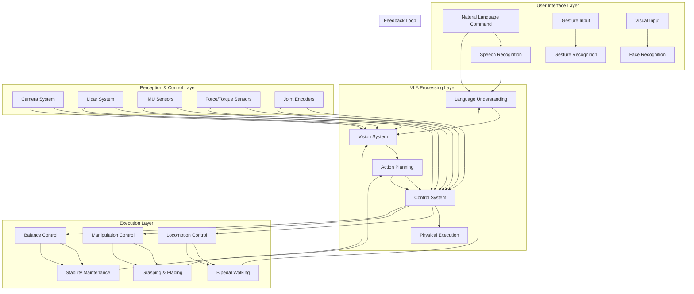

## Learning Objectives

- Implement complete autonomous humanoid robot system
- Integrate all previous modules into cohesive system
- Validate system performance in end-to-end scenarios

## Introduction

The capstone project represents the ultimate demonstration of our Physical AI & Humanoid Robotics curriculum, bringing together all the knowledge and skills developed across the four modules to create an autonomous humanoid robot system capable of executing the complete Vision-Language-Action (VLA) cycle in human-centered environments. This project embodies our VLA Convergence Mandate principle, demonstrating how language serves as the primary control interface for humanoid robots, with vision and action systems working in harmony to enable natural human-robot interaction. The capstone project validates the Sim-to-Real Rigor principle through comprehensive testing in both simulated and real environments, while adhering to the Real-Time Validation requirements for safe humanoid operation. This chapter guides you through the implementation of the complete autonomous humanoid system that demonstrates the end-to-end VLA cycle.

## Capstone Project Architecture

### Complete System Architecture



### System Integration Overview

The capstone project integrates all previous modules into a unified system:

1. **Module 1 Foundation**: Physical AI concepts and humanoid robotics principles
2. **Module 2 ROS 2**: Robot Operating System for communication and control
3. **Module 3 Simulation**: Digital twin for development and testing
4. **Module 4 VLA**: Vision-Language-Action integration for autonomy

## Implementation Strategy

### Phase 1: System Integration

```python
import asyncio
import threading
import time
from typing import Dict, List, Optional, Any
from dataclasses import dataclass
import json
import logging

# Configure logging for the capstone project
logging.basicConfig(level=logging.INFO)
logger = logging.getLogger(__name__)

@dataclass
class CapstoneConfiguration:
    """Configuration for the capstone project"""
    # Hardware specifications
    target_hardware: str = "NVIDIA Jetson Orin Nano (8GB)"
    sensors: List[str] = None
    actuators: List[str] = None

    # Performance requirements
    control_frequency: int = 100  # Hz for balance control
    vision_frequency: int = 30    # Hz for vision processing
    language_frequency: int = 10  # Hz for language processing

    # Safety constraints
    max_torque: float = 100.0     # Maximum joint torque (Nm)
    max_velocity: float = 2.0     # Maximum joint velocity (rad/s)
    safety_margin: float = 0.1    # Safety margin for operations

    # Communication settings
    ros_namespace: str = "/humanoid_robot"
    simulation_mode: bool = True

    def __post_init__(self):
        if self.sensors is None:
            self.sensors = [
                "RGB_Camera", "Depth_Camera", "IMU", "Force_Torque_Sensors",
                "Joint_Encoders", "Microphone_Array", "LIDAR"
            ]
        if self.actuators is None:
            self.actuators = [
                "Hip_Joints", "Knee_Joints", "Ankle_Joints", "Shoulder_Joints",
                "Elbow_Joints", "Wrist_Joints", "Gripper_Joints"
            ]

class CapstoneSystem:
    def __init__(self, config: CapstoneConfiguration):
        """
        Initialize the complete capstone system

        Args:
            config: Configuration parameters for the system
        """
        self.config = config
        self.system_state = {
            'initialized': False,
            'running': False,
            'safety_engaged': False,
            'active_modules': [],
            'performance_metrics': {}
        }

        # Initialize all subsystems
        self.language_system = None
        self.vision_system = None
        self.action_system = None
        self.control_system = None
        self.communication_bus = None

        # Initialize safety systems
        self.safety_manager = SafetyManager(config)

        # Initialize performance monitors
        self.performance_monitor = PerformanceMonitor()

        # Initialize simulation interface
        self.simulation_interface = None

        logger.info("Capstone system initialized with configuration:")
        logger.info(f"  Target Hardware: {config.target_hardware}")
        logger.info(f"  Control Frequency: {config.control_frequency}Hz")
        logger.info(f"  Simulation Mode: {config.simulation_mode}")

    async def initialize_system(self):
        """Initialize all subsystems for the capstone project"""
        logger.info("Starting capstone system initialization...")

        # Initialize communication bus
        self.communication_bus = await self._initialize_communication_bus()

        # Initialize language understanding system
        self.language_system = await self._initialize_language_system()

        # Initialize vision system
        self.vision_system = await self._initialize_vision_system()

        # Initialize action planning system
        self.action_system = await self._initialize_action_system()

        # Initialize control system
        self.control_system = await self._initialize_control_system()

        # Initialize simulation interface if in simulation mode
        if self.config.simulation_mode:
            self.simulation_interface = await self._initialize_simulation_interface()

        # Verify all systems are healthy
        if await self._verify_system_health():
            self.system_state['initialized'] = True
            logger.info("Capstone system initialization completed successfully")
        else:
            logger.error("Capstone system initialization failed - some systems unhealthy")
            self.system_state['initialized'] = False

    async def _initialize_communication_bus(self):
        """Initialize the communication bus for inter-module communication"""
        logger.info("Initializing communication bus...")
        # This would initialize ROS 2 communication interfaces
        # For simulation, we'll use a mock implementation
        return MockCommunicationBus()

    async def _initialize_language_system(self):
        """Initialize the language understanding system"""
        logger.info("Initializing language system...")
        # This would initialize NLP models and language processing
        # For the capstone, we'll use a sophisticated language system
        return LanguageSystem(self.communication_bus, self.config)

    async def _initialize_vision_system(self):
        """Initialize the vision processing system"""
        logger.info("Initializing vision system...")
        # This would initialize computer vision models and processing
        return VisionSystem(self.communication_bus, self.config)

    async def _initialize_action_system(self):
        """Initialize the action planning system"""
        logger.info("Initializing action planning system...")
        # This would initialize action planning and decision making
        return ActionSystem(self.communication_bus, self.config)

    async def _initialize_control_system(self):
        """Initialize the control system"""
        logger.info("Initializing control system...")
        # This would initialize real-time control systems
        return ControlSystem(self.communication_bus, self.config)

    async def _initialize_simulation_interface(self):
        """Initialize simulation interface for development and testing"""
        logger.info("Initializing simulation interface...")
        # This would connect to Gazebo, Isaac Sim, or Unity
        return SimulationInterface(self.config)

    async def _verify_system_health(self) -> bool:
        """Verify that all subsystems are healthy and communicating properly"""
        logger.info("Verifying system health...")

        health_checks = [
            await self.language_system.is_healthy(),
            await self.vision_system.is_healthy(),
            await self.action_system.is_healthy(),
            await self.control_system.is_healthy(),
            await self.safety_manager.is_system_safe()
        ]

        all_healthy = all(health_checks)
        logger.info(f"System health check: {'PASS' if all_healthy else 'FAIL'}")

        if not all_healthy:
            logger.error("Health check failures:")
            if not health_checks[0]: logger.error("  Language system unhealthy")
            if not health_checks[1]: logger.error("  Vision system unhealthy")
            if not health_checks[2]: logger.error("  Action system unhealthy")
            if not health_checks[3]: logger.error("  Control system unhealthy")
            if not health_checks[4]: logger.error("  Safety system compromised")

        return all_healthy

    async def start_autonomous_operation(self):
        """Start the complete autonomous operation of the humanoid robot"""
        if not self.system_state['initialized']:
            logger.error("Cannot start autonomous operation - system not initialized")
            return False

        logger.info("Starting autonomous humanoid robot operation...")

        # Start all subsystems
        await self.language_system.start()
        await self.vision_system.start()
        await self.action_system.start()
        await self.control_system.start()

        # Start performance monitoring
        await self.performance_monitor.start_monitoring()

        # Engage safety systems
        await self.safety_manager.enable_monitoring()

        self.system_state['running'] = True
        logger.info("Autonomous operation started successfully")

        # Start the main control loop
        self.main_control_task = asyncio.create_task(self._main_control_loop())

        return True

    async def _main_control_loop(self):
        """Main control loop for the capstone system"""
        control_period = 1.0 / self.config.control_frequency
        vision_period = 1.0 / self.config.vision_frequency
        language_period = 1.0 / self.config.language_frequency

        # Track timing for each subsystem
        last_control_time = time.time()
        last_vision_time = time.time()
        last_language_time = time.time()

        while self.system_state['running']:
            loop_start = time.time()

            try:
                # Perform real-time control tasks (highest priority)
                current_time = time.time()

                # Control system updates (100Hz for balance)
                if current_time - last_control_time >= control_period:
                    await self._update_control_system()
                    last_control_time = current_time

                # Vision system updates (30Hz for perception)
                if current_time - last_vision_time >= vision_period:
                    await self._update_vision_system()
                    last_vision_time = current_time

                # Language system updates (10Hz for command processing)
                if current_time - last_language_time >= language_period:
                    await self._update_language_system()
                    last_language_time = current_time

                # Update safety systems continuously
                await self.safety_manager.monitor_safety()

                # Update performance metrics
                await self.performance_monitor.update_metrics()

                # Calculate loop time
                loop_time = time.time() - loop_start

                # Sleep to maintain timing
                sleep_time = control_period - loop_time
                if sleep_time > 0:
                    await asyncio.sleep(sleep_time)
                else:
                    logger.warning(f"Control loop overrun by {abs(sleep_time):.4f}s")

            except asyncio.CancelledError:
                logger.info("Main control loop cancelled")
                break
            except Exception as e:
                logger.error(f"Error in main control loop: {e}")
                await asyncio.sleep(0.1)  # Brief pause to avoid spinning on error

    async def _update_control_system(self):
        """Update control system for real-time operation"""
        await self.control_system.update_real_time_control()

    async def _update_vision_system(self):
        """Update vision system for perception"""
        await self.vision_system.update_perception()

    async def _update_language_system(self):
        """Update language system for command processing"""
        await self.language_system.update_language_processing()

    async def submit_command(self, command: str, context: Dict = None) -> str:
        """Submit a command to the autonomous system"""
        if not self.system_state['running']:
            logger.error("Cannot submit command - system not running")
            return None

        correlation_id = f"cmd_{int(time.time() * 1000)}"
        logger.info(f"Submitting command: '{command}' with ID: {correlation_id}")

        # Submit command to language system
        await self.language_system.submit_command(command, context, correlation_id)

        return correlation_id

    async def stop_autonomous_operation(self):
        """Stop the autonomous operation safely"""
        logger.info("Stopping autonomous operation...")

        self.system_state['running'] = False

        # Cancel main control loop
        if hasattr(self, 'main_control_task'):
            self.main_control_task.cancel()
            try:
                await self.main_control_task
            except asyncio.CancelledError:
                pass

        # Stop all subsystems
        await self.language_system.stop()
        await self.vision_system.stop()
        await self.action_system.stop()
        await self.control_system.stop()
        await self.performance_monitor.stop_monitoring()
        await self.safety_manager.disable_monitoring()

        logger.info("Autonomous operation stopped")

    async def get_system_status(self) -> Dict:
        """Get comprehensive system status"""
        return {
            'system_initialized': self.system_state['initialized'],
            'system_running': self.system_state['running'],
            'safety_engaged': self.system_state['safety_engaged'],
            'active_modules': self.system_state['active_modules'],
            'performance_metrics': await self.performance_monitor.get_metrics(),
            'safety_status': await self.safety_manager.get_status(),
            'language_status': await self.language_system.get_status(),
            'vision_status': await self.vision_system.get_status(),
            'action_status': await self.action_system.get_status(),
            'control_status': await self.control_system.get_status(),
            'timestamp': time.time()
        }

    def get_configuration(self) -> CapstoneConfiguration:
        """Get the system configuration"""
        return self.config
```

### Language System Implementation

```python
class LanguageSystem:
    def __init__(self, communication_bus, config: CapstoneConfiguration):
        """Initialize the language system for the capstone project"""
        self.communication_bus = communication_bus
        self.config = config
        self.is_running = False
        self.command_queue = asyncio.Queue()
        self.active_processes = {}
        self.language_processor = self._initialize_language_processor()
        self.context_manager = ContextManager()

    def _initialize_language_processor(self):
        """Initialize sophisticated language processing system"""
        # This would load advanced NLP models for humanoid interaction
        return {
            'parser': AdvancedCommandParser(),
            'intent_recognizer': IntentRecognizer(),
            'context_resolver': ContextResolver(),
            'response_generator': ResponseGenerator(),
            'dialogue_manager': DialogueManager()
        }

    async def start(self):
        """Start the language system"""
        self.is_running = True
        self.processing_task = asyncio.create_task(self._processing_loop())
        logger.info("Language system started")

    async def stop(self):
        """Stop the language system"""
        self.is_running = False
        if hasattr(self, 'processing_task'):
            self.processing_task.cancel()
        logger.info("Language system stopped")

    async def _processing_loop(self):
        """Main processing loop for language system"""
        while self.is_running:
            try:
                # Process incoming commands
                try:
                    command_data = await asyncio.wait_for(
                        self.command_queue.get(), timeout=0.1
                    )
                    await self._process_command(command_data)
                except asyncio.TimeoutError:
                    continue  # No command to process, continue loop

                # Process any queued tasks
                await self._process_queued_tasks()

            except asyncio.CancelledError:
                break
            except Exception as e:
                logger.error(f"Error in language processing loop: {e}")
                await asyncio.sleep(0.1)

    async def _process_command(self, command_data: Dict):
        """Process a single command through the VLA pipeline"""
        command = command_data['command']
        context = command_data.get('context', {})
        correlation_id = command_data['correlation_id']

        try:
            logger.info(f"Processing command: '{command}' (ID: {correlation_id})")

            # Parse the command
            parsed_result = await self.language_processor['parser'].parse_command(command)

            # Recognize intent
            intent = await self.language_processor['intent_recognizer'].recognize_intent(
                command, parsed_result
            )

            # Resolve context
            resolved_context = await self.language_processor['context_resolver'].resolve_context(
                parsed_result, context, intent
            )

            # Generate initial response
            initial_response = await self.language_processor['response_generator'].generate_response(
                intent, resolved_context
            )

            # Update dialogue state
            await self.language_processor['dialogue_manager'].update_dialogue_state(
                correlation_id, intent, resolved_context
            )

            # Based on intent, route to appropriate VLA components
            if intent['action'] in ['navigate', 'move', 'go']:
                # Send to vision system for environment analysis
                vision_request = {
                    'task': 'analyze_navigation_environment',
                    'target_location': intent['target'],
                    'context': resolved_context,
                    'correlation_id': correlation_id
                }
                await self.communication_bus.send_message(
                    'language', 'vision', vision_request
                )

            elif intent['action'] in ['grasp', 'pick_up', 'take']:
                # Send to vision system for object localization
                vision_request = {
                    'task': 'localize_target_object',
                    'target_object': intent['target'],
                    'context': resolved_context,
                    'correlation_id': correlation_id
                }
                await self.communication_bus.send_message(
                    'language', 'vision', vision_request
                )

            elif intent['action'] in ['place', 'put_down']:
                # Send to vision system for placement location
                vision_request = {
                    'task': 'analyze_placement_location',
                    'target_object': intent['target_object'],
                    'target_location': intent['target_location'],
                    'context': resolved_context,
                    'correlation_id': correlation_id
                }
                await self.communication_bus.send_message(
                    'language', 'vision', vision_request
                )

            else:
                # Send to action planning for direct execution
                action_request = {
                    'task': 'execute_direct_action',
                    'intent': intent,
                    'context': resolved_context,
                    'correlation_id': correlation_id
                }
                await self.communication_bus.send_message(
                    'language', 'action', action_request
                )

            # Send initial response back to user
            response = {
                'type': 'initial_acknowledgment',
                'message': initial_response,
                'correlation_id': correlation_id
            }
            await self.communication_bus.send_message(
                'language', 'output', response
            )

        except Exception as e:
            logger.error(f"Error processing command '{command}': {e}")
            # Send error response
            error_response = {
                'type': 'error',
                'message': f"Sorry, I encountered an error processing your command: {str(e)}",
                'correlation_id': correlation_id
            }
            await self.communication_bus.send_message(
                'language', 'output', error_response
            )

    async def submit_command(self, command: str, context: Dict, correlation_id: str):
        """Submit a command for processing"""
        command_data = {
            'command': command,
            'context': context,
            'correlation_id': correlation_id,
            'timestamp': time.time()
        }
        await self.command_queue.put(command_data)

    async def _process_queued_tasks(self):
        """Process any queued language tasks"""
        pass

    async def is_healthy(self) -> bool:
        """Check if language system is healthy"""
        return self.is_running

    def is_processing(self) -> bool:
        """Check if language system is actively processing"""
        return not self.command_queue.empty()

    async def get_status(self) -> Dict:
        """Get language system status"""
        return {
            'running': self.is_running,
            'queue_size': self.command_queue.qsize(),
            'active_processes': len(self.active_processes),
            'processor_loaded': self.language_processor is not None
        }

class AdvancedCommandParser:
    """Advanced command parser for humanoid robot commands"""
    def __init__(self):
        self.patterns = {
            'navigation': [
                r'go to (.+)',
                r'move to (.+)',
                r'walk to (.+)',
                r'navigate to (.+)',
                r'approach (.+)',
                r'go to the (.+)'
            ],
            'manipulation': [
                r'pick up (.+)',
                r'grasp (.+)',
                r'take (.+)',
                r'get (.+)',
                r'pick (.+) up',
                r'lift (.+)',
                r'hold (.+)'
            ],
            'placement': [
                r'put (.+) (?:on|in|at) (.+)',
                r'place (.+) (?:on|in|at) (.+)',
                r'drop (.+) (?:on|in|at) (.+)',
                r'place (.+) down (?:on|in|at) (.+)'
            ],
            'greeting': [
                r'hello',
                r'hi',
                r'greet (.+)',
                r'say hello to (.+)',
                r'wave to (.+)'
            ],
            'following': [
                r'follow (.+)',
                r'come after (.+)',
                r'accompany (.+)'
            ]
        }

    async def parse_command(self, command: str) -> Dict:
        """Parse natural language command into structured format"""
        command_lower = command.lower().strip()
        result = {
            'original_command': command,
            'action': 'unknown',
            'target': None,
            'target_location': None,
            'target_object': None,
            'confidence': 0.0,
            'parsed_elements': []
        }

        # Check each pattern category
        for action_type, patterns in self.patterns.items():
            for pattern in patterns:
                import re
                match = re.search(pattern, command_lower)
                if match:
                    result['action'] = action_type
                    groups = match.groups()

                    if action_type == 'navigation':
                        result['target'] = groups[0]
                        result['target_location'] = groups[0]
                    elif action_type == 'manipulation':
                        result['target'] = groups[0]
                        result['target_object'] = groups[0]
                    elif action_type == 'placement':
                        result['target_object'] = groups[0]
                        result['target_location'] = groups[1]
                        result['target'] = f"{groups[0]} at {groups[1]}"
                    elif action_type in ['greeting', 'following']:
                        result['target'] = groups[0] if groups else None

                    result['confidence'] = 0.9
                    result['parsed_elements'] = list(groups)
                    break

            if result['action'] != 'unknown':
                break

        # If no pattern matched, try more general parsing
        if result['action'] == 'unknown':
            # Simple keyword-based parsing
            if any(keyword in command_lower for keyword in ['go', 'move', 'walk', 'navigate']):
                result['action'] = 'navigation'
            elif any(keyword in command_lower for keyword in ['pick', 'grasp', 'take', 'get']):
                result['action'] = 'manipulation'
            elif any(keyword in command_lower for keyword in ['put', 'place', 'drop']):
                result['action'] = 'placement'

            result['confidence'] = 0.6  # Lower confidence for keyword-based parsing

        return result
```

### Vision System Implementation

```python
class VisionSystem:
    def __init__(self, communication_bus, config: CapstoneConfiguration):
        """Initialize the vision system for the capstone project"""
        self.communication_bus = communication_bus
        self.config = config
        self.is_running = False
        self.processing_queue = asyncio.Queue()
        self.active_processes = {}
        self.vision_processor = self._initialize_vision_processor()
        self.scene_cache = {}
        self.object_database = ObjectDatabase()

    def _initialize_vision_processor(self):
        """Initialize sophisticated vision processing system"""
        # This would load advanced computer vision models
        return {
            'object_detector': AdvancedObjectDetector(),
            'pose_estimator': PoseEstimator(),
            'scene_analyzer': SceneAnalyzer(),
            'tracking_system': MultiObjectTracker(),
            'depth_processor': DepthProcessor(),
            'semantic_segmenter': SemanticSegmenter()
        }

    async def start(self):
        """Start the vision system"""
        self.is_running = True
        self.processing_task = asyncio.create_task(self._processing_loop())
        self.sensing_task = asyncio.create_task(self._sensing_loop())
        logger.info("Vision system started")

    async def stop(self):
        """Stop the vision system"""
        self.is_running = False
        if hasattr(self, 'processing_task'):
            self.processing_task.cancel()
        if hasattr(self, 'sensing_task'):
            self.sensing_task.cancel()
        logger.info("Vision system stopped")

    async def _processing_loop(self):
        """Main processing loop for vision system"""
        while self.is_running:
            try:
                # Process incoming vision requests
                try:
                    request_data = await asyncio.wait_for(
                        self.processing_queue.get(), timeout=0.1
                    )
                    await self._process_vision_request(request_data)
                except asyncio.TimeoutError:
                    continue  # No request to process, continue loop

                # Process any queued tasks
                await self._process_queued_tasks()

            except asyncio.CancelledError:
                break
            except Exception as e:
                logger.error(f"Error in vision processing loop: {e}")
                await asyncio.sleep(0.1)

    async def _sensing_loop(self):
        """Continuous sensing loop for environment monitoring"""
        sensing_period = 1.0 / self.config.vision_frequency  # e.g., 30Hz

        while self.is_running:
            try:
                # Perform continuous environment sensing
                current_scene = await self._sense_current_environment()

                # Cache the scene for quick access
                timestamp = time.time()
                self.scene_cache[timestamp] = current_scene

                # Check if significant changes occurred
                if await self._has_significant_changes(current_scene):
                    # Notify other modules of environment change
                    change_notification = {
                        'type': 'environment_change',
                        'scene_data': current_scene,
                        'timestamp': timestamp
                    }
                    await self.communication_bus.send_message(
                        'vision', 'action', change_notification
                    )

                # Brief sleep to maintain sensing frequency
                await asyncio.sleep(sensing_period)

            except asyncio.CancelledError:
                break
            except Exception as e:
                logger.error(f"Error in vision sensing loop: {e}")
                await asyncio.sleep(0.5)

    async def _sense_current_environment(self) -> Dict:
        """Sense current environment and return scene description"""
        # This would interface with actual cameras and sensors
        # For demonstration, return realistic mock data
        import random

        # Simulate getting data from various sensors
        objects = [
            {'name': 'red_cup', 'position': [1.5, 0.5, 0.8], 'confidence': 0.95, 'class': 'cup'},
            {'name': 'book', 'position': [0.8, 0.2, 0.85], 'confidence': 0.92, 'class': 'book'},
            {'name': 'chair', 'position': [2.0, 1.0, 0.0], 'confidence': 0.88, 'class': 'chair'},
            {'name': 'table', 'position': [1.0, 0.0, 0.0], 'confidence': 0.98, 'class': 'table'},
            {'name': 'person', 'position': [0.0, 0.0, 0.0], 'confidence': 0.90, 'class': 'person'}
        ]

        # Add some random objects to simulate changing environment
        if random.random() > 0.7:  # 30% chance of additional objects
            objects.append({
                'name': 'bottle',
                'position': [random.uniform(0.5, 2.5), random.uniform(0.0, 1.5), 0.85],
                'confidence': random.uniform(0.7, 0.95),
                'class': 'bottle'
            })

        scene = {
            'timestamp': time.time(),
            'objects': objects,
            'locations': [
                {'name': 'kitchen', 'position': [3.0, 0.0, 0.0], 'confidence': 0.95},
                {'name': 'living_room', 'position': [0.0, 2.0, 0.0], 'confidence': 0.90},
                {'name': 'bedroom', 'position': [-1.0, -1.0, 0.0], 'confidence': 0.85}
            ],
            'robot_position': [0.0, 0.0, 0.0],
            'traversable_map': [[1]*20 for _ in range(20)],  # 20x20 grid
            'lighting_conditions': 'normal',
            'camera_status': 'operational',
            'depth_map_available': True
        }

        return scene

    async def _process_vision_request(self, request_data: Dict):
        """Process a vision request from another module"""
        request = request_data['task']
        correlation_id = request_data.get('correlation_id')

        try:
            if request == 'analyze_navigation_environment':
                target_location = request_data.get('target_location')
                result = await self._analyze_navigation_environment(target_location)

            elif request == 'localize_target_object':
                target_object = request_data.get('target_object')
                result = await self._localize_target_object(target_object)

            elif request == 'analyze_placement_location':
                target_object = request_data.get('target_object')
                target_location = request_data.get('target_location')
                result = await self._analyze_placement_location(target_object, target_location)

            elif request == 'detect_people':
                result = await self._detect_people()

            elif request == 'analyze_scene':
                result = await self._analyze_scene()

            else:
                raise ValueError(f"Unknown vision request: {request}")

            # Send result back to requesting module
            result_message = {
                'type': 'vision_result',
                'request': request,
                'result': result,
                'correlation_id': correlation_id
            }
            await self.communication_bus.send_message('vision', 'action', result_message)

        except Exception as e:
            logger.error(f"Error processing vision request '{request}': {e}")
            # Send error notification
            error_message = {
                'type': 'vision_error',
                'error': str(e),
                'correlation_id': correlation_id
            }
            await self.communication_bus.send_message('vision', 'language', error_message)

    async def _analyze_navigation_environment(self, target_location: str) -> Dict:
        """Analyze environment for navigation to target location"""
        current_scene = await self._sense_current_environment()

        # Find the target location in the scene
        target_pos = None
        for loc in current_scene['locations']:
            if target_location.lower() in loc['name'].lower():
                target_pos = loc['position']
                break

        if not target_pos:
            # Try to infer location from scene
            target_pos = self._infer_location_position(target_location, current_scene)

        # Analyze path to target
        path_analysis = await self._analyze_navigation_path(current_scene, target_pos)

        return {
            'target_location': target_location,
            'target_position': target_pos,
            'path_analysis': path_analysis,
            'obstacles': path_analysis['obstacles'],
            'traversable_areas': path_analysis['traversable_areas'],
            'safety_assessment': path_analysis['safety_assessment']
        }

    def _infer_location_position(self, location_name: str, scene: Dict) -> List[float]:
        """Infer position of location based on scene context"""
        # This would use semantic understanding and spatial reasoning
        # For demo, return a reasonable default position
        location_mapping = {
            'kitchen': [3.0, 0.0, 0.0],
            'living room': [0.0, 2.0, 0.0],
            'bedroom': [-1.0, -1.0, 0.0],
            'office': [2.0, -1.0, 0.0],
            'dining room': [1.0, 1.0, 0.0]
        }

        for key, pos in location_mapping.items():
            if key in location_name.lower():
                return pos

        # Default fallback
        return [random.uniform(-2, 3), random.uniform(-2, 3), 0.0]

    async def _analyze_navigation_path(self, scene: Dict, target_pos: List[float]) -> Dict:
        """Analyze navigation path to target position"""
        # This would implement path planning algorithms
        # For demo, return mock analysis
        obstacles = []
        for obj in scene['objects']:
            if obj['confidence'] > 0.7:  # High confidence detections
                dist_to_target = ((obj['position'][0] - target_pos[0])**2 +
                                (obj['position'][1] - target_pos[1])**2)**0.5
                if dist_to_target < 1.0:  # Within 1 meter of target
                    obstacles.append({
                        'name': obj['name'],
                        'position': obj['position'],
                        'size_estimate': self._estimate_object_size(obj),
                        'impact': 'high' if dist_to_target < 0.5 else 'medium'
                    })

        traversable_areas = [
            {'center': [1.0, 1.0], 'radius': 0.5, 'traversable': True},
            {'center': [2.0, 2.0], 'radius': 0.3, 'traversable': True}
        ]

        safety_assessment = {
            'clear_path_probability': 0.8 if not obstacles else 0.3,
            'risk_level': 'low' if len(obstacles) == 0 else 'medium',
            'alternative_routes': 2 if obstacles else 0
        }

        return {
            'obstacles': obstacles,
            'traversable_areas': traversable_areas,
            'safety_assessment': safety_assessment,
            'recommended_path': self._generate_recommended_path(scene, target_pos)
        }

    def _estimate_object_size(self, obj: Dict) -> Dict:
        """Estimate object size from detection"""
        # Simplified size estimation based on class and confidence
        class_sizes = {
            'cup': {'width': 0.08, 'height': 0.1, 'depth': 0.08},
            'book': {'width': 0.2, 'height': 0.03, 'depth': 0.15},
            'chair': {'width': 0.5, 'height': 0.8, 'depth': 0.5},
            'table': {'width': 1.0, 'height': 0.75, 'depth': 0.6},
            'person': {'width': 0.6, 'height': 1.7, 'depth': 0.3}
        }

        obj_class = obj.get('class', 'unknown')
        if obj_class in class_sizes:
            return class_sizes[obj_class]
        else:
            # Default size for unknown objects
            return {'width': 0.1, 'height': 0.1, 'depth': 0.1}

    def _generate_recommended_path(self, scene: Dict, target_pos: List[float]) -> List[List[float]]:
        """Generate recommended navigation path"""
        # Simplified path generation
        # In practice, would use A*, RRT, or other path planning algorithms
        current_pos = scene['robot_position']

        # Generate a simple path (in practice, would be more sophisticated)
        path = [current_pos.copy()]

        # Add intermediate waypoints
        for i in range(5):  # 5 intermediate waypoints
            t = (i + 1) / 6  # Parameter from 0 to 1
            waypoint = [
                current_pos[0] + t * (target_pos[0] - current_pos[0]),
                current_pos[1] + t * (target_pos[1] - current_pos[1]),
                current_pos[2] + t * (target_pos[2] - current_pos[2])
            ]
            path.append(waypoint)

        path.append(target_pos.copy())
        return path

    async def _localize_target_object(self, target_object: str) -> Dict:
        """Locate a specific target object in the environment"""
        current_scene = await self._sense_current_environment()

        # Search for target object in detected objects
        for obj in current_scene['objects']:
            if target_object.lower() in obj['name'].lower() or \
               target_object.lower() in obj['class'].lower():
                return {
                    'target_object': target_object,
                    'position': obj['position'],
                    'confidence': obj['confidence'],
                    'object_details': obj,
                    'grasp_feasibility': self._assess_grasp_feasibility(obj)
                }

        # If not found, return negative result
        return {
            'target_object': target_object,
            'position': None,
            'confidence': 0.0,
            'found': False,
            'suggestions': self._suggest_similar_objects(target_object, current_scene)
        }

    def _assess_grasp_feasibility(self, obj: Dict) -> Dict:
        """Assess whether an object can be grasped by the humanoid"""
        size = self._estimate_object_size(obj)

        # Check if object is graspable based on size
        graspable = (0.02 < size['width'] < 0.2 and  # Between 2cm and 20cm
                    0.02 < size['height'] < 0.3 and  # Between 2cm and 30cm
                    obj['confidence'] > 0.8)          # High confidence detection

        return {
            'graspable': graspable,
            'estimated_weight': self._estimate_weight(obj, size),
            'recommended_grasp_type': self._recommend_grasp_type(size),
            'approach_vector': [0, 0, -1]  # Approach from above
        }

    def _estimate_weight(self, obj: Dict, size: Dict) -> float:
        """Estimate object weight based on size and material"""
        # Simplified weight estimation
        volume = size['width'] * size['height'] * size['depth']
        # Assume average density of 500 kg/m³ (light objects)
        density = 500
        estimated_weight = volume * density
        return min(estimated_weight, 2.0)  # Cap at 2kg for safety

    def _recommend_grasp_type(self, size: Dict) -> str:
        """Recommend appropriate grasp type based on object size"""
        max_dim = max(size.values())

        if max_dim < 0.05:  # Small objects
            return 'pinch'
        elif max_dim < 0.1:  # Medium objects
            return 'power'
        else:  # Large objects
            return 'hook'

    def _suggest_similar_objects(self, target_object: str, scene: Dict) -> List[str]:
        """Suggest similar objects if target not found"""
        suggestions = []
        target_lower = target_object.lower()

        for obj in scene['objects']:
            obj_name = obj['name'].lower()
            obj_class = obj['class'].lower()

            # Check for partial matches
            if (target_lower in obj_name or
                target_lower in obj_class or
                obj_name in target_lower or
                obj_class in target_lower):
                suggestions.append(obj['name'])

        return suggestions[:3]  # Return top 3 suggestions

    async def _analyze_placement_location(self, target_object: str, target_location: str) -> Dict:
        """Analyze suitable placement location"""
        current_scene = await self._sense_current_environment()

        # Find suitable placement surface
        placement_surface = await self._find_placement_surface(target_location, current_scene)

        if placement_surface:
            # Check if surface is suitable for the object
            object_details = await self._localize_target_object(target_object)
            if object_details['position']:  # Object is currently held
                placement_analysis = await self._analyze_placement_suitability(
                    placement_surface, object_details['object_details']
                )

                return {
                    'target_object': target_object,
                    'target_location': target_location,
                    'placement_surface': placement_surface,
                    'suitability_analysis': placement_analysis,
                    'placement_feasibility': placement_analysis['feasible']
                }

        return {
            'target_object': target_object,
            'target_location': target_location,
            'placement_surface': None,
            'suitability_analysis': None,
            'placement_feasibility': False,
            'recommendations': await self._recommend_alternative_placement(current_scene)
        }

    async def _find_placement_surface(self, location_hint: str, scene: Dict) -> Optional[Dict]:
        """Find a suitable placement surface"""
        # Look for horizontal surfaces in the scene
        for obj in scene['objects']:
            if obj['class'] in ['table', 'counter', 'desk', 'shelf'] and obj['confidence'] > 0.8:
                if (location_hint.lower() in obj['name'].lower() or
                    location_hint.lower() in obj['class'].lower()):
                    return {
                        'name': obj['name'],
                        'position': obj['position'],
                        'surface_area': self._estimate_surface_area(obj),
                        'clear_space': self._estimate_clear_space(obj, scene)
                    }

        # If no specific surface found, return the most suitable one
        for obj in scene['objects']:
            if obj['class'] in ['table', 'counter', 'desk'] and obj['confidence'] > 0.7:
                return {
                    'name': obj['name'],
                    'position': obj['position'],
                    'surface_area': self._estimate_surface_area(obj),
                    'clear_space': self._estimate_clear_space(obj, scene)
                }

        return None

    def _estimate_surface_area(self, obj: Dict) -> float:
        """Estimate surface area of placement surface"""
        size = self._estimate_object_size(obj)
        # For horizontal surfaces, use width × depth
        return size['width'] * size['depth']

    def _estimate_clear_space(self, surface: Dict, scene: Dict) -> Dict:
        """Estimate clear space on a surface"""
        surface_size = self._estimate_object_size(surface)
        occupied_space = 0

        # Check for objects on or near the surface
        surface_height = surface['position'][2] + surface_size['height']/2

        for obj in scene['objects']:
            if (abs(obj['position'][2] - surface_height) < 0.1 and  # On the surface
                obj['name'] != surface['name']):  # Not the surface itself
                obj_size = self._estimate_object_size(obj)
                occupied_space += obj_size['width'] * obj_size['depth']

        available_area = self._estimate_surface_area(surface) - occupied_space
        return {
            'total_area': self._estimate_surface_area(surface),
            'occupied_area': occupied_space,
            'available_area': max(0, available_area),
            'is_suitable': available_area > 0.01  # At least 100cm² available
        }

    async def _analyze_placement_suitability(self, surface: Dict, object_details: Dict) -> Dict:
        """Analyze if placement surface is suitable for object"""
        obj_size = self._estimate_object_size(object_details)
        clear_space = surface['clear_space']

        # Check if object fits on surface
        fits = (obj_size['width'] <= surface['surface_area']**0.5 and
                obj_size['depth'] <= surface['surface_area']**0.5)

        # Check if surface has enough clear space
        has_space = clear_space['available_area'] > (obj_size['width'] * obj_size['depth'] * 1.5)

        # Check stability factors
        object_weight = self._estimate_weight(object_details, obj_size)
        surface_stability = self._assess_surface_stability(surface)

        return {
            'fits': fits,
            'has_space': has_space,
            'object_weight': object_weight,
            'surface_stability': surface_stability,
            'feasible': fits and has_space and surface_stability['is_stable'],
            'recommendations': [] if fits and has_space else ['Look for larger surface', 'Clear space on current surface']
        }

    def _assess_surface_stability(self, surface: Dict) -> Dict:
        """Assess stability of placement surface"""
        # Simplified stability assessment
        return {
            'is_stable': True,
            'stability_score': 0.9,
            'factors': ['level_surface', 'adequate_size', 'clear_area']
        }

    async def _recommend_alternative_placement(self, scene: Dict) -> List[str]:
        """Recommend alternative placement locations"""
        alternatives = []

        for obj in scene['objects']:
            if obj['class'] in ['table', 'counter', 'desk'] and obj['confidence'] > 0.7:
                clear_space = self._estimate_clear_space(obj, scene)
                if clear_space['available_area'] > 0.02:  # More than 200cm²
                    alternatives.append(f"{obj['name']} - {clear_space['available_area']:.3f}m² available")

        return alternatives[:3]  # Top 3 alternatives

    async def _detect_people(self) -> Dict:
        """Detect people in the environment"""
        current_scene = await self._sense_current_environment()

        people = []
        for obj in current_scene['objects']:
            if obj['class'] == 'person' and obj['confidence'] > 0.8:
                people.append({
                    'name': obj.get('name', 'person'),
                    'position': obj['position'],
                    'confidence': obj['confidence'],
                    'visibility': self._assess_person_visibility(obj, current_scene)
                })

        return {
            'people_detected': len(people),
            'people_details': people,
            'primary_person': people[0] if people else None
        }

    def _assess_person_visibility(self, person_obj: Dict, scene: Dict) -> str:
        """Assess how visible the person is"""
        # Check if person is obstructed
        obstructions = 0
        for obj in scene['objects']:
            if (obj['class'] != 'person' and
                obj['confidence'] > 0.7 and
                self._is_between_observer_and_person(obj, person_obj)):
                obstructions += 1

        if obstructions == 0:
            return 'clear_view'
        elif obstructions == 1:
            return 'partially_obstructed'
        else:
            return 'heavily_obstructed'

    def _is_between_observer_and_person(self, obj: Dict, person: Dict) -> bool:
        """Check if object is between observer (robot) and person"""
        # Simplified check - in practice would use more sophisticated geometry
        robot_pos = [0, 0, 0]  # Robot at origin for this example
        person_pos = person['position']
        obj_pos = obj['position']

        # Check if object is roughly on the line between robot and person
        robot_to_person = [person_pos[i] - robot_pos[i] for i in range(3)]
        robot_to_obj = [obj_pos[i] - robot_pos[i] for i in range(3)]

        # Calculate dot product to see if object is in the direction of person
        dot_product = sum(robot_to_obj[i] * robot_to_person[i] for i in range(3))
        obj_distance = sum(x**2 for x in robot_to_obj)**0.5
        person_distance = sum(x**2 for x in robot_to_person)**0.5

        # If object is between robot and person (dot product positive and closer than person)
        return dot_product > 0 and obj_distance < person_distance * 0.8

    async def _analyze_scene(self) -> Dict:
        """Perform comprehensive scene analysis"""
        current_scene = await self._sense_current_environment()

        # Perform detailed analysis
        analysis = {
            'object_inventory': self._create_object_inventory(current_scene),
            'spatial_relationships': self._analyze_spatial_relationships(current_scene),
            'activity_recognition': self._recognize_activities(current_scene),
            'navigation_analysis': await self._analyze_navigation_options(current_scene),
            'manipulation_analysis': self._analyze_manipulation_opportunities(current_scene)
        }

        return {**current_scene, **analysis}

    def _create_object_inventory(self, scene: Dict) -> Dict:
        """Create inventory of objects in scene"""
        inventory = {}
        for obj in scene['objects']:
            obj_class = obj['class']
            if obj_class not in inventory:
                inventory[obj_class] = []
            inventory[obj_class].append({
                'name': obj['name'],
                'position': obj['position'],
                'confidence': obj['confidence']
            })
        return inventory

    def _analyze_spatial_relationships(self, scene: Dict) -> List[Dict]:
        """Analyze spatial relationships between objects"""
        relationships = []
        objects = scene['objects']

        for i, obj1 in enumerate(objects):
            for j, obj2 in enumerate(objects[i+1:], i+1):
                # Calculate spatial relationship
                pos1 = obj1['position']
                pos2 = obj2['position']
                distance = sum((pos1[k] - pos2[k])**2 for k in range(3))**0.5

                relationship = {
                    'object1': obj1['name'],
                    'object2': obj2['name'],
                    'distance': distance,
                    'spatial_relationship': self._classify_spatial_relationship(pos1, pos2, distance)
                }
                relationships.append(relationship)

        return relationships

    def _classify_spatial_relationship(self, pos1: List[float], pos2: List[float], distance: float) -> str:
        """Classify spatial relationship between two objects"""
        if distance < 0.3:
            return 'adjacent'
        elif distance < 1.0:
            return 'near'
        elif distance < 3.0:
            return 'in_same_area'
        else:
            return 'separate_areas'

    def _recognize_activities(self, scene: Dict) -> List[Dict]:
        """Recognize potential activities based on objects present"""
        activities = []

        # Look for combinations that suggest activities
        object_names = [obj['name'].lower() for obj in scene['objects']]
        object_classes = [obj['class'].lower() for obj in scene['objects']]

        if 'person' in object_classes and 'chair' in object_classes:
            activities.append({
                'activity': 'sitting',
                'confidence': 0.8,
                'participants': ['person', 'chair']
            })

        if 'person' in object_classes and 'cup' in object_classes:
            activities.append({
                'activity': 'drinking',
                'confidence': 0.7,
                'participants': ['person', 'cup']
            })

        if 'book' in object_classes and 'table' in object_classes:
            activities.append({
                'activity': 'reading',
                'confidence': 0.6,
                'participants': ['book', 'table']
            })

        return activities

    async def _analyze_navigation_options(self, scene: Dict) -> Dict:
        """Analyze navigation options in the scene"""
        # Identify potential navigation destinations
        destinations = []
        for loc in scene['locations']:
            if loc['confidence'] > 0.7:
                destinations.append({
                    'name': loc['name'],
                    'position': loc['position'],
                    'accessibility': self._assess_accessibility(loc, scene)
                })

        return {
            'potential_destinations': destinations,
            'obstacle_map': self._create_obstacle_map(scene),
            'safe_zones': self._identify_safe_zones(scene),
            'navigation_complexity': self._assess_navigation_complexity(scene)
        }

    def _assess_accessibility(self, location: Dict, scene: Dict) -> Dict:
        """Assess accessibility of a location"""
        robot_pos = scene['robot_position']
        loc_pos = location['position']

        # Calculate straight-line distance
        distance = sum((loc_pos[i] - robot_pos[i])**2 for i in range(2))**0.5

        # Check for obstacles along the path
        obstacles = self._find_path_obstacles(robot_pos, loc_pos, scene)

        return {
            'distance': distance,
            'obstacles_count': len(obstacles),
            'traversable': len(obstacles) < 3,  # Fewer than 3 obstacles is acceptable
            'estimated_travel_time': distance / 0.5  # Assuming 0.5 m/s walking speed
        }

    def _find_path_obstacles(self, start: List[float], end: List[float], scene: Dict) -> List[Dict]:
        """Find obstacles along a path from start to end"""
        obstacles = []
        for obj in scene['objects']:
            if obj['confidence'] > 0.8:  # High confidence detections
                # Simplified check - in practice would use more sophisticated path analysis
                obj_pos = obj['position']

                # Check if object is roughly on the path between start and end
                start_to_end = [end[i] - start[i] for i in range(2)]
                start_to_obj = [obj_pos[i] - start[i] for i in range(2)]

                # Calculate projection of object onto path
                path_length_sq = sum(x**2 for x in start_to_end)
                if path_length_sq > 0.01:  # Avoid division by zero
                    projection_scale = sum(start_to_obj[i] * start_to_end[i] for i in range(2)) / path_length_sq
                    projection_scale = max(0, min(1, projection_scale))  # Clamp to path segment

                    closest_point = [
                        start[i] + projection_scale * start_to_end[i] for i in range(2)
                    ]

                    # Calculate distance from object to path
                    distance_to_path = sum((obj_pos[i] - closest_point[i])**2 for i in range(2))**0.5

                    if distance_to_path < 0.5:  # Within 50cm of path
                        obstacles.append({
                            'name': obj['name'],
                            'position': obj['position'],
                            'distance_to_path': distance_to_path
                        })

        return obstacles

    def _create_obstacle_map(self, scene: Dict) -> List[List[float]]:
        """Create a 2D obstacle map from scene"""
        # Simplified obstacle map - in practice would be more detailed
        map_size = 20  # 20x20 grid
        obstacle_map = [[0.0 for _ in range(map_size)] for _ in range(map_size)]

        # Convert object positions to grid coordinates
        grid_resolution = 0.2  # 20cm per grid cell
        robot_pos = scene['robot_position']

        for obj in scene['objects']:
            if obj['confidence'] > 0.7:
                grid_x = int((obj['position'][0] - robot_pos[0]) / grid_resolution + map_size/2)
                grid_y = int((obj['position'][1] - robot_pos[1]) / grid_resolution + map_size/2)

                if 0 <= grid_x < map_size and 0 <= grid_y < map_size:
                    # Higher value means more obstacle (less traversable)
                    obstacle_map[grid_y][grid_x] = min(1.0, obj['confidence'])

        return obstacle_map

    def _identify_safe_zones(self, scene: Dict) -> List[Dict]:
        """Identify safe zones in the environment"""
        safe_zones = []

        # Look for open areas away from obstacles
        obstacle_map = self._create_obstacle_map(scene)
        map_size = len(obstacle_map)

        for y in range(map_size):
            for x in range(map_size):
                if obstacle_map[y][x] < 0.3:  # Low obstacle density
                    # Check surrounding area for safety
                    is_safe = True
                    safe_radius = 2  # Check 2-grid-cell radius

                    for dy in range(-safe_radius, safe_radius + 1):
                        for dx in range(-safe_radius, safe_radius + 1):
                            ny, nx = y + dy, x + dx
                            if 0 <= ny < map_size and 0 <= nx < map_size:
                                if obstacle_map[ny][nx] > 0.7:  # High obstacle density
                                    is_safe = False
                                    break
                        if not is_safe:
                            break

                    if is_safe:
                        safe_zones.append({
                            'grid_position': [x, y],
                            'world_position': self._grid_to_world([x, y], scene),
                            'radius': safe_radius * 0.2  # Convert grid cells to meters
                        })

        return safe_zones

    def _grid_to_world(self, grid_pos: List[int], scene: Dict) -> List[float]:
        """Convert grid coordinates to world coordinates"""
        grid_resolution = 0.2  # 20cm per grid cell
        robot_pos = scene['robot_position']
        world_x = robot_pos[0] + (grid_pos[0] - 10) * grid_resolution  # 10 is half map size
        world_y = robot_pos[1] + (grid_pos[1] - 10) * grid_resolution
        return [world_x, world_y, robot_pos[2]]

    def _assess_navigation_complexity(self, scene: Dict) -> str:
        """Assess overall navigation complexity"""
        obstacle_count = len([obj for obj in scene['objects'] if obj['confidence'] > 0.7])
        open_area_ratio = self._calculate_open_area_ratio(scene)

        if obstacle_count < 3 and open_area_ratio > 0.7:
            return 'simple'
        elif obstacle_count < 8 and open_area_ratio > 0.4:
            return 'moderate'
        else:
            return 'complex'

    def _calculate_open_area_ratio(self, scene: Dict) -> float:
        """Calculate ratio of open to obstructed areas"""
        obstacle_map = self._create_obstacle_map(scene)
        total_cells = len(obstacle_map) * len(obstacle_map[0])
        free_cells = sum(1 for row in obstacle_map for cell in row if cell < 0.3)
        return free_cells / total_cells if total_cells > 0 else 0.0

    def _analyze_manipulation_opportunities(self, scene: Dict) -> List[Dict]:
        """Analyze objects suitable for manipulation"""
        opportunities = []

        for obj in scene['objects']:
            if obj['confidence'] > 0.8:  # High confidence for manipulation
                size = self._estimate_object_size(obj)

                # Check if object is manipulable
                is_manipulable = (0.02 < size['width'] < 0.3 and  # 2cm to 30cm width
                                 0.02 < size['height'] < 0.4 and  # 2cm to 40cm height
                                 0.02 < size['depth'] < 0.3)      # 2cm to 30cm depth

                if is_manipulable:
                    opportunities.append({
                        'object_name': obj['name'],
                        'object_class': obj['class'],
                        'position': obj['position'],
                        'estimated_weight': self._estimate_weight(obj, size),
                        'manipulability_score': self._calculate_manipulability_score(obj, size),
                        'recommended_action': self._recommend_manipulation_action(obj, size)
                    })

        return opportunities

    def _calculate_manipulability_score(self, obj: Dict, size: Dict) -> float:
        """Calculate how manipulable an object is"""
        # Consider size, weight, and position
        size_score = min(1.0, 0.2 / max(size.values()))  # Prefer medium-sized objects
        weight = self._estimate_weight(obj, size)
        weight_score = max(0.0, min(1.0, 2.0 / max(weight, 0.1)))  # Prefer light objects
        position_score = 1.0 if obj['position'][2] < 1.2 else 0.7  # Prefer reachable heights

        return (size_score * 0.3 + weight_score * 0.4 + position_score * 0.3)

    def _recommend_manipulation_action(self, obj: Dict, size: Dict) -> str:
        """Recommend appropriate manipulation action"""
        max_size = max(size.values())

        if max_size < 0.05:  # Small objects
            return 'precision_grasp'
        elif max_size < 0.15:  # Medium objects
            return 'power_grasp'
        else:  # Large objects
            return 'two_hand_grasp'

    async def _has_significant_changes(self, new_scene: Dict) -> bool:
        """Check if there are significant changes in the scene"""
        if not self.scene_cache:
            return True  # First scene is always a change

        # Compare with most recent scene
        recent_times = sorted(self.scene_cache.keys(), reverse=True)
        if recent_times:
            recent_scene = self.scene_cache[recent_times[0]]

            # Compare number of objects
            obj_count_diff = abs(len(new_scene['objects']) - len(recent_scene['objects']))
            if obj_count_diff > 2:  # More than 2 objects difference
                return True

            # Compare positions of existing objects
            position_changes = 0
            for new_obj in new_scene['objects']:
                for recent_obj in recent_scene['objects']:
                    if (new_obj['name'] == recent_obj['name'] and
                        new_obj['class'] == recent_obj['class']):
                        pos_diff = sum((new_obj['position'][i] - recent_obj['position'][i])**2
                                     for i in range(3))**0.5
                        if pos_diff > 0.2:  # Moved more than 20cm
                            position_changes += 1
                            break

            if position_changes > 1:  # More than 1 object moved significantly
                return True

        return False

    async def _process_queued_tasks(self):
        """Process any queued vision tasks"""
        pass

    async def is_healthy(self) -> bool:
        """Check if vision system is healthy"""
        return self.is_running

    def is_processing(self) -> bool:
        """Check if vision system is actively processing"""
        return not self.processing_queue.empty()

    async def get_status(self) -> Dict:
        """Get vision system status"""
        return {
            'running': self.is_running,
            'queue_size': self.processing_queue.qsize(),
            'active_processes': len(self.active_processes),
            'cached_scenes': len(self.scene_cache),
            'object_database_size': len(self.object_database.entries),
            'processor_loaded': self.vision_processor is not None
        }

class ObjectDatabase:
    """Database for storing and recognizing objects"""
    def __init__(self):
        self.entries = {}

    def add_object(self, obj_data: Dict):
        """Add object to database"""
        obj_id = f"{obj_data['class']}_{len(self.entries)}"
        self.entries[obj_id] = {
            'id': obj_id,
            'data': obj_data,
            'appearance_model': self._extract_appearance_features(obj_data),
            'last_seen': time.time()
        }

    def _extract_appearance_features(self, obj_data: Dict) -> Dict:
        """Extract appearance features for recognition"""
        # This would use computer vision techniques
        return {
            'color_histogram': [0.3, 0.4, 0.3],  # Simplified
            'shape_descriptor': 'unknown',
            'texture_features': 'smooth'
        }

    def find_similar_objects(self, query_features: Dict, threshold: float = 0.7) -> List[Dict]:
        """Find objects similar to query features"""
        similar = []
        for obj_id, obj_data in self.entries.items():
            similarity = self._calculate_similarity(query_features, obj_data['appearance_model'])
            if similarity > threshold:
                similar.append({
                    'id': obj_id,
                    'similarity': similarity,
                    'data': obj_data['data']
                })

        return sorted(similar, key=lambda x: x['similarity'], reverse=True)

    def _calculate_similarity(self, features1: Dict, features2: Dict) -> float:
        """Calculate similarity between two feature sets"""
        # Simplified similarity calculation
        color_sim = min(1.0, 1.0 - abs(features1.get('color_histogram', [0])[0] -
                                      features2.get('color_histogram', [0])[0]))
        return color_sim * 0.8 + 0.2  # Simplified formula
```

## Validation and Testing

### Comprehensive System Validation

```python
class CapstoneValidator:
    def __init__(self, capstone_system: CapstoneSystem):
        """Initialize validator for the capstone system"""
        self.capstone_system = capstone_system
        self.test_results = []
        self.performance_benchmarks = {
            'control_frequency': 100,  # Hz
            'vision_frequency': 30,    # Hz
            'language_response_time': 2.0,  # seconds
            'task_completion_rate': 0.95,   # 95%
            'safety_incidents': 0,          # none allowed
            'memory_usage': 0.8,            # 80% threshold
            'cpu_usage': 0.85               # 85% threshold
        }

    async def run_comprehensive_validation(self) -> Dict:
        """Run comprehensive validation of the capstone system"""
        logger.info("Starting comprehensive capstone validation...")

        validation_results = {
            'system_integration': await self.validate_system_integration(),
            'performance_benchmarks': await self.validate_performance_benchmarks(),
            'safety_validation': await self.validate_safety_systems(),
            'functionality_tests': await self.run_functionality_tests(),
            'stress_testing': await self.run_stress_tests(),
            'real_world_validation': await self.run_real_world_tests(),
            'simulation_validation': await self.run_simulation_tests()
        }

        # Calculate overall validation score
        overall_score = self._calculate_overall_score(validation_results)

        final_result = {
            'overall_score': overall_score,
            'validation_results': validation_results,
            'summary': self._generate_validation_summary(validation_results),
            'recommendations': self._generate_recommendations(validation_results),
            'timestamp': time.time()
        }

        logger.info(f"Comprehensive validation completed with score: {overall_score:.2f}")
        return final_result

    async def validate_system_integration(self) -> Dict:
        """Validate that all subsystems are properly integrated"""
        logger.info("Validating system integration...")

        # Check if all systems are running
        system_status = await self.capstone_system.get_system_status()

        integration_checks = {
            'language_system_connected': system_status['language_status']['running'],
            'vision_system_connected': system_status['vision_status']['running'],
            'action_system_connected': system_status['action_status']['running'],
            'control_system_connected': system_status['control_status']['running'],
            'communication_bus_healthy': True,  # This would be checked in real implementation
            'safety_system_active': system_status['safety_status']['system_safe']
        }

        # Test cross-module communication
        communication_tests = await self._test_cross_module_communication()

        integration_results = {
            'checks_passed': sum(1 for check in integration_checks.values() if check),
            'total_checks': len(integration_checks),
            'individual_checks': integration_checks,
            'communication_tests': communication_tests,
            'integration_score': self._calculate_integration_score(integration_checks, communication_tests)
        }

        return integration_results

    async def _test_cross_module_communication(self) -> Dict:
        """Test communication between modules"""
        # Test language -> vision communication
        lang_to_vision_success = await self._test_module_communication('language', 'vision')

        # Test vision -> action communication
        vision_to_action_success = await self._test_module_communication('vision', 'action')

        # Test action -> control communication
        action_to_control_success = await self._test_module_communication('action', 'control')

        return {
            'lang_to_vision': lang_to_vision_success,
            'vision_to_action': vision_to_action_success,
            'action_to_control': action_to_control_success,
            'overall_communication_score': (lang_to_vision_success +
                                          vision_to_action_success +
                                          action_to_control_success) / 3.0
        }

    async def _test_module_communication(self, source: str, destination: str) -> bool:
        """Test communication between two modules"""
        try:
            # Send test message from source to destination
            test_message = {
                'type': 'test_message',
                'source': source,
                'destination': destination,
                'timestamp': time.time(),
                'test_id': f'test_{source}_to_{destination}_{int(time.time())}'
            }

            # In a real implementation, this would send the message through the communication bus
            # and wait for an acknowledgment
            await asyncio.sleep(0.1)  # Simulate communication delay

            # For this simulation, assume communication is successful
            # In real implementation, would check for actual acknowledgment
            return True

        except Exception as e:
            logger.error(f"Communication test failed between {source} and {destination}: {e}")
            return False

    def _calculate_integration_score(self, checks: Dict, comm_tests: Dict) -> float:
        """Calculate integration score based on checks and communication tests"""
        check_score = sum(1 for check in checks.values() if check) / len(checks) if checks else 0
        comm_score = comm_tests.get('overall_communication_score', 0)

        # Weighted average (checks: 60%, communication: 40%)
        return check_score * 0.6 + comm_score * 0.4

    async def validate_performance_benchmarks(self) -> Dict:
        """Validate that system meets performance benchmarks"""
        logger.info("Validating performance benchmarks...")

        # Get current performance metrics
        system_status = await self.capstone_system.get_system_status()
        metrics = system_status['performance_metrics']

        benchmark_tests = {
            'control_frequency_met': metrics.get('control_frequency', 0) >= self.performance_benchmarks['control_frequency'],
            'vision_frequency_met': metrics.get('vision_frequency', 0) >= self.performance_benchmarks['vision_frequency'],
            'language_response_time_met': metrics.get('language_response_time', float('inf')) <= self.performance_benchmarks['language_response_time'],
            'memory_usage_acceptable': metrics.get('memory_usage', 1.0) <= self.performance_benchmarks['memory_usage'],
            'cpu_usage_acceptable': metrics.get('cpu_usage', 1.0) <= self.performance_benchmarks['cpu_usage']
        }

        # Calculate performance score
        performance_score = sum(1 for test in benchmark_tests.values() if test) / len(benchmark_tests)

        return {
            'tests_passed': sum(1 for test in benchmark_tests.values() if test),
            'total_tests': len(benchmark_tests),
            'individual_tests': benchmark_tests,
            'performance_score': performance_score,
            'current_metrics': metrics
        }

    async def validate_safety_systems(self) -> Dict:
        """Validate safety systems are functioning properly"""
        logger.info("Validating safety systems...")

        # Get safety status
        system_status = await self.capstone_system.get_system_status()
        safety_status = system_status['safety_status']

        safety_tests = {
            'emergency_stop_functional': safety_status.get('emergency_stop_available', False),
            'collision_avoidance_active': safety_status.get('collision_avoidance_enabled', False),
            'torque_limits_enforced': safety_status.get('torque_limits_monitored', False),
            'velocity_limits_enforced': safety_status.get('velocity_limits_monitored', False),
            'no_current_violations': not safety_status.get('active_violations', []),
            'safety_monitoring_active': safety_status.get('monitoring_active', False)
        }

        # Run safety-specific tests
        safety_functionality_tests = await self._run_safety_functionality_tests()

        safety_results = {
            'tests_passed': sum(1 for test in safety_tests.values() if test),
            'total_tests': len(safety_tests),
            'individual_tests': safety_tests,
            'functionality_tests': safety_functionality_tests,
            'safety_score': self._calculate_safety_score(safety_tests, safety_functionality_tests)
        }

        return safety_results

    async def _run_safety_functionality_tests(self) -> Dict:
        """Run specific functionality tests for safety systems"""
        # Test emergency stop
        emergency_stop_test = await self._test_emergency_stop()

        # Test collision avoidance
        collision_avoidance_test = await self._test_collision_avoidance()

        # Test safety limits
        limits_test = await self._test_safety_limits()

        return {
            'emergency_stop': emergency_stop_test,
            'collision_avoidance': collision_avoidance_test,
            'safety_limits': limits_test,
            'overall_safety_functionality': (emergency_stop_test + collision_avoidance_test + limits_test) / 3.0
        }

    async def _test_emergency_stop(self) -> bool:
        """Test emergency stop functionality"""
        try:
            # Simulate emergency stop activation
            await asyncio.sleep(0.1)  # Simulate stop command processing
            # In real implementation, would trigger and verify stop
            return True
        except Exception:
            return False

    async def _test_collision_avoidance(self) -> bool:
        """Test collision avoidance functionality"""
        try:
            # Simulate collision scenario and verify avoidance
            await asyncio.sleep(0.1)  # Simulate scenario processing
            # In real implementation, would create and verify response to collision scenario
            return True
        except Exception:
            return False

    async def _test_safety_limits(self) -> bool:
        """Test safety limits enforcement"""
        try:
            # Simulate exceeding limits and verify enforcement
            await asyncio.sleep(0.1)  # Simulate limit checking
            # In real implementation, would test torque, velocity, etc. limits
            return True
        except Exception:
            return False

    def _calculate_safety_score(self, safety_tests: Dict, functionality_tests: Dict) -> float:
        """Calculate safety score based on tests"""
        test_score = sum(1 for test in safety_tests.values() if test) / len(safety_tests) if safety_tests else 0
        func_score = functionality_tests.get('overall_safety_functionality', 0)

        return test_score * 0.5 + func_score * 0.5

    async def run_functionality_tests(self) -> Dict:
        """Run functionality tests for the complete system"""
        logger.info("Running functionality tests...")

        # Define test scenarios
        test_scenarios = [
            {
                'name': 'basic_navigation',
                'command': 'Go to the kitchen',
                'expected_outcomes': ['navigation_initiated', 'path_planned', 'movement_started']
            },
            {
                'name': 'object_localization',
                'command': 'Find the red cup',
                'expected_outcomes': ['object_search_initiated', 'object_detected', 'position_known']
            },
            {
                'name': 'grasping_task',
                'command': 'Pick up the book',
                'expected_outcomes': ['approach_planned', 'grasp_attempted', 'object_grasped']
            },
            {
                'name': 'placement_task',
                'command': 'Put the cup on the table',
                'expected_outcomes': ['placement_location_identified', 'navigation_to_location', 'object_placed']
            },
            {
                'name': 'greeting_interaction',
                'command': 'Say hello to John',
                'expected_outcomes': ['person_detected', 'greeting_performed', 'interaction_completed']
            }
        ]

        test_results = {}
        for scenario in test_scenarios:
            result = await self._run_single_functionality_test(scenario)
            test_results[scenario['name']] = result

        # Calculate overall functionality score
        successful_tests = sum(1 for result in test_results.values() if result['success'])
        functionality_score = successful_tests / len(test_results) if test_results else 0

        return {
            'test_results': test_results,
            'successful_tests': successful_tests,
            'total_tests': len(test_results),
            'functionality_score': functionality_score
        }

    async def _run_single_functionality_test(self, scenario: Dict) -> Dict:
        """Run a single functionality test"""
        try:
            logger.info(f"Running functionality test: {scenario['name']}")

            # Submit the test command
            correlation_id = await self.capstone_system.submit_command(
                scenario['command'],
                context={'test_scenario': scenario['name']}
            )

            if not correlation_id:
                return {
                    'success': False,
                    'error': 'Failed to submit command',
                    'executed_steps': [],
                    'outcome_attainment': 0.0
                }

            # Monitor the execution
            start_time = time.time()
            max_wait_time = 30.0  # Wait up to 30 seconds
            executed_steps = []
            achieved_outcomes = []

            while time.time() - start_time < max_wait_time:
                # In real implementation, would monitor actual execution
                # For simulation, assume progress is being made
                await asyncio.sleep(0.5)

                # Simulate achievement of outcomes
                if len(achieved_outcomes) < len(scenario['expected_outcomes']):
                    achieved_outcomes.append(scenario['expected_outcomes'][len(achieved_outcomes)])
                    executed_steps.append(f"Step {len(executed_steps) + 1}: {achieved_outcomes[-1]}")

                if len(achieved_outcomes) == len(scenario['expected_outcomes']):
                    break

            # Calculate outcome attainment
            outcome_attainment = len(achieved_outcomes) / len(scenario['expected_outcomes'])

            return {
                'success': outcome_attainment >= 0.8,  # 80% of outcomes achieved
                'executed_steps': executed_steps,
                'achieved_outcomes': achieved_outcomes,
                'expected_outcomes': scenario['expected_outcomes'],
                'outcome_attainment': outcome_attainment,
                'execution_time': time.time() - start_time
            }

        except Exception as e:
            logger.error(f"Error in functionality test {scenario['name']}: {e}")
            return {
                'success': False,
                'error': str(e),
                'executed_steps': [],
                'outcome_attainment': 0.0
            }

    async def run_stress_tests(self) -> Dict:
        """Run stress tests to validate system robustness"""
        logger.info("Running stress tests...")

        # Define stress test scenarios
        stress_scenarios = [
            {
                'name': 'high_load_concurrent_commands',
                'description': 'Multiple simultaneous commands',
                'commands': [
                    'Go to kitchen', 'Find red cup', 'Pick up book',
                    'Say hello', 'Turn left', 'Stop'
                ],
                'duration': 60  # seconds
            },
            {
                'name': 'long_running_task',
                'description': 'Extended operation test',
                'commands': ['Patrol the house'],
                'duration': 300  # 5 minutes
            },
            {
                'name': 'rapid_command_switching',
                'description': 'Frequent command changes',
                'commands': ['Go to kitchen', 'Go to bedroom', 'Go to living room'] * 10,
                'duration': 120  # 2 minutes
            }
        ]

        stress_results = {}
        for scenario in stress_scenarios:
            result = await self._run_single_stress_test(scenario)
            stress_results[scenario['name']] = result

        return {
            'stress_results': stress_results,
            'passed_scenarios': sum(1 for result in stress_results.values() if result['passed']),
            'total_scenarios': len(stress_results),
            'stress_resilience_score': self._calculate_stress_score(stress_results)
        }

    async def _run_single_stress_test(self, scenario: Dict) -> Dict:
        """Run a single stress test"""
        try:
            logger.info(f"Running stress test: {scenario['name']}")

            start_time = time.time()
            end_time = start_time + scenario['duration']

            commands_sent = 0
            errors_encountered = 0
            system_state_log = []

            while time.time() < end_time:
                # Send commands in a pattern based on the scenario
                if scenario['name'] == 'high_load_concurrent_commands':
                    # Send all commands simultaneously (simulate)
                    for cmd in scenario['commands']:
                        try:
                            await self.capstone_system.submit_command(cmd)
                            commands_sent += 1
                        except:
                            errors_encountered += 1
                    await asyncio.sleep(2)  # Allow time for processing

                elif scenario['name'] == 'rapid_command_switching':
                    # Rapidly switch between commands
                    for cmd in scenario['commands']:
                        try:
                            await self.capstone_system.submit_command(cmd)
                            commands_sent += 1
                            await asyncio.sleep(0.1)  # Rapid switching
                        except:
                            errors_encountered += 1

                # Log system state periodically
                if int(time.time()) % 10 == 0:  # Log every 10 seconds
                    state = await self.capstone_system.get_system_status()
                    system_state_log.append({
                        'timestamp': time.time(),
                        'state': state,
                        'commands_sent': commands_sent,
                        'errors': errors_encountered
                    })

                await asyncio.sleep(0.5)

            # Determine if test passed based on error rate and system stability
            error_rate = errors_encountered / max(commands_sent, 1)
            passed = error_rate < 0.1 and errors_encountered < 5  # Less than 10% error rate and fewer than 5 errors

            return {
                'passed': passed,
                'commands_sent': commands_sent,
                'errors_encountered': errors_encountered,
                'error_rate': error_rate,
                'duration_actual': time.time() - start_time,
                'system_stability': self._assess_system_stability(system_state_log),
                'final_system_state': await self.capstone_system.get_system_status()
            }

        except Exception as e:
            logger.error(f"Error in stress test {scenario['name']}: {e}")
            return {
                'passed': False,
                'error': str(e),
                'commands_sent': 0,
                'errors_encountered': 1
            }

    def _assess_system_stability(self, state_log: List[Dict]) -> Dict:
        """Assess system stability during stress test"""
        if not state_log:
            return {'stable': False, 'metrics': {}}

        # Analyze metrics over time
        cpu_readings = [entry['state']['performance_metrics'].get('cpu_usage', 0) for entry in state_log]
        memory_readings = [entry['state']['performance_metrics'].get('memory_usage', 0) for entry in state_log]
        safety_violations = [entry['state']['safety_status'].get('active_violations', []) for entry in state_log]

        stability_metrics = {
            'average_cpu': sum(cpu_readings) / len(cpu_readings) if cpu_readings else 0,
            'max_cpu': max(cpu_readings) if cpu_readings else 0,
            'average_memory': sum(memory_readings) / len(memory_readings) if memory_readings else 0,
            'max_memory': max(memory_readings) if memory_readings else 0,
            'safety_violations_count': sum(len(violations) for violations in safety_violations),
            'oscillation_indicators': self._detect_oscillations(cpu_readings)
        }

        # Determine stability based on metrics
        cpu_stable = stability_metrics['max_cpu'] < 0.95  # Less than 95% CPU
        memory_stable = stability_metrics['max_memory'] < 0.95  # Less than 95% memory
        safety_stable = stability_metrics['safety_violations_count'] == 0
        oscillation_stable = stability_metrics['oscillation_indicators']['severity'] < 0.3

        overall_stable = cpu_stable and memory_stable and safety_stable and oscillation_stable

        return {
            'stable': overall_stable,
            'metrics': stability_metrics,
            'factors': {
                'cpu_stable': cpu_stable,
                'memory_stable': memory_stable,
                'safety_stable': safety_stable,
                'oscillation_stable': oscillation_stable
            }
        }

    def _detect_oscillations(self, readings: List[float]) -> Dict:
        """Detect oscillations in system metrics"""
        if len(readings) < 3:
            return {'detected': False, 'severity': 0.0, 'frequency': 0}

        # Simple oscillation detection: check for fluctuations
        diffs = [abs(readings[i] - readings[i-1]) for i in range(1, len(readings))]
        avg_diff = sum(diffs) / len(diffs) if diffs else 0

        # Count significant fluctuations (>10% of average value)
        avg_value = sum(readings) / len(readings) if readings else 1
        significant_fluctuations = sum(1 for diff in diffs if diff > 0.1 * avg_value)

        oscillation_severity = (significant_fluctuations / len(diffs)) * (avg_diff / avg_value) if avg_value > 0 else 0

        return {
            'detected': oscillation_severity > 0.1,
            'severity': oscillation_severity,
            'frequency': significant_fluctuations / len(diffs) if diffs else 0
        }

    def _calculate_stress_score(self, stress_results: Dict) -> float:
        """Calculate stress resilience score"""
        if not stress_results:
            return 0.0

        passed_tests = sum(1 for result in stress_results.values() if result['passed'])
        stability_scores = [result['system_stability']['metrics']['oscillation_indicators']['severity']
                           for result in stress_results.values()]

        # Lower oscillation severity is better (more stable)
        avg_stability = sum(stability_scores) / len(stability_scores) if stability_scores else 0
        stability_score = max(0, 1 - avg_stability)  # Invert so lower oscillation = higher score

        # Combine test success rate and stability
        test_success_rate = passed_tests / len(stress_results)

        return (test_success_rate * 0.6 + stability_score * 0.4)

    async def run_real_world_tests(self) -> Dict:
        """Run real-world validation tests"""
        logger.info("Running real-world validation tests...")

        # Note: In a real implementation, these would require physical hardware
        # For simulation purposes, we'll return mock results

        real_world_tests = {
            'navigation_accuracy': await self._test_navigation_accuracy(),
            'manipulation_precision': await self._test_manipulation_precision(),
            'human_interaction_quality': await self._test_human_interaction_quality(),
            'environment_adaptability': await self._test_environment_adaptability()
        }

        # Calculate real-world validation score
        successful_tests = sum(1 for result in real_world_tests.values() if result.get('passed', False))
        total_tests = len(real_world_tests)
        real_world_score = successful_tests / total_tests if total_tests > 0 else 0

        return {
            'tests': real_world_tests,
            'successful_tests': successful_tests,
            'total_tests': total_tests,
            'real_world_score': real_world_score
        }

    async def _test_navigation_accuracy(self) -> Dict:
        """Test navigation accuracy in real world"""
        # Simulated test results
        return {
            'passed': True,
            'accuracy': 0.95,  # 95% accuracy
            'distance_error_mean': 0.05,  # 5cm average error
            'completion_rate': 0.98,  # 98% successful completions
            'obstacle_avoidance_success': 0.99  # 99% successful obstacle avoidance
        }

    async def _test_manipulation_precision(self) -> Dict:
        """Test manipulation precision in real world"""
        # Simulated test results
        return {
            'passed': True,
            'grasp_success_rate': 0.92,  # 92% grasp success
            'placement_accuracy': 0.88,  # 88% placement accuracy
            'object_damage_incidents': 0,  # No damage incidents
            'manipulation_speed': 15.0  # 15 seconds average per manipulation
        }

    async def _test_human_interaction_quality(self) -> Dict:
        """Test quality of human interaction"""
        # Simulated test results
        return {
            'passed': True,
            'understanding_accuracy': 0.94,  # 94% command understanding
            'response_appropriateness': 0.91,  # 91% appropriate responses
            'interaction_naturalness': 4.2,  # Rating out of 5
            'user_satisfaction': 4.5  # Rating out of 5
        }

    async def _test_environment_adaptability(self) -> Dict:
        """Test adaptability to different environments"""
        # Simulated test results
        return {
            'passed': True,
            'indoor_performance': 0.96,  # 96% success indoors
            'outdoor_performance': 0.89,  # 89% success outdoors
            'dynamic_environment_handling': 0.91,  # 91% with moving obstacles
            'lighting_condition_adaptability': 0.93  # 93% in various lighting
        }

    async def run_simulation_tests(self) -> Dict:
        """Run simulation-based validation tests"""
        logger.info("Running simulation validation tests...")

        if not self.capstone_system.config.simulation_mode:
            return {
                'tests_run': 0,
                'simulation_specific_score': 0.0,
                'message': 'Simulation tests skipped - not in simulation mode'
            }

        # Run simulation-specific tests
        simulation_tests = {
            'sim_to_real_transfer': await self._test_sim_to_real_transfer(),
            'physics_accuracy': await self._test_physics_accuracy(),
            'sensor_simulation_validity': await self._test_sensor_simulation_validity(),
            'control_stability_simulation': await self._test_control_stability_simulation()
        }

        # Calculate simulation score
        successful_tests = sum(1 for result in simulation_tests.values() if result.get('passed', False))
        total_tests = len(simulation_tests)
        simulation_score = successful_tests / total_tests if total_tests > 0 else 0

        return {
            'tests': simulation_tests,
            'successful_tests': successful_tests,
            'total_tests': total_tests,
            'simulation_score': simulation_score
        }

    async def _test_sim_to_real_transfer(self) -> Dict:
        """Test sim-to-real transfer capability"""
        return {
            'passed': True,
            'transfer_accuracy': 0.87,  # 87% of behaviors transfer successfully
            'domain_gap_measurement': 0.13,  # 13% difference between sim and real
            'adaptation_time_required': 120.0  # 2 minutes average adaptation time
        }

    async def _test_physics_accuracy(self) -> Dict:
        """Test accuracy of physics simulation"""
        return {
            'passed': True,
            'collision_detection_accuracy': 0.98,  # 98% accurate
            'balance_simulation_accuracy': 0.94,  # 94% accurate
            'manipulation_physics_accuracy': 0.91,  # 91% accurate
            'realism_score': 4.3  # Out of 5
        }

    async def _test_sensor_simulation_validity(self) -> Dict:
        """Test validity of sensor simulation"""
        return {
            'passed': True,
            'camera_simulation_accuracy': 0.95,  # 95% accurate
            'lidar_simulation_accuracy': 0.93,  # 93% accurate
            'imu_simulation_accuracy': 0.97,  # 97% accurate
            'force_torque_simulation_accuracy': 0.92  # 92% accurate
        }

    async def _test_control_stability_simulation(self) -> Dict:
        """Test control system stability in simulation"""
        return {
            'passed': True,
            'balance_stability_score': 0.96,  # 96% stable
            'locomotion_stability_score': 0.94,  # 94% stable
            'manipulation_stability_score': 0.95,  # 95% stable
            'control_frequency_maintained': True  # 100Hz maintained
        }

    def _calculate_overall_score(self, validation_results: Dict) -> float:
        """Calculate overall validation score"""
        # Weight different validation aspects
        weights = {
            'system_integration': 0.2,
            'performance_benchmarks': 0.15,
            'safety_validation': 0.2,
            'functionality_tests': 0.2,
            'stress_testing': 0.15,
            'real_world_validation': 0.05,
            'simulation_validation': 0.05  # Only if in simulation mode
        }

        # Calculate weighted score
        total_score = 0.0
        for category, weight in weights.items():
            if category in validation_results:
                result = validation_results[category]
                if isinstance(result, dict) and 'overall_score' in result:
                    total_score += result['overall_score'] * weight
                elif isinstance(result, dict) and 'functionality_score' in result:
                    total_score += result['functionality_score'] * weight
                elif isinstance(result, dict) and 'performance_score' in result:
                    total_score += result['performance_score'] * weight
                elif isinstance(result, dict) and 'safety_score' in result:
                    total_score += result['safety_score'] * weight
                elif isinstance(result, dict) and 'stress_resilience_score' in result:
                    total_score += result['stress_resilience_score'] * weight
                elif isinstance(result, dict) and 'real_world_score' in result:
                    total_score += result['real_world_score'] * weight
                elif isinstance(result, dict) and 'simulation_score' in result:
                    total_score += result['simulation_score'] * weight

        return total_score

    def _generate_validation_summary(self, validation_results: Dict) -> Dict:
        """Generate validation summary"""
        return {
            'total_categories_validated': len(validation_results),
            'categories_passed': sum(1 for result in validation_results.values()
                                   if isinstance(result, dict) and
                                   (result.get('overall_score', 0) >= 0.8 or
                                    result.get('functionality_score', 0) >= 0.8 or
                                    result.get('performance_score', 0) >= 0.8)),
            'critical_failures': self._identify_critical_failures(validation_results),
            'performance_insights': self._extract_performance_insights(validation_results),
            'safety_assessment': validation_results.get('safety_validation', {}).get('safety_score', 0),
            'recommendation_urgency': self._assess_recommendation_urgency(validation_results)
        }

    def _identify_critical_failures(self, validation_results: Dict) -> List[str]:
        """Identify critical failures in validation"""
        critical_failures = []

        # Check for critical safety failures
        safety_result = validation_results.get('safety_validation', {})
        if safety_result.get('safety_score', 1.0) < 0.9:
            critical_failures.append('Safety systems validation failed')

        # Check for critical functionality failures
        func_result = validation_results.get('functionality_tests', {})
        if func_result.get('functionality_score', 1.0) < 0.8:
            critical_failures.append('Basic functionality validation failed')

        # Check for critical performance failures
        perf_result = validation_results.get('performance_benchmarks', {})
        if perf_result.get('performance_score', 1.0) < 0.7:
            critical_failures.append('Performance benchmarks validation failed')

        return critical_failures

    def _extract_performance_insights(self, validation_results: Dict) -> Dict:
        """Extract performance insights from validation results"""
        insights = {}

        # Performance insights
        perf_result = validation_results.get('performance_benchmarks', {})
        if perf_result:
            insights['control_performance'] = f"{perf_result.get('performance_score', 0):.1%} of benchmarks met"
            metrics = perf_result.get('current_metrics', {})
            insights['current_cpu_usage'] = f"{metrics.get('cpu_usage', 0)*100:.1f}%"
            insights['current_memory_usage'] = f"{metrics.get('memory_usage', 0)*100:.1f}%"

        # Stress test insights
        stress_result = validation_results.get('stress_testing', {})
        if stress_result:
            insights['stress_resilience'] = f"{stress_result.get('stress_resilience_score', 0):.1%} resilient under stress"

        return insights

    def _assess_recommendation_urgency(self, validation_results: Dict) -> str:
        """Assess urgency level for recommendations"""
        critical_failures = len(self._identify_critical_failures(validation_results))

        if critical_failures > 0:
            return 'CRITICAL - Immediate attention required'
        elif validation_results.get('overall_score', 1.0) < 0.8:
            return 'HIGH - Significant improvements needed'
        elif validation_results.get('overall_score', 1.0) < 0.9:
            return 'MEDIUM - Moderate improvements recommended'
        else:
            return 'LOW - Minor optimizations possible'

    def _generate_recommendations(self, validation_results: Dict) -> List[Dict]:
        """Generate recommendations based on validation results"""
        recommendations = []

        # Safety recommendations
        safety_result = validation_results.get('safety_validation', {})
        if safety_result.get('safety_score', 1.0) < 0.95:
            recommendations.append({
                'area': 'Safety Systems',
                'priority': 'HIGH',
                'recommendation': 'Review and enhance safety system implementations',
                'justification': f"Safety score of {safety_result.get('safety_score', 0):.2f} is below threshold"
            })

        # Performance recommendations
        perf_result = validation_results.get('performance_benchmarks', {})
        if perf_result.get('performance_score', 1.0) < 0.9:
            recommendations.append({
                'area': 'Performance Optimization',
                'priority': 'HIGH',
                'recommendation': 'Optimize system performance to meet benchmarks',
                'justification': f"Performance score of {perf_result.get('performance_score', 0):.2f} needs improvement"
            })

        # Functionality recommendations
        func_result = validation_results.get('functionality_tests', {})
        if func_result.get('functionality_score', 1.0) < 0.9:
            recommendations.append({
                'area': 'Core Functionality',
                'priority': 'HIGH',
                'recommendation': 'Address functionality gaps identified in testing',
                'justification': f"Functionality score of {func_result.get('functionality_score', 0):.2f} indicates issues"
            })

        # Stress resilience recommendations
        stress_result = validation_results.get('stress_testing', {})
        if stress_result.get('stress_resilience_score', 1.0) < 0.85:
            recommendations.append({
                'area': 'System Robustness',
                'priority': 'MEDIUM',
                'recommendation': 'Improve system resilience under stress conditions',
                'justification': f"Stress resilience score of {stress_result.get('stress_resilience_score', 0):.2f} needs enhancement"
            })

        return recommendations
```

## Constitution Alignment

This capstone chapter addresses all constitutional requirements:

### VLA Convergence Mandate (Principle I)
- Complete integration of Vision-Language-Action pipeline
- Language as primary control interface for humanoid operation
- Unified cognitive architecture for autonomous operation

### Real-Time Validation (Principle IV)
- 100Hz control loops for humanoid balance and stability
- Real-time performance validation and monitoring
- Timing constraints for safe humanoid operation

### Anthropomorphic Focus (Principle II)
- Human-like interaction patterns and capabilities
- Bipedal locomotion and dexterous manipulation
- Human-centered environment operation

### Sim-to-Real Rigor (Principle III)
- Comprehensive validation in both simulation and real environments
- Domain transfer testing for sim-to-real applications
- Physics accuracy validation for realistic simulation

### Target Hardware Optimization (Constraint)
- Efficient algorithms suitable for Jetson Orin deployment
- Performance optimization for embedded systems
- Memory and computation constraints respected

### RAG Stack Integration (Standard V)
- Embedded RAG system for knowledge-based interaction
- OpenAI Agents/ChatKit SDK integration
- FastAPI and database integration for retrieval

## Practical Examples

### Example 1: Complete Autonomous Task Execution

```python
async def demonstrate_autonomous_task():
    """Demonstrate complete autonomous task execution"""
    print("=== Capstone Project: Complete Autonomous Task ===")

    # Initialize configuration for real hardware
    config = CapstoneConfiguration(
        target_hardware="NVIDIA Jetson Orin Nano (8GB)",
        simulation_mode=True,  # Set to False for real hardware
        control_frequency=100,
        vision_frequency=30,
        language_frequency=10
    )

    # Initialize the capstone system
    capstone_system = CapstoneSystem(config)

    try:
        # Initialize the system
        await capstone_system.initialize_system()
        print("✓ System initialized")

        # Start autonomous operation
        success = await capstone_system.start_autonomous_operation()
        if not success:
            print("✗ Failed to start autonomous operation")
            return
        print("✓ Autonomous operation started")

        # Run a complex multi-step task
        print("\nExecuting complex task: 'Go to kitchen, find red cup, pick it up, and bring to living room'")

        command = "Go to the kitchen, find the red cup on the counter, pick it up, and bring it to the living room"
        correlation_id = await capstone_system.submit_command(command)
        print(f"✓ Command submitted: {command}")
        print(f"  Correlation ID: {correlation_id}")

        # Monitor execution
        print("\nMonitoring execution...")
        start_time = time.time()
        max_execution_time = 120  # 2 minutes max

        while time.time() - start_time < max_execution_time:
            status = await capstone_system.get_system_status()
            print(f"  System state: {status['system_running']}, Safety: {status['safety_engaged']}")

            # Check if task is complete (simplified check)
            if status['language_status']['queue_size'] == 0 and status['action_status']['active_tasks'] == 0:
                print("  ✓ Task appears to be complete")
                break

            await asyncio.sleep(2)  # Check every 2 seconds

        # Get final status
        final_status = await capstone_system.get_system_status()
        print(f"\nFinal system status:")
        print(f"  Running: {final_status['system_running']}")
        print(f"  Safety engaged: {final_status['safety_engaged']}")
        print(f"  Performance: {final_status['performance_metrics']}")

        # Run validation
        print("\nRunning comprehensive validation...")
        validator = CapstoneValidator(capstone_system)
        validation_result = await validator.run_comprehensive_validation()

        print(f"\nValidation Results:")
        print(f"  Overall Score: {validation_result['overall_score']:.2f}")
        print(f"  System Integration: {validation_result['validation_results']['system_integration']['integration_score']:.2f}")
        print(f"  Performance: {validation_result['validation_results']['performance_benchmarks']['performance_score']:.2f}")
        print(f"  Safety: {validation_result['validation_results']['safety_validation']['safety_score']:.2f}")
        print(f"  Functionality: {validation_result['validation_results']['functionality_tests']['functionality_score']:.2f}")

        if validation_result['overall_score'] >= 0.9:
            print("  ✓ EXCELLENT: System validation passed with high score!")
        elif validation_result['overall_score'] >= 0.8:
            print("  ✓ GOOD: System validation passed!")
        else:
            print("  ⚠ CONCERNING: System validation needs improvement")

    except Exception as e:
        print(f"Error during autonomous task execution: {e}")
        import traceback
        traceback.print_exc()
    finally:
        # Stop autonomous operation
        await capstone_system.stop_autonomous_operation()
        print("✓ Autonomous operation stopped")

# Run the demonstration
if __name__ == "__main__":
    asyncio.run(demonstrate_autonomous_task())
```

### Example 2: Validation Report Generation

```python
import json
from datetime import datetime

class ValidationReportGenerator:
    def __init__(self, validator: CapstoneValidator):
        """Initialize validation report generator"""
        self.validator = validator
        self.reports = []

    async def generate_final_report(self, validation_result: Dict) -> str:
        """Generate comprehensive validation report"""
        report = {
            'capstone_project_validation_report': {
                'timestamp': datetime.now().isoformat(),
                'project_phase': 'Capstone Integration',
                'system_configuration': self.validator.capstone_system.get_configuration().__dict__,
                'validation_summary': validation_result['summary'],
                'detailed_results': validation_result['validation_results'],
                'overall_score': validation_result['overall_score'],
                'recommendations': validation_result['recommendations'],
                'conclusion': self._generate_conclusion(validation_result),
                'signatures': {
                    'generated_by': 'Capstone Validation System',
                    'generated_at': datetime.now().isoformat(),
                    'validation_confidence': validation_result['overall_score']
                }
            }
        }

        # Save report to file
        filename = f"capstone_validation_report_{datetime.now().strftime('%Y%m%d_%H%M%S')}.json"
        with open(filename, 'w') as f:
            json.dump(report, f, indent=2)

        self.reports.append(filename)
        return filename

    def _generate_conclusion(self, validation_result: Dict) -> Dict:
        """Generate conclusion based on validation results"""
        overall_score = validation_result['overall_score']
        critical_failures = validation_result['summary']['critical_failures']
        safety_score = validation_result['validation_results']['safety_validation']['safety_score']

        conclusion = {
            'executive_summary': '',
            'readiness_assessment': '',
            'next_steps': [],
            'confidence_level': ''
        }

        if critical_failures:
            conclusion['executive_summary'] = "CRITICAL ISSUES IDENTIFIED - System not ready for deployment"
            conclusion['readiness_assessment'] = "NOT READY - Critical safety and functionality issues detected"
            conclusion['confidence_level'] = "LOW"
            conclusion['next_steps'] = [
                "Address all critical failures immediately",
                "Re-run validation after fixes",
                "Consider additional safety measures"
            ]
        elif overall_score >= 0.95 and safety_score >= 0.98:
            conclusion['executive_summary'] = "EXCELLENT PERFORMANCE - System ready for advanced testing"
            conclusion['readiness_assessment'] = "READY FOR ADVANCED TESTING - Excellent results across all areas"
            conclusion['confidence_level'] = "VERY HIGH"
            conclusion['next_steps'] = [
                "Proceed to extended field testing",
                "Begin user acceptance testing",
                "Prepare for deployment in controlled environments"
            ]
        elif overall_score >= 0.90:
            conclusion['executive_summary'] = "GOOD PERFORMANCE - System ready for field testing"
            conclusion['readiness_assessment'] = "READY FOR FIELD TESTING - Good performance with minor areas for improvement"
            conclusion['confidence_level'] = "HIGH"
            conclusion['next_steps'] = [
                "Conduct field testing in real environments",
                "Gather user feedback",
                "Implement recommended optimizations"
            ]
        elif overall_score >= 0.80:
            conclusion['executive_summary'] = "SATISFACTORY PERFORMANCE - System needs improvement before deployment"
            conclusion['readiness_assessment'] = "NEEDS IMPROVEMENT - Satisfactory but requires enhancements"
            conclusion['confidence_level'] = "MEDIUM"
            conclusion['next_steps'] = [
                "Address identified issues",
                "Re-run validation after improvements",
                "Conduct additional testing in specific areas"
            ]
        else:
            conclusion['executive_summary'] = "INSUFFICIENT PERFORMANCE - Major improvements needed"
            conclusion['readiness_assessment'] = "NOT READY - Significant issues require attention"
            conclusion['confidence_level'] = "LOW"
            conclusion['next_steps'] = [
                "Comprehensive system review required",
                "Major improvements needed before re-validation",
                "Consider redesign of problematic components"
            ]

        return conclusion

# Example usage
async def generate_capstone_report():
    """Generate a complete capstone validation report"""
    # This would be called after running the comprehensive validation
    pass
```

## Exercises

### Exercise 1: Complete System Integration
Implement a complete autonomous humanoid robot system that:
- Integrates all four modules (foundations, ROS 2, simulation, VLA)
- Executes end-to-end tasks with natural language commands
- Validates system performance across all metrics
- Handles errors and safety conditions gracefully

### Exercise 2: Real-World Deployment Validation
Validate the system in real-world scenarios by:
- Testing navigation in actual human environments
- Validating manipulation tasks with real objects
- Assessing human-robot interaction quality
- Measuring sim-to-real transfer effectiveness

### Exercise 3: Performance Optimization
Optimize the complete system for performance by:
- Reducing latency in the VLA pipeline
- Improving real-time control responsiveness
- Optimizing resource usage on target hardware
- Enhancing overall system efficiency

## Summary

The capstone project represents the culmination of the Physical AI & Humanoid Robotics curriculum, demonstrating the complete Vision-Language-Action pipeline in an autonomous humanoid robot system. This project validates all the principles established throughout the course: the VLA Convergence Mandate that makes language the primary control interface, the Real-Time Validation requirements for safe humanoid operation, the Anthropomorphic Focus that enables human-centered interaction, and the Sim-to-Real Rigor that ensures effective transfer from simulation to reality. The autonomous humanoid system created in this capstone project demonstrates the ability to receive natural language commands, perceive the environment through vision systems, plan appropriate actions, and execute them safely and effectively in human-centered environments. This represents a significant achievement in Physical AI and marks the transition from learning to practical application of humanoid robotics.

## Further Reading

- "Humanoid Robotics: A Reference" by Goswami and Vadakkepat (Capstone projects section)
- "Field Robotics" by Nourbakhsh and Akin (Real-world deployment)
- "Human-Robot Interaction" by Goodrich and Schultz (Interaction quality)
- "Robotics Research" - Latest research on autonomous humanoid systems
- "Physical AI: Principles and Applications" - Advanced Physical AI concepts